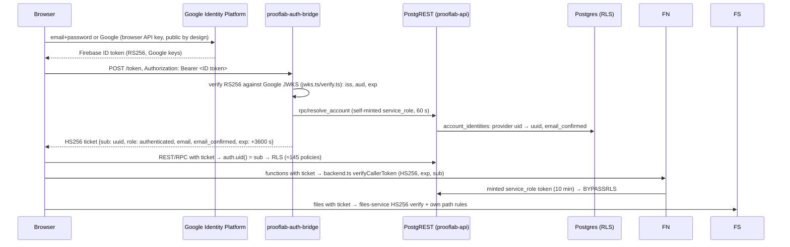

# Authentication, identity and authorization map (3 Oct 2026)

Read-only.
- SRC at HEAD `d736e4d`.
- CFG read on 3 Oct.
- EARLIER: authz matrix 58/58 on 2 Oct; 4-role sign-in on 1 Oct.
- RUN today: anonymous/forged attack surface 66/66.

## 1. Login to permission: end-to-end trace (SRC + CFG)

| Item | Value (tag) |
|---|---|
| Token TTL | `TOKEN_TTL=3600` (CFG) |
| Refresh | `src/integrations/google/identity.ts` sets a refresh timer. Before expiry it uses Google's refresh token to get a new ID token and re-exchanges it at the bridge (`exchange()`). The whole session, **including Google's refresh token, is kept in `localStorage`** (lines 100–110), so XSS = session theft (SRC). The bridge itself issues no refresh token |
| Logout | Firebase sign-out plus the ticket dropped from memory. **Tickets cannot be revoked server-side**; they stay valid until `exp` (INFERRED from the HS256 stateless design) |
| Multiple tabs | Each tab exchanges its own ticket (SRC: per-tab `x-session-id`); same identity |
| Account switching | Sign-out, then sign-in, then a new ticket; the role is read from `user_roles` per query (no role claim in the ticket other than `authenticated`) |
| Role storage | `user_roles` (`user_id`, role): student 17, startup 3, college_admin 2, admin 1 (DATA). The `recruiter` role is allowed in routes but **no user has it** |
| Org entities | `colleges` (`user_id` owner, `verification_status`), `startups` (company org), `recruiters` (separate entity used by the recruiter RPCs: `my_recruiter_id`, sponsored Lots) |
| Identity mapping | `account_identities` (provider uid ↔ uuid), `record_account` / `resolve_account` RPCs |

## 2. F1: shared HS256 secret (re-evaluated: CONFIRMED OPEN, architecture change needed)

**Secret `prooflab-jwt-secret` readers (CFG):**
- the compute SA (Cloud Build);
- rt-accounts, rt-api, rt-authbridge, rt-bugfinder, rt-crawler, rt-files, rt-functions, rt-transcriber;
- transc-wk.

That is **10 identities**.

**Code paths that mint `service_role`** with it (SRC):
- `_shared/backend.ts:serviceToken`;
- `auth-bridge` (for `resolve_account`);
- `transcription-worker mint_token`;
- `crawler/db.py`;
- `bug-finder/run.mjs`;
- `scripts/dev-tools/pl.py`.

**Impact:** code execution in **any** of those runtimes yields full database read/write with RLS bypassed. Examples: a malicious audio file against the transcriber, a dependency compromise in the crawler, which installs agent-reach, gh, mcporter and yt-dlp from the network.

**Classification:** architecture change. The fix needs:
- the bridge as the only signer, using an asymmetric key;
- services authenticating each other with Cloud Run identity, not minted `service_role`;
- PostgREST verifying public keys.

## 3. F2: `service_role` everywhere (CONFIRMED OPEN, architecture change)

`createClient()` in Google mode **ignores its arguments** and always uses a minted `service_role` token (`backend.ts:533-557`). All 40 functions bypass RLS and re-implement authorization by hand:
- `_shared/authz.ts mayActOnStudentWork` (owner / admin / approved college);
- per-function checks (`lot-writer`: own Lot today; `submit-*`: own or assigned task; `transcription-enqueue`: own folder and task).

Even `authClient = createClient(url, anonKey, {Authorization})` returns the service client. Only `auth.getClaims` reads the caller's token.

**Classification:** architecture change. Default to the caller's token plus narrow definer RPCs.

## 4. F4: email pre-registration takeover (CONFIRMED OPEN in code; live NOT TESTED)

| Flow | Frontend check | Server check |
|---|---|---|
| Email/password signup | `Auth.tsx:49`, `AuthCallback.tsx:113`, `EnhancedRoleBasedAuthForm.tsx:145` block unverified sign-in **in the browser** | bridge issues tickets with `email_confirmed:false`; **no server refusal** |
| Google sign-in | Google emails are verified by Google | `resolve_account` stores `email_confirmed` |
| CSV import (`create-student-users`) | TPO uploads the CSV | `findAccountByEmail` (line 141). An existing account **is linked to the imported student without checking email verification** (lines 141–220), unless `drop_empty_account` frees an empty one |
| College-created / admin-created users (`create-college-user`, accounts) | admin UI | `accounts:signUp` with the browser key, then `record_account` |
| Recruiter / company signup | self signup + `OnboardingStartup` | approval gate (`verification_status`, `is_verified_recruiter`) |

**Attack:** register `student@college.edu` before the import, never verify, wait for the college's CSV import, then be linked as that student with the college's data. The browser gate is bypassable by calling the bridge and API directly.

**Classification:** hardening, inside the current architecture. Fix with a server-side verified-email check in the import and in `resolve_account`.

## 5. F5: browser-chosen roles (PARTIALLY CONFIRMED, P3)

Policy `user_roles_self_claim` (stage 47) lets a new user insert their own role: `student`, `college_admin`, `startup` or `recruiter`, never `admin`. The powers that matter are gated by approval:
- `my_college_id` requires an approved college;
- `is_verified_recruiter`;
- the startup `verification_status`.

Hardening.

## 6. Account sync: F6 (CONFIRMED OPEN, hardening)

Scheduler every 10 min → `accounts /sync` (webhook secret) runs these steps:
1. `all_login_ids()` pages every Identity Platform account; any error returns 500 and **nothing is removed**.
2. 0 logins returns 409 (refuses).
3. `rpc/student_logins` lists the students.
4. `gone` = students whose provider uid is not in the list.
5. `rpc/remove_students(_ids, 'console_sync')` runs.

There is **no maximum-delete threshold and no dry run**. A partial-but-non-empty list (for example 60%) removes about 40% of students.
- `remove_students` writes `removed_students` (99 rows; DATA). The 2 Oct console removals were 4 (EARLIER).
- It is a **hard delete** (`migration/17-remove-students.sql:76-92`):
  - it inserts a `removed_students` snapshot;
  - it deletes `account_identities`, `student_intake` and `auth.users`;
  - **everything else cascades**: profile, tasks, submissions, voice rows.
- Recovery = re-import plus restore from backup/PITR. The snapshot is not an automatic restore (SRC + INFERRED).
- Files of removed students stay in the bucket (N2).

**New (SRC):** `accounts /password-link` returns a **password-reset link for any email** to any caller holding `webhook-secret`. Readers: compute SA, rt-accounts, rt-functions. This widens F7's blast radius to **account takeover** (classification: hardening, P2).

## 7. F7: scheduler shared secret (CONFIRMED OPEN, P3, hardening)

- The same `webhook-secret` is used for all functions jobs and the accounts `/sync` and `/password-link`.
- Deno compares it with `!==` (`scheduled-job/index.ts:36`, `transcription-reap/index.ts:38`). Accounts uses `hmac.compare_digest`.
- The URLs are public.
- Fix direction: OIDC from the scheduler identity, plus the invoker restricted.

## 8. Files service (SRC, EARLIER)

| Check | Behaviour |
|---|---|
| Auth | HS256 ticket verify (`files-service/main.ts:174`) |
| Student isolation | Path prefix must be the caller's own folder for private writes and reads; cross-student read returns 404 (EARLIER, 2 Oct) |
| College access | Approved college's own students (rules in files-service plus `mayActOnStudentWork`-like checks) |
| Company access | Private file returns 404 (EARLIER, 2 Oct) |
| Admin | all |
| Signed URLs | grant tokens via `proof-file-url` (legacy) and `FILES_URL` grants; no GCS signed URLs exposed |
| Path traversal | normalised path, prefix check (SRC); attack surface 66/66 RUN today includes traversal probes |
| Overwrite / delete | `x-upsert` and DELETE allowed in the owner's folder, so **scored audio is mutable** (F11) |

## 9. Cross-college and cross-role isolation (SRC + EARLIER)

| Boundary | Mechanism | Evidence |
|---|---|---|
| College A vs College B students | RLS `my_approved_college_ids()`; definer RPCs (`tpo_*`) check the college; migration 49 restricts college reports to approved accounts | authz matrix 58/58 EARLIER (2 Oct); G28 closed |
| Student A vs Student B | RLS own rows; files owner folder | EARLIER 404 |
| Recruiter vs private data | discoverable-student checks (`student_is_discoverable`), aggregates in `recruiter_*` RPCs; files 404 | EARLIER |
| Functions | hand-written checks (F2 risk); 5 earlier bugs fixed via `authz.ts` | SRC |
| **New:** student vs their own grading keys | `resume_assessments_own_all` is FOR ALL, so the student can read (and by policy write) answer keys and hidden tests | **N20**, SRC + DATA; live NOT TESTED |

## 10. Current vs intent vs gap

| Intent | Current | Gap |
|---|---|---|
| One identity, server-enforced roles | Identity Platform + bridge + `user_roles` | browser-chosen roles (F5); the verified-email gate is browser-only (F4) |
| Least privilege between services | shared HS256 + `service_role` everywhere | F1, F2 (architecture) |
| Recruiter = Company | role `startup` + orgs `startups` and `recruiters` (two entities) | duplicate org model |
