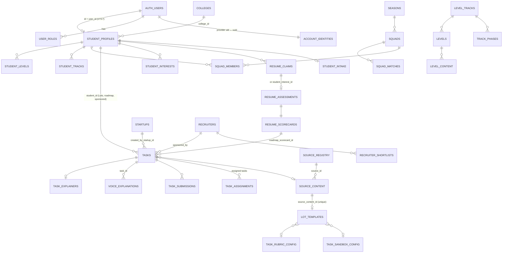

# Complete database data model (3 Oct 2026)

Read-only.
- **DATA:** production row counts via PostgREST with a minted read-only-used `service_role` token, GET only (3 Oct). Full list in `PIN-TO-PIN-MANIFEST.txt` §DB reads.
- **SRC:** policies and functions from `supabase/migrations/` + `migration/`.
- **Exposure:** PostgREST shows **92 tables/views** and **113 RPCs** to `service_role`. RPCs granted only to `authenticated` (for example `recruiter_talent`, `tpo_students`, the `recruiter_*` family) are not in that list. The full grant inventory is **UNKNOWN** (needs SQL, U8).

## 1. Relationship map (current)



**Old proof architecture.** Separate and all **0 rows**:

```text
proof_uploads ─┬─ conceptual_tests ── conceptual_answer_keys
               ├─ proof_appeals
               ├─ ai_verifications
               ├─ github_verifications
               ├─ cosigns
               └─ (voice_explanations.proof_id: 0 linked)
trust_scores, student_profiles.trust_score, coding_streaks, task_templates,
recruiter_links, recruiter_link_views
```

## 2. Table inventory (DATA counts, 3 Oct)

| Area | Table (rows) | PK / key FKs | Writers | Readers | RLS notes | Class |
|---|---|---|---|---|---|---|
| Identity | auth.users (compat), account_identities, user_roles (23), admin_users (view, 0) | uuid | bridge `record_account`, import | RLS helpers | self-claim policy (F5) | current |
| Students | student_profiles (17), student_contact (17), student_intake (10), student_imports (9), student_import_rows (125), removed_students (99) | `id=user_id` | import, `remove_students` | all roles via RLS / RPC | own / college / admin; removed_students no client access | current |
| Colleges | colleges (2), college_profiles (1) | user_id owner | onboarding, admin | RLS | `verification_status` gate | current |
| Company | startups (3), startup_profiles (3), recruiters (3), recruiter_shortlists (0), recruiter_views (0), task_applications (0), job_opportunities (0) | — | company, admin | recruiter RPCs | `is_verified_recruiter` | current (two org entities) |
| Resume | resume_claims (9), student_interests (2), resume_assessments (10), resume_scorecards (10), public_resume_scorecards (view, 2), ai_templates (24) | — | resume functions | student, TPO, recruiter (aggregates) | **assessments FOR ALL own (N20)** | current |
| Content | source_registry (8), source_content (28), lot_templates (37), task_explainers (70), learning_resources (0) | `source_content_id` unique on templates | crawler, college RPC, lot-writer | Lot engine | admin library RPCs | current |
| Grading | task_sandbox_config (14), task_rubric_config (36) | — | auto-config, admin | functions only | **admin-only RLS** (students cannot read) | current |
| Work | tasks (83), task_assignments (0), task_submissions (14) | unique (`student_id`, `lot_date`) | `create_lot_for`, `assign_tasks`, `sponsor_lot`, roadmap, company | all | submissions: SELECT policy; writes via definer `record_task_submission` | current |
| Voice | voice_explanations (12) | idempotency key unique | enqueue, worker, voice-score | Build-log, TPO, recruiter | 4 triggers; UPDATE revoked (mig 47) | current |
| Squads | seasons (2), squads (1), squad_members (11), squad_matches (0), squad_weekly_scores (0), student_weekly_scores (0), squad_scoring_rules (7), squad_name_themes (9) | — | scheduled RPCs, TPO | student, TPO | teammates' profiles hidden (N3) | current |
| Learning | level_tracks (41), track_phases (164), levels (6,087), level_content (6,087), level_syllabus (650), topic_links (47), skill_aliases (51), student_tracks (16), student_levels (101), topic_ratings (0) | — | migrations, level-open | Roadmap | — | current |
| Engagement | xp_logs (18), student_streaks (8), badges (10), student_badges (3), quests (7), student_quests (11), student_week_plan (4), student_activity_events (22), interventions (3), notifications (16), announcements (0) | — | triggers, jobs, TPO | all | — | current |
| AI / ops | llm_usage (25, last 11 Sep), llm_usage_by_student (view 0), llm_cache (4), rate_limits (0), security_events (645), audit_logs (86), app_events (851), bug_finder_runs (920), student_credits (0), manual_adjustment_log (0) | — | functions (F3: broken), triggers, client-log, bug finder | admin | app_events: no client policy | current (partly dead) |
| Settings | user_preferences (0), verification_settings (0) | — | — | — | — | legacy-ish |
| Legacy | proof_uploads, proof_appeals, conceptual_tests, conceptual_answer_keys, cosigns, trust_scores, ai_verifications, github_verifications, coding_streaks, task_templates, recruiter_links, recruiter_link_views (**all 0**) + `student_profiles.trust_score` | — | legacy functions | legacy UI, compat branches in current RPCs (L7) | — | HISTORICAL_DB_KEEP |

## 3. Key RPC families (SRC; names from the PostgREST schema)

| Family | RPCs |
|---|---|
| Lot engine | `assign_todays_lots`, `create_lot_for`, `next_lot_source`, `seed_lot_template`, `ensure_and_claim_lot_template`, `claim_lot_template`, `touch_lot_template`, `release_lot_template`, `save_lot_template`, `lot_needs_writer`, `my_todays_lot`, `is_duplicate_source`, `template_key`, `touch_template` |
| Grading | `record_task_submission`, `similar_written_submission` (pg_trgm), `start_task_assignment`, `check_answer` |
| Voice | `claim_transcription_job`, `complete_transcription_job`, `fail_transcription_job`, `claim_transcription_recovery`, `claim_voice_scoring`, `complete_voice_scoring`, `fail_voice_scoring` |
| Accounts | `record_account`, `resolve_account`, `resolve_account_uuid`, `account_id_for_email`, `drop_empty_account`, `remove_students`, `student_logins`, `college_owns_student`, `is_admin` |
| Squads / seasons | `form_squads`, `form_all_colleges`, `extend_fixtures`, `extend_all_fixtures`, `run_squad_week`, `run_all_seasons`, `advance_season`, `season_*`, `generate_*`, `schedule_round_robin`, `qualify_squads`, `settle_round`, `head_to_head`, `squad_championship_achievements` |
| TPO | `tpo_*` (squads, naming, scoring, cohorts, placement report, student learning), plus `tpo_students` / `tpo_student_profile` (authenticated-only) |
| Learning | `suggest_tracks`, `placement_questions`, `submit_placement`, `my_placement_status`, `record_topic_attempt`, `topic_priorities`, `is_last_step` |
| Ops | `check_rate_limit`, `bump_llm_cache_hit`, `log_security_event`, `prune_app_events`, `prune_rate_limits`, `prune_bug_finder_runs`, `admin_trace_*`, `admin_bug_finder_*`, `admin_content_*`, `notify_weekly_progress`, `plan_all_weeks` |
| Extensions exposed | pgcrypto (`armor`, `dearmor`, `gen_salt`, `pgp_*`), pg_trgm (`show_trgm`, `show_limit`) |

## 4. Source of truth per fact (point 99)

| Fact | Authoritative today | Competing source |
|---|---|---|
| Student work | `task_submissions` (14) | `proof_uploads` (0) still read by company / sponsored / portfolio / admin screens |
| Task status | `tasks.status` (free text: pending, completed, In Progress, Pending) | `task_submissions.status` (passed / failed / needs_review); not synchronised everywhere (N7) |
| Coding score | `task_submissions.sandbox_score` (Lots); `resume_scorecards.coding_score` (resume) | two systems |
| Written score | `task_submissions.rubric_scores` / `sandbox_score` field reused for the score | — |
| Voice score | `voice_explanations.communication_score` | `resume_scorecards.voice_authenticity_score` (no current writer) |
| Resume score | `resume_scorecards.*` | `resume_claims.resume_quality_score` / `ats_match_score` (AI estimates) |
| Recruiter evidence | `recruiter_talent` / `recruiter_proof_profile` aggregates (mixed current + compat proof branches) | — |
| Squad score | `squad_weekly_scores` / `student_weekly_scores` (0 rows so far) + `squads.points` | `trust_score` used by `form_squads` (L7) |
| Activity / recency | `student_profiles.last_active` + app_events + student_activity_events | several |

## 5. Migration lineage (D1, F17)

| Location | Files | Naming | Highest | Notes |
|---|---|---|---|---|
| `supabase/migrations/` | 139 | `YYYYMMDDHHMMSS_stageNN_*.sql` (dates partly in the future, for example `20261101000000`) | `20261101000000_college_reports_college_only.sql` | Supabase-era history; mirrors of 48, 49 |
| `migration/` | 66 (+ subfolders such as `step6ee-production-before/`) | `NN-*.sql`, `NNb-*`, `step6*-*` | **49** (3 files: apply, rollback, staging rehearsal) | 41–47 voice queue **only here**; Step 6 production/staging scripts and rollbacks |
| Applied-migrations table | none in the repo; production UNKNOWN (U1) | | | |
| Generated types | `src/integrations/supabase/types.ts` (last touched 30 Sep) | | | `strict:false`; RPCs cast `as never` |

Migrations 41–49 (EARLIER evidence, unchanged):

| Migration | Content | Production | Staging |
|---|---|---|---|
| 41 + 42 | transcription jobs + hardening | applied 27 Sep | applied |
| 43 | recovery + insert guard | applied | applied |
| 44 | scoring claim | applied, superseded | applied |
| 45 | lease token | **corrected 6DD** | **original (N11)** |
| 46 | recruiter provenance filter | **not applied (on hold)** | original applied |
| 47 | voice UPDATE revoke | applied | applied |
| 48 | scratch_language | applied 30 Sep | applied |
| 49 | college reports approved-only | applied 1 Oct | applied |

**Manual changes outside canonical files:** the Step 6 runbook records production executions done by owner jobs from `migration/step6*` scripts (DOC). G01 proved migration 45 byte-identical (EARLIER). Anything else is UNKNOWN without a schema dump diff.
