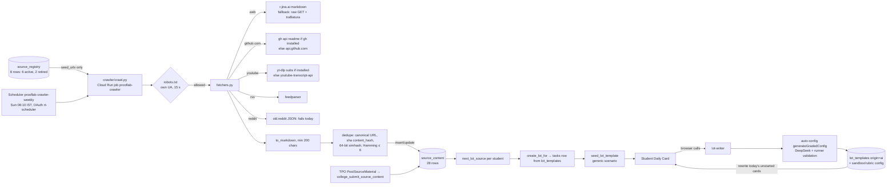

# Crawler / agent → source_content → Daily Lot: pin-to-pin trace (3 Oct 2026)

Read-only. Tags: SRC / CFG / DATA / EARLIER / DOC / INFERRED / UNKNOWN.

## A. Current reality: the chain

### A1. Schedule and runtime (CFG)

| Item | Value |
|---|---|
| Trigger | Scheduler `prooflab-crawler-weekly`, cron `10 8 * * 0`, Asia/Kolkata. Calls Run Jobs API `jobs/prooflab-crawler:run` as `prooflab-rt-scheduler` |
| Job | 1 CPU / 1 Gi, timeout 1800 s, max retries 1, SA `prooflab-rt-crawler` |
| Env | `BACKEND`, `POSTGREST_URL`, `PGRST_JWT_SECRET` (secret), `GITHUB_PAT` (secret), `GH_TOKEN` |
| Executions | 21 Sep (2) and 27 Sep, all succeeded |
| GitHub workflow | `.github/workflows/crawl.yml` is manual-only (`workflow_dispatch`). Its header still lists the Supabase secrets, but its body uses `PGRST_JWT_SECRET` (DOC drift) |
| Write path | `crawler/db.py` mints its own `service_role` HS256 token from `prooflab-jwt-secret` (F1 blast radius) and writes `source_content` through PostgREST |

### A2. agent-reach: exact role (SRC)

- It is installed in `crawler/Dockerfile` from GitHub, pinned to commit `da5044d…`, together with `gh` 2.63.0, `mcporter` 0.13.13, deno and node. The Exa MCP is configured but **never called** by `crawl.py`.
- The Python code uses only the tools agent-reach brings:
  - `gh api repos/{owner}/{repo}/readme` (`fetchers.py:fetch_github`);
  - `yt-dlp` subtitles (`fetch_youtube_ytdlp`).
- `report_tools()` runs `agent-reach doctor` purely for the log.
- **Optional.** When it is absent, every reader falls back to plain HTTP (`api.github.com`, `youtube-transcript-api`) and the log says "not installed here - using plain HTTP fallbacks".
- Web pages never go through agent-reach. They use **Jina Reader (`https://r.jina.ai/`)**, a third-party service, and fall back to a raw GET.
  - The README says this matches what agent-reach does for web pages (DOC).
  - INFERRED: Jina therefore sees every URL fetched. The registry's retired entries note "we do not read through a third-party reader that hides who we are". Jina is a third-party reader, though it does not hide the UA. This is a policy ambiguity, not a legal conclusion.

### A3. Sources (DATA 3 Oct)

| Domain | Name | Seeds | rights_flag | Active | Pages stored |
|---|---|---|---|---|---|
| prepinsta.com | Company interview experiences | 12 | ORIGINAL_ONLY | yes | 11 |
| indiabix.com | Aptitude and reasoning | 8 | ORIGINAL_ONLY | yes | 8 |
| docs.python.org | Python tutorial | 6 | ORIGINAL_ONLY | yes | 6 |
| apna.co | Apna Jobs | 1 | ORIGINAL_ONLY | yes | 1 |
| github.com | Public repository readmes | 1 | ORIGINAL_ONLY | yes | 1 |
| college-submitted | College / TPO material | 0 | ORIGINAL_ONLY | yes | 1 (`fetch_method=manual`) |
| naukri.com | Naukri postings | 3 | ORIGINAL_ONLY | **retired 21 Sep** (403 to named bots) | 0 |
| foundit.in | Foundit postings | 2 | ORIGINAL_ONLY | **retired 21 Sep** | 0 |

`source_content`:

| Field | Value |
|---|---|
| Rows | 28 |
| `fetch_method` | web 26, github 1, manual 1 |
| Hidden | 1 |
| `enriched_at` | NULL on all |
| `grading_mode_hint` | **NULL on all 28** |
| Latest `fetched_at` | **13 Sep 2026** |

The three weekly runs since then stored nothing new, which matches "unchanged" as the steady state for a seed-only crawler (DATA + SRC).

### A4. Failure behaviour (SRC)
- Per URL, `try/except` keeps the run going. A source whose stored rows cannot be read is skipped. robots.txt that is 403, 5xx or times out means the page is skipped that week. 404 means "no rules".
- Reddit: 403 on `www`, and HTML on `old` for listings. It fails cleanly and stores nothing. No Reddit source is in the registry.
- No alert fires when a run stores 0 new pages. An alert exists for "crawler failed" (EARLIER, DOC: CLAUDE.md).

### A5. Rights / licensing (SRC + DATA). No legal conclusions.
- `rights_flag` values: `ORIGINAL_ONLY` (all active rows) and `BLOCKED_SOURCE` (skipped by the crawler).
- `license_note` is free text per source, for example "inspiration/grounding only, never republished verbatim".
- **What actually reaches students:**
  - `lot-writer` sends an excerpt (`pageExcerpt`) of the page to DeepSeek and asks for a new scenario, so the student sees model-written text.
  - `source_jd` displays "Real source: <page title>". The URL is not shown to students, in line with the "no outbound links" rule.
  - INFERRED: the model can reproduce phrasing from the excerpt. Nothing checks for verbatim overlap.
- The Books corpus (`gs://…/books/sections.jsonl.gz`) uses a separate licence scan (`licence_scan.py`) and feeds the Tracks "Read more" cards, not Lots (DOC, CLAUDE.md).
- **LEGAL QUESTIONS (not decided here):**
  - whether using PrepInsta interview write-ups and IndiaBix question pages as AI grounding is allowed under those sites' terms;
  - whether the PSF docs licence covers derivative task text;
  - whether routing fetches through Jina is acceptable under the registry policy.

## B. source_content → Lot (SRC, DATA)

| Step | Object | Behaviour |
|---|---|---|
| 1 | Scheduler `prooflab-daily-lots` 05:40 IST → `scheduled-job?job=daily-lots` → `assign_todays_lots()` | Loops every `student_profiles.status='active'` row and calls `create_lot_for(id, current_date)`. `current_date` is the DB date (UTC); 05:40 IST is 00:10 UTC, so the dates agree |
| 2 | `create_lot_for` | Returns early if today's task exists. Otherwise calls `next_lot_source`; if the page has no template, `seed_lot_template` inserts a generic one. Then it inserts `tasks` (`source='daily_lot'`, `created_by_type='system'`, `on conflict (student_id, lot_date) do nothing`) |
| 3 | `next_lot_source` | Picks the first unused page, ordered by own-college submission, then any college submission, then **`fetched_at` ascending**. When every page is used, it picks the page used longest ago. **Every student in the same position gets the same page** (N6) |
| 4 | Seed template | Title = page title. Scenario = "Build the smallest working thing that proves you understand <title>. Submit what you built, then record sixty seconds…". Grading = generic written checklist (trigger `lot_template_default_checker`, migration 21) |
| 5 | `lot-writer` (browser-triggered from `StudentDailyCard`) | Students may only trigger it for their own Lot today; admins for any page. Claims a lease (`ensure_and_claim_lot_template`, 30 s heartbeat, 2 min stale). Builds the prompt and calls `generateGradedConfig` |
| 6 | Grading mode | `grading_mode_hint` if set (**never set today**). Otherwise the keyword regex `CODE_SIGNALS` on the title plus the first 400 chars: code, coding, program, algorithm, function, syntax, debug, compile, array, loop, api, sql, query, script, variable, "data structure". Match means sandbox, else rubric |
| 7 | Job grounding | `job_opportunities` with status approved, `description ILIKE '%<first word of title>%'`, newest first. **0 rows exist**, so this path never runs today |
| 8 | Save | `save_lot_template` is fenced on the lease token. Then `explainTask` writes `task_explainers`, and today's unstarted cards for that page are rewritten in place |

### B1. Lot generation cost model (SRC)
- **One AI generation per `source_content` row, reused by every student** (`lot_templates.source_content_id` unique, `origin='ai'` short-circuits).
- Calls per page, first time only:

| Path | Calls |
|---|---|
| Sandbox | up to 2 generation calls, each validated by running the reference solution on the code runner. On failure, up to 2 rubric-downgrade generations, each followed by 1 `gradeOnce` validation |
| Rubric | up to 2 generations, each followed by 1 `gradeOnce` |
| Afterwards | 1 `explainTask` call |
| Worst case | 4 generations + 2 validations + 1 explain = **7 DeepSeek calls per page** |
| Best case | 2 calls for rubric (generation + validation) + 1 explain |

- **Duplicate-generation risks:**
  - The claim TTL is 2 min. A generation slower than that, with no heartbeat (process killed), can be claimed twice; `save_lot_template` fencing makes the late writer lose. INFERRED: both paid.
  - Rubric-config rows from failed attempts are inserted before the save and become orphans when the save loses (SRC: `insertRubricConfig` runs inside `generateGradedConfig`).
  - Nothing else duplicates: the per-student cost is 0 after the first writer.
- Usage logging is off (F3), so the real spend is **UNKNOWN**. `llm_usage` shows only 3 lot-writer rows, all before 11 Sep.

### B2. Provenance (SRC, DATA)
- **What is preserved:** task → `source_content_id` → `source_content.url` and `source_id` → `source_registry` (domain, `license_note`). Lot template → `source_content_id`. Grading config ids are stored on the task and the template.
- **Missing:**
  - the model or prompt version used to write the template;
  - the excerpt actually sent;
  - which `job_opportunities` row grounded it, if any (only the text "role at company" is kept);
  - a version history of a template when its page is updated. `update_content` changes the page text but **the template is not regenerated**, so a stale template can sit on top of changed content.
- 9 of 37 templates have no `source_content_id`: older Track-level templates (`level_id` set), kept from before stage 75.

## C. Product intent (owner)
- Daily Lots come mainly from the crawler/agent research corpus, grounded in real pages and jobs, not invented by AI.
- Lots are decoupled from Tracks.

## D. Gap

| Gap | Evidence |
|---|---|
| The corpus is tiny and static: 27 visible pages, nothing new since 13 Sep, and the crawler does not discover links | DATA, SRC |
| Job grounding is effectively absent: `job_opportunities` = 0 and the two job boards are retired | DATA |
| The mode decision is a keyword heuristic for 100% of content; the hint was built (stage 76) but never populated. Production right now has 0 sandbox tasks | DATA, SRC |
| No personalisation: everyone gets the same order | SRC (N6) |
| The first student of the day on a new page sees seed text until lot-writer finishes, and lot-writer runs in that student's request | SRC |
| No wording contract (Input/Output/Constraints/Example) in the Lot prompt; see `QUESTION-WORDING-AND-EVALUATION-QUALITY-AUDIT` | SRC |
| agent-reach is presented as "the agent" but is a tool installer. There is no autonomous research agent: the crawl is a fixed seed list | SRC |

## E. Unknowns
- C-U1: Jina Reader terms and rate limits.
- C-U2: whether PrepInsta and IndiaBix terms allow this use (legal).
- C-U3: the actual per-run cost of the crawler job (billing export).
