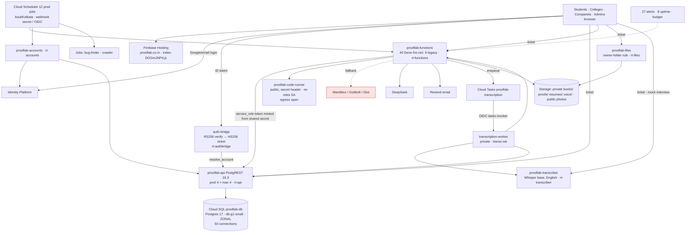
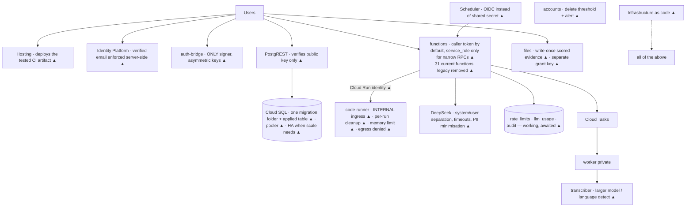

# Current and target architecture — 3 Oct 2026

## 1. CURRENT (from live config read now + source)

Legacy still wired in (not drawn): proof_uploads/trust/cosign/conceptual tables, 9 functions, and the
Proof Review / Trust & XP / Cosigns / portfolio screens (see the legacy map).

Key properties of the current state:
- One HS256 secret is shared by the signer and every verifier (F1).
- Every function talks to the database as `service_role` (F2).
- Rate limits and AI usage logging are not running (F3).
- Infrastructure lives in the console only (F18).

## 2. TARGET production architecture (changes still required are marked ▲)

