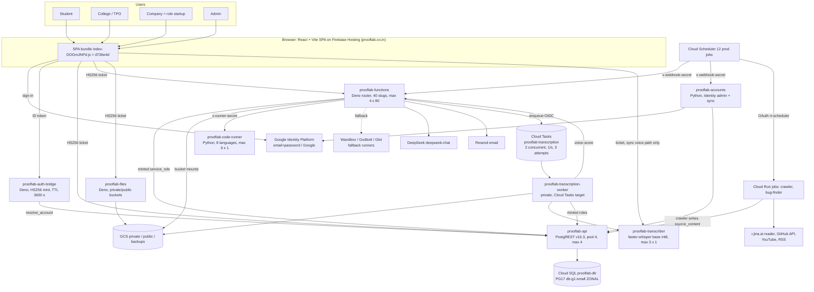

# Current full system architecture — 3 Oct 2026 (CURRENT REALITY ONLY)

Baseline: branch `work/step6j-release-gates`, HEAD = GitHub `main` = `d736e4dd95925aeaa017200d06033bf0d92c77fa`.
Nothing here is a recommendation. The target is in `TARGET-SYSTEM-ARCHITECTURE-2026-10-03.md`.

Evidence tags:
- **SRC**: source at HEAD.
- **CFG**: live cloud config read on 3 Oct.
- **DATA**: production row counts and aggregates read on 3 Oct.
- **RUN**: tested now.
- **EARLIER**: tested 29 Sep–2 Oct, not re-run.
- **DOC**: documentation only.
- **INFERRED**: architectural inference.
- **UNKNOWN**: not settled.

## 1. One-page picture

## 2. Runtime inventory (CFG 3 Oct)

| Service | Revision | Image | Service account | CPU/RAM | Min–max × concurrency | Timeout | Invoker | Secrets (names only) |
|---|---|---|---|---|---|---|---|---|
| prooflab-api | 00004-rom | postgrest:v16.3 | rt-api | 1 / 512Mi | 0–4 × 80 | 30 s | allUsers | prooflab-db-uri, prooflab-jwt-secret |
| prooflab-functions | 00053-c7m | functions@b101fcdc | rt-functions | 1 / 1Gi | 0–4 × 80 | 300 s | allUsers | jwt, deepseek-api-key, github-pat, resend-api-key, webhook-secret, code-runner-secret |
| prooflab-auth-bridge | 00012-vdh | auth-bridge@1f082fda | rt-authbridge | 1 / 256Mi | 0–3 × 80 | 20 s | allUsers | jwt |
| prooflab-files | 00014-r2w | files:v-no-vercel | rt-files | 1 / 512Mi | 0–4 × 80 | 60 s | allUsers | jwt |
| prooflab-accounts | 00003-rgf | accounts:v2 | rt-accounts (identitytoolkit.admin) | 1 / 512Mi | 0–2 × 80 | 300 s | allUsers | jwt, webhook-secret |
| prooflab-transcriber | 00003-v7l | transcriber:v1 | rt-transcriber | 2 / 2Gi | 0–3 × 1 | 120 s | allUsers | jwt |
| prooflab-code-runner | 00001-rpr | code-runner:v1 | code-runner (no project roles) | 2 / 2Gi | 0–6 × 1 | 120 s | allUsers | code-runner-secret |
| prooflab-transcription-worker | 00001-sl6 | transcription-worker:g1w | transc-wk | 1 / 512Mi | 0–**default (unset)** × 80 | 300 s | tasks-invoker only | jwt |

Every service scales to zero (min 0). Ingress is `all` everywhere. No service has a VPC connector or egress control. Only `prooflab-api` has a Cloud SQL connection; every other service reaches the database through PostgREST.

Production functions env names (CFG):
- `BACKEND`, `POSTGREST_URL`, `PRIVATE_MOUNT`, `PUBLIC_MOUNT`, `ALLOWED_ORIGINS`
- `GOOGLE_API_KEY`, `FILES_URL`, `EMAIL_FROM`
- `CODE_RUNNER_URL`, `ACCOUNTS_URL`
- `TASKS_LOCATION`, `TRANSCRIPTION_QUEUE`, `TRANSCRIPTION_WORKER_URL`, `TASKS_INVOKER_SA`
- `STALE_AFTER_SECONDS`, `ENVIRONMENT`
- the six secrets in the table above

These are **absent**:
- `SUPABASE_URL` and `SUPABASE_SERVICE_ROLE_KEY` (F3 root cause, below);
- `GEMINI_API_KEY*`, `KIMI_API_KEY` (DeepSeek is the only AI provider);
- `GLOT_API_TOKEN` (the Glot fallback is off).

Jobs (CFG):

| Job | Image | Service account | Resources | Timeout | Retries | Last runs |
|---|---|---|---|---|---|---|
| `prooflab-crawler` | crawler:agent-reach-da5044d-6 | rt-crawler | 1 CPU / 1Gi | 1800 s | 1 | 21 Sep, 21 Sep, 27 Sep: all succeeded |
| `prooflab-bug-finder` | bug-finder:v22 | rt-bugfinder | 2 / 2Gi | 900 s | 0 | the last 3 (2 Oct) **failed** (N1) |
| `prooflab-staging-inspect4` | postgres:17 | staging-api | 1 / 512Mi | 60 s | 0 | leftover, purpose not documented (W-list) |

Queues (CFG):
- `prooflab-transcription`: 2 concurrent, 1/s, burst 10, 3 attempts, backoff 5–30 s.
- Staging: `prooflab-staging-transcription` with the same settings.
- Leftover: `prooflab-staging-ai-background`, which has no producer in the source.

Scheduler (CFG): 12 production + 1 staging jobs, all `Asia/Kolkata`. Detail is in `SYNC-ASYNC-JOB-QUEUE-MATRIX-2026-10-03.md`.
- `prooflab-bugfinder-deep-run`: last status **code 7 (PERMISSION_DENIED)** on 1 Oct 22:30 UTC. It is the only job failing at the trigger level.

Cloud SQL (CFG): `prooflab-db`

| Setting | Value |
|---|---|
| Version / tier | POSTGRES_17, db-g1-small |
| Availability | ZONAL, asia-south1-c |
| Disk | 20 GB PD_SSD, auto-resize on |
| Backups | on; PITR on; 7 days of logs; 7 retained backups |
| Maintenance window | Sunday 21:00 UTC |
| Deletion protection | on |
| Flags | `cloudsql.iam_authentication=on` |
| Network | public IPv4 enabled, `requireSsl=false` (reached only through the connector by `prooflab-api`) |

Staging DB: `prooflab-staging-db` db-f1-micro.

## 3. Data shape at a glance (DATA 3 Oct, production row counts)

**PostgREST exposure:** 92 tables or views, 113 RPCs.

**Students and accounts**

| Table | Rows |
|---|---|
| student_profiles | 17 |
| user_roles | 23: student 17, startup 3, college_admin 2, admin 1 |
| removed_students | 99 |
| colleges | 2 |
| startups | 3 |
| recruiters | 3 |

**Work and tasks**

| Table | Rows | Notes |
|---|---|---|
| tasks | 83 | 72 resume-roadmap tasks, 10 Daily Lots (all dated 2 Oct), 1 other |
| task_submissions | 14 | all written, `runner='llm'`; 7 passed, 7 failed; **0 code submissions** |
| lot_templates | 37 | 32 ai, 5 seed; 7 sandbox, 30 rubric (9 generic) |
| task_sandbox_config | 14 | |
| task_rubric_config | 36 | 1 generic fallback |

**Content sources**

| Table | Rows | Notes |
|---|---|---|
| source_content | 28 | latest `fetched_at` 13 Sep 2026; `grading_mode_hint` NULL on all 28 |
| source_registry | 8 | 6 active, 2 retired |
| job_opportunities | 0 | |

**Voice and resume**

| Table | Rows | Notes |
|---|---|---|
| voice_explanations | 12 | all `transcript_source='server'`: 10 scored, 2 failed |
| resume_claims | 9 | |
| resume_assessments | 10 | |
| resume_scorecards | 10 | |
| ai_templates | 24 | all `coding_round`, 31 hits |

**AI, rate-limit and logs**

| Table | Rows | Notes |
|---|---|---|
| llm_usage | 25 | first 21 Aug, **last 11 Sep** |
| llm_cache | 4 | all 21 Aug |
| rate_limits | 0 | |
| security_events | 645 | **0 with `source=server`** in the latest 300 |

**Legacy tables (all 0 rows):** proof_uploads, conceptual_tests, conceptual_answer_keys, cosigns, proof_appeals, trust_scores, ai_verifications, github_verifications, coding_streaks, task_templates, recruiter_links, recruiter_link_views.

## 4. Subsystem summaries (current reality)

| Subsystem | What it actually does (tag) | Detail doc |
|---|---|---|
| Auth | Identity Platform ID token → auth-bridge verifies it, calls `resolve_account`, mints an HS256 ticket (`role=authenticated`, TTL 3600 s). The same secret lets functions, the worker, the bug finder and the crawler mint `service_role` (SRC, CFG) | AUTH-IDENTITY-AUTHORIZATION-MAP |
| Frontend | One SPA with 27 top-level routes. The student shell has 4 nav items but **17 sub-tabs**. The company shell embeds the recruiter screens (SRC) | COMPLETE-FRONTEND-ROUTE-AND-SCREEN-MAP |
| Functions | 40 Deno handlers in one Cloud Run service. 9 are legacy. All use a minted `service_role` (SRC, CFG) | COMPLETE-BACKEND-FUNCTION-AND-SERVICE-MAP |
| Crawler | Weekly job reads the `seed_urls` of 6 active sources (no link following). The web goes through Jina Reader. agent-reach is installed but only its `gh` and `yt-dlp` tools are used. **No new page since 13 Sep** (SRC, CFG, DATA) | CRAWLER-AGENT-SOURCE-TO-LOT-TRACE |
| Daily Lot | 05:40 IST `assign_todays_lots` → `create_lot_for` per active student → `next_lot_source` (same oldest-unused page for everyone) → seed template. The student's browser calls `lot-writer`, which writes **one AI template per page**, reused by every student (SRC) | same |
| Grading | Coding: own runner with the hidden tests from `task_sandbox_config` (admin-only RLS). Written: DeepSeek rubric (1–2 calls), quote-checked. Everything without a config falls back to a generic written checklist (SRC, DATA) | CODING-EVALUATION…, QUESTION-WORDING… |
| Resume | Browser pdf.js → `resume-parser` (DeepSeek) → claims → 5 MCQ + short answers (server answer key) → coding round (2 problems × 3 AI-written tests, **not execution-validated**) → scorecard plus roadmap tasks (SRC) | RESUME-ASSESSMENT-CODING-SYSTEM-TRACE |
| Voice | Consent, then a ≤ 60 s recording uploaded to the private bucket. `transcription-enqueue` → Cloud Tasks → worker → Whisper base (English) → transcript → `voice-score` (DeepSeek) → Build-log (SRC, CFG, DATA) | VOICE-COMPLETE-PIPELINE-TRACE |
| Squads | Nightly `form_all_colleges` / `extend_all_fixtures`; weekly `run_all_seasons` (SRC, CFG) | master §Squads |
| Company | Role `startup`, org `startups`. Recruiter screens use a separate `recruiters` entity. Two work systems (Post Task / Applications / Submissions on `proof_uploads`, and Sponsored Lots on `tasks.sponsored_by`, also read through `proof_uploads`) (SRC) | master §Recruiter |
| Observability | 27 alerts, 8 uptime checks, a ₹3,000 budget (EARLIER/CFG). AI usage, rate limit and server audit are silently off (F3) | TESTING-OBSERVABILITY… |

## 5. F3 root cause (new, SRC + CFG + DATA, cause INFERRED-strong)

`_shared/llm.ts` (`logUsage`, cache), `_shared/rate-limit.ts` (`checkRateLimit`) and `_shared/audit.ts` (`logSecurityEvent`) all reach the database by reading `SUPABASE_URL` / `SUPABASE_SERVICE_ROLE_KEY` directly. They do not go through `_shared/backend.ts`, which is what makes every other call work on Google.

Those two variables exist only inside Supabase's runtime (`_shared/serve.ts` comment), and production functions do not have them (CFG). The timeline lines up:

| Date | Event |
|---|---|
| 12 Sep 2026 | Functions moved to Google (`5d86c91`, `acf22b6`) |
| 11 Sep 2026 | Last `llm_usage` row |
| — | `rate_limits` has 0 rows |
| — | 0 server-sourced `security_events`; the 645 rows are all browser events posted through `security-log` |

## 6. Known current/target gaps (pointer)

See `TARGET-SYSTEM-ARCHITECTURE-2026-10-03.md` §Gaps and the master dossier §Biggest mismatches.
