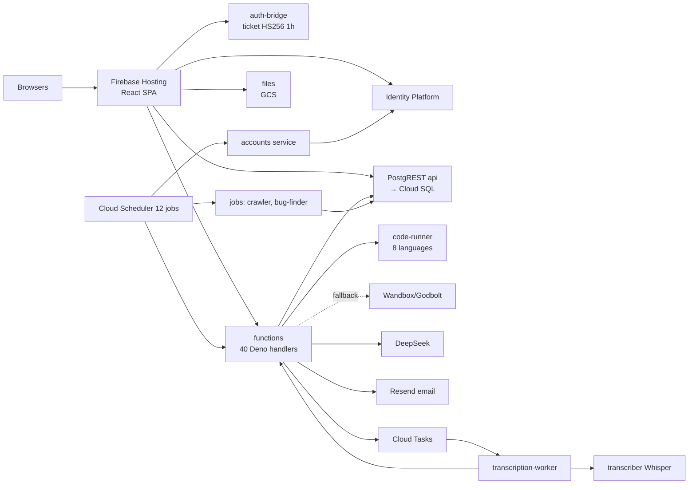
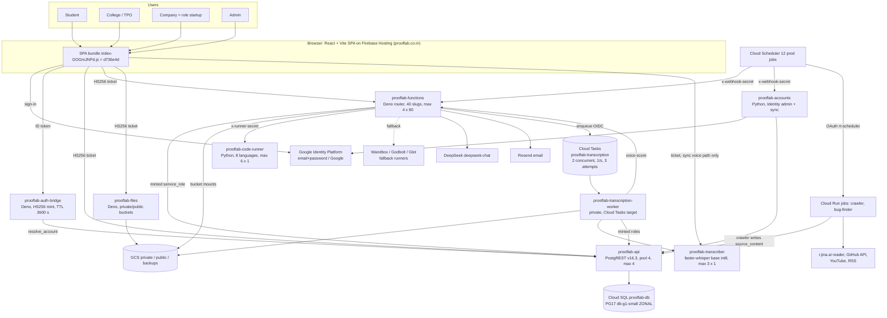
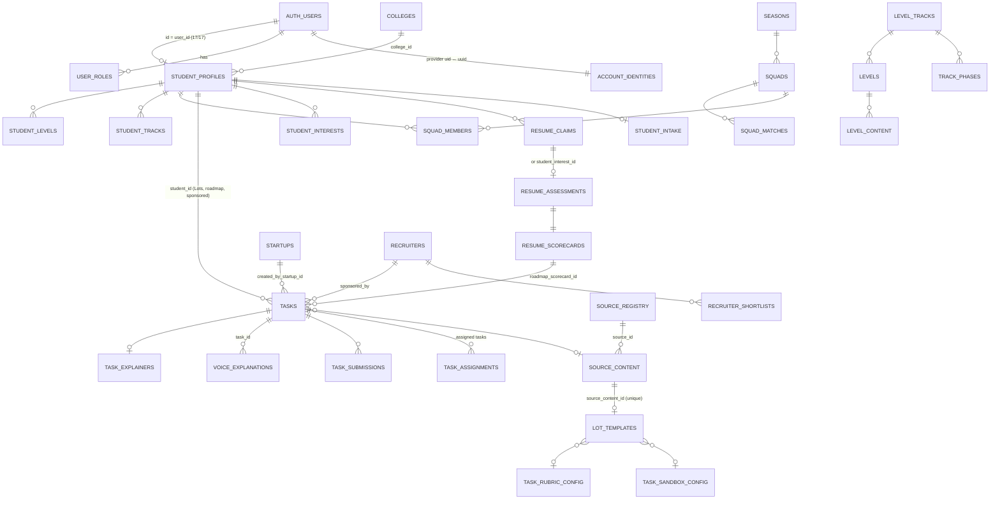
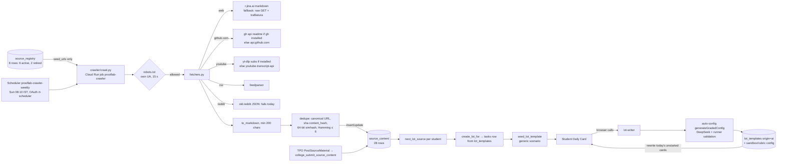
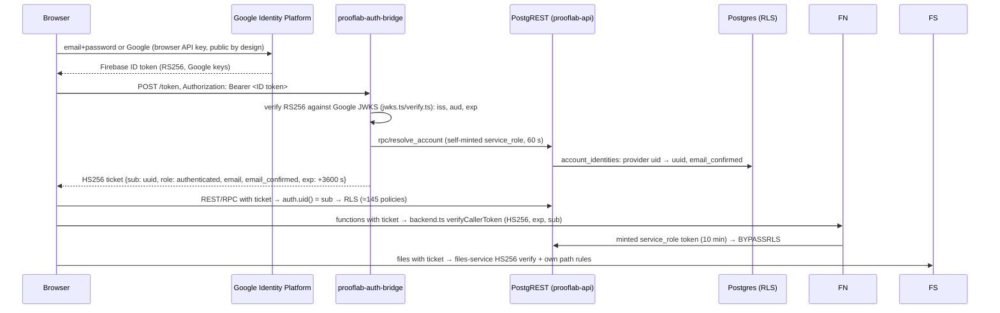

# ProofLabAI — EVERYTHING in one file (3 Oct 2026)

All 20 discovery documents joined, unchanged. Read-only discovery at HEAD d736e4d. Order: living architecture, master dossier, then each area.

## Contents
1. ProofLabAI — Full Project Architecture (LIVING DOCUMENT)
2. ProofLabAI — final pin-to-pin full project dossier (3 Oct 2026)
3. Current full system architecture — 3 Oct 2026 (CURRENT REALITY ONLY)
4. Target system architecture — RECOMMENDATION ONLY (3 Oct 2026)
5. Complete frontend route and screen map (3 Oct 2026)
6. Complete backend function and service map (3 Oct 2026)
7. Complete database data model (3 Oct 2026)
8. Crawler / agent → source_content → Daily Lot: pin-to-pin trace (3 Oct 2026)
9. Resume → claims → assessment → coding round → scorecard: pin-to-pin trace (3 Oct 2026)
10. Coding evaluation, Code Runner and AutoTestCase gap analysis (3 Oct 2026)
11. Voice: complete pipeline trace (3 Oct 2026)
12. DeepSeek / AI call inventory (3 Oct 2026)
13. Sync / async / scheduled / queue matrix (3 Oct 2026)
14. Authentication, identity and authorization map (3 Oct 2026)
15. Legacy, duplicate and waste dependency map (3 Oct 2026)
16. Security F1–F21 revalidation + D1–D5 (3 Oct 2026)
17. Cloud infrastructure, IAM, cost and capacity map (3 Oct 2026)
18. Testing, observability and release evidence map (3 Oct 2026)
19. Question wording and evaluation quality audit (3 Oct 2026)
20. Final implementation dependency plan — RECOMMENDATION ONLY (3 Oct 2026)


---

<!-- source: docs/PROOFLABAI-FULL-PROJECT-ARCHITECTURE.md -->
# ProofLabAI — Full Project Architecture (LIVING DOCUMENT)

> **Rule:** update this file in the same change as any change to code, database, cloud config, IAM, scheduler, queues, secrets (names only), prompts or product flow.
> - Add a line to the **Change log** at the bottom.
> - Edit the affected section.
> - If something is planned but not built, put it under **Future (target)**, never under **Now**.
>
> Last verified against reality: **3 Oct 2026**, HEAD `d736e4d`.
> Deep evidence lives in `docs/FINAL-FULL-PROJECT-PIN-TO-PIN-DOSSIER-2026-10-03.md` and its 18 companion reports.

---

## Part 1 — NOW (what is actually running)

### 1.1 The product in one paragraph

A proof-of-skill platform for Indian engineering colleges (https://prooflab.co.in).
1. A college imports students from a CSV.
2. Each student gets one real work task a day (a **Lot**), does it in the app (a code editor or a written answer), and it is graded on the spot.
3. Students can record a spoken explanation, which is transcribed and scored in the background.
4. Students learn on Tracks.
5. They compete in squads inside their college.
6. Companies search talent and sponsor Lots.
7. Admins run the platform.

### 1.2 Who uses what

| Role (DB role) | Main screens now |
|---|---|
| Student (`student`) | Daily Card · Build-Log · Squad · Profile (17 sub-tabs inside) |
| College / TPO (`college_admin`) | Home · Students · Squads · Insights |
| Company / Recruiter (`startup`; org tables `startups` + `recruiters`) | Home · Talent (Search, Shortlist) · Work (Post Task, My Tasks, Applications, Submissions, Sponsored Lots) · Jobs |
| Admin (`admin`) | Overview · People · Work Queue · Platform |

### 1.3 System map



### 1.4 Google Cloud resources (project `prooflab-508214`, region `asia-south1`)

| Kind | Production | Staging |
|---|---|---|
| Cloud Run services | api, functions, auth-bridge, files, accounts, code-runner, transcriber, transcription-worker (all min 0) | the same 8 with `prooflab-staging-*` names + leftover `staging-tasks-test-worker` |
| Cloud Run jobs | prooflab-crawler, prooflab-bug-finder | prooflab-staging-inspect4 (leftover) |
| Cloud SQL | prooflab-db (PG17, db-g1-small, zonal, PITR on) | prooflab-staging-db (db-f1-micro) |
| Cloud Tasks | prooflab-transcription (2 concurrent, 3 attempts) | prooflab-staging-transcription; prooflab-staging-ai-background (no producer) |
| Scheduler | 12 jobs, all Asia/Kolkata | 1 (reaper) |
| Buckets | private (resumes, voice, books, 1 old proof), public (photos), backups | private, public |
| Service accounts | one robot per service (`prooflab-rt-*`, `transc-wk`, `code-runner`, `tasks-invoker`, `rt-scheduler`); **nobody has Editor** | `prooflab-staging-*` |
| Monitoring | 27 alert policies, 8 uptime checks, ₹3,000 budget | — |

### 1.5 How the main flows work

| Flow | Path |
|---|---|
| **Login** | Identity Platform → bridge verifies the Google token → `resolve_account` → HS256 ticket (1 h) → API / functions / files |
| **Daily Lot** | 05:40 IST `assign_todays_lots` → `create_lot_for` → oldest unused `source_content` page → seed template. The first student's browser calls `lot-writer` → DeepSeek writes the Lot + grading config **once per page**; every student reuses it |
| **Coding task** | Run = visible tests; Submit = all tests (hidden redacted) on the own code runner, with public fallbacks → `task_submissions` |
| **Written task** | `submit-written-task` → DeepSeek rubric (quote-checked, 2nd grader near the pass line) → `task_submissions` |
| **Voice** | Record ≤ 60 s → private bucket → `transcription-enqueue` → Cloud Tasks → worker → Whisper base (English) → `voice-score` (DeepSeek) → Build-Log. Optional, not limited per task |
| **Resume** | browser pdf.js → `resume-parser` (DeepSeek) → claims → 5 MCQ + short answers → coding round (2 problems × 3 AI tests) → scorecard + roadmap tasks |
| **Crawler** | Sunday 08:10 IST job reads seed URLs of 6 sources → Jina Reader / GitHub / YouTube → dedupe → `source_content` (28 pages, nothing new since 13 Sep) |
| **Squads** | nightly formation; Sunday scoring and seasons |
| **Account sync** | every 10 min: students whose Identity login is gone are hard-deleted (snapshot kept) |

### 1.6 Known problems right now (top)

| ID | Problem |
|---|---|
| F3 | AI usage, rate limits, AI cache and server security log are silently off (env-var mismatch since 12 Sep) |
| N20 | Resume answer keys and hidden tests are on a student-readable/writable row (to verify) |
| L1 / N24 | Companies never see submissions or Sponsored-Lot results (they read the old `proof_uploads`) |
| F1 / F2 | One shared signing secret; every function runs with full DB rights |
| F4 | CSV import links unverified accounts |
| F8 / F9 / F10 | Code runner isolation; hidden tests can go to public runners |
| N30 | Some Lot texts ask for files or unseen articles |
| N1 | Test logins deleted, so the bug finder and healthcheck are blind |

Full register: `docs/SECURITY-F1-F21-REVALIDATION-2026-10-03.md`.

---

## Part 2 — FUTURE (target, not built)

| Area | Target |
|---|---|
| Student UI | Floor · Build-log · Squad · Profile, few concepts |
| Recruiter = Company | one role, one org; Home → Talent → Shortlist → Lots → Submissions → Review on `task_submissions` |
| Work evidence | `task_submissions` + voice only; Proof/Trust/Cosigns/conceptual retired |
| Coding | one shared evaluation engine; AI drafts tests, real execution validates (reference + known-wrong) and grades; hidden tests never leave the server; AutoTestCase ideas inside it, never AI-simulated results |
| Lots | pre-generated after each crawl; wording contract (Title, Context, Task, Input, Output, Constraints, Example); personalised order; job sources |
| Voice | required after Submit, one per task, length-gated, scored against the submitted work, write-once audio |
| AI | every call metered, capped, timed out; heavy work async |
| Security | bridge-only asymmetric signing; service identity; verified email server-side; isolated internal code runner |
| Ops | IaC, build-once CI for all services, one migration folder + applied table, alerts for silent AI logging / mass removals / crawler 0-new |
| Scale | 15k registered students: daily job fan-out, pool sizing, pre-aggregated recruiter search, measured on staging |

Order of work: `docs/FINAL-IMPLEMENTATION-DEPENDENCY-PLAN-2026-10-03.md`.

---

## Change log (newest first)

| Date | Change | By | Evidence |
|---|---|---|---|
| 2026-10-03 | File created from the pin-to-pin discovery (read-only; no system changes) | Claude | `docs/FINAL-FULL-PROJECT-PIN-TO-PIN-DOSSIER-2026-10-03.md` |

---

<!-- source: docs/FINAL-FULL-PROJECT-PIN-TO-PIN-DOSSIER-2026-10-03.md -->
# ProofLabAI — final pin-to-pin full project dossier (3 Oct 2026)

**Read-only discovery.**
- No application source, staging, production, database, IAM, scheduler, queue, secret or test account was changed.
- The only files created are discovery documents under `docs/` (uncommitted) and the evidence ZIP outside the repository.

**Evidence tags:**
- **SRC**: source at HEAD.
- **CFG**: live cloud configuration read on 3 Oct.
- **DATA**: production row counts and aggregates read on 3 Oct, GET only, no personal data printed.
- **RUN**: tested on 3 Oct.
- **EARLIER**: tested 29 Sep–2 Oct, not re-run.
- **DOC**: documentation only.
- **INFERRED** / **UNKNOWN**.

## 0. Executive summary

**What ProofLabAI is today.** A working pilot on Google Cloud with 17 students, 2 colleges and 3 companies.

Sound foundations:
- crawler → `source_content` → **one AI Lot template per page, reused by all students**;
- execution-validated coding tests for Daily Lots;
- quote-checked rubric grading;
- a robust async voice pipeline (Cloud Tasks, leases, reaper);
- per-service robots with no Editor role;
- backups with a tested restore.

**What changed today.** This discovery materially changed the earlier understanding:
1. **F3 root cause found.** Rate limiting, AI usage logging, the AI cache and server security events read `SUPABASE_URL` / `SUPABASE_SERVICE_ROLE_KEY` directly, not through `backend.ts`. Production has neither variable, so all four have been silent since the 12 Sep move to Google (last `llm_usage` row 11 Sep; 0 server security events ever).
2. **N20 (new, P1 candidate).** Resume MCQ answer keys and hidden coding tests are stored on `resume_assessments`, a row the student can read and, by policy, UPDATE through PostgREST (`FOR ALL own`; `id = user_id` 17/17). Live exploitability is NOT TESTED.
3. **The resume coding round is weaker than the Daily Lot engine.** Its 3 AI tests per problem are never validated, are returned to the browser after Submit, are shared across students with the same skill profile, and TypeScript is mapped but cannot run.
4. **Production currently hands out no coding Lots.** All 14 submissions are written (`runner=llm`). 0 of 83 tasks have a sandbox config; 72 of the 83 are resume-roadmap tasks on the generic checklist.
5. **The crawler corpus is static and small.** 28 pages; nothing new since 13 Sep; job grounding never used (0 `job_opportunities`); `grading_mode_hint` NULL everywhere, so a keyword regex decides coding vs written. agent-reach is a tool installer (`gh`, `yt-dlp`), not a research agent; web pages go through Jina Reader.
6. **Lot wording is defective in identifiable ways.** "Submit a plain text file" (no upload exists), "use the attached article" (not shown), fabricated first-person premises, voice folded into written tasks, and a coding test set that a constant-output program passes.
7. **Sponsored Lots are broken the same way as company Submissions** (N24). Results land in `task_submissions` but the recruiter reads `proof_uploads`. The work is graded by the generic written checklist.
8. **Ops findings.** The deep bug-finder trigger is failing (code 7 PERMISSION_DENIED). `accounts /password-link` hands a reset link for any email to any webhook-secret holder. Leftovers: a staging job, queue and test worker. Staging shares the production DeepSeek key.

**Counts after revalidation:**

| Severity | Count |
|---|---|
| P0 | 0 |
| P1 | 7 |
| P2 | 19 |
| P3 | 20 |
| P4 | 10 |
| UNKNOWN | 11 + register below |

Detail: `SECURITY-F1-F21-REVALIDATION-2026-10-03.md`.

**Overall: READY FOR STABILISATION IMPLEMENTATION**, starting with Waves 0–1 of `FINAL-IMPLEMENTATION-DEPENDENCY-PLAN-2026-10-03.md`. **Not ready for broader rollout.**

## 1. Verified baseline (SRC, CFG)

| Item | Value |
|---|---|
| Repository | `C:\Users\manit\Downloads\prooflabai-mvp\prooflabai-mvp`; remote `prooflaab` = github.com/manitejakanuri1/prooflaab (no `origin`) |
| Branch / HEAD | `work/step6j-release-gates` @ `d736e4dd95925aeaa017200d06033bf0d92c77fa` |
| GitHub main / work branch | both `d736e4d` (`ls-remote`) |
| Local `main` ref | stale at `28578fa` (26 Sep, 79 behind); never used for pushes. **Difference recorded; no code impact** |
| Staged / unstaged tracked changes | none |
| Untracked | 7 old STEP6 audit files, `authz_matrix_results.json`, `__pycache__`, `voice-playback-fail.png`, the 2 Oct legacy audit, the 12 reports of 3 Oct, and the 19 reports + living architecture file of this discovery |
| Live website | `index-DOGmJNPd.js` = `d736e4d` |
| Live revisions | see `CURRENT-FULL-SYSTEM-ARCHITECTURE` §2 |

## 2. Product intent (owner, as given)

| Role | Intended |
|---|---|
| Student | Floor · Build-log · Squad · Profile. Lot → understand → do the work → submit → authoritative evaluation → **required voice** → async processing → Build-log. No conceptual quiz after submit; not an LMS |
| TPO | Home · Students · Squads · Insights: participation, readiness, weak/inactive, improvement, squads, interventions. No Trust Score |
| Recruiter (organisation = Company) | Home → Talent → Shortlist → Lots → Submissions → Review → hiring decision. **One role, not two platforms** |
| Admin | Users, colleges, recruiters, tasks/submissions, flagged, operations, jobs, health, current evidence. Not Upload Proof / Trust / Cosigns / old review |
| Retired | Trust Score (+ history), Upload Proof / `proof_uploads`, conceptual verification, Cosigns, old Proof Review, LeetCode/HackerRank/old GitHub scoring, old recruiter proof viewer, old company proof submissions, old public proof, appeals/reflections, proof stats/notifications |

## 3. Architecture: current, target and gap, per subsystem

Detail docs: `CURRENT-FULL-SYSTEM-ARCHITECTURE`, `TARGET-SYSTEM-ARCHITECTURE`.

| Subsystem | A. Current reality | B. Intent | C. Gap |
|---|---|---|---|
| Frontend | 27 routes. The student shell has 4 nav items but **about 22 visible concepts / 17 sub-tabs** (SRC) | 4 simple areas | Concept overload; legacy tabs (Cosigns, Progress streaks, Privacy proof, Portfolio) |
| Backend | 40 slugs in one Deno service; 9 legacy; all `service_role` (SRC, CFG) | least privilege | F2; legacy slugs public |
| Database | 92 exposed tables/views; 12 empty legacy tables; two migration folders (DATA, SRC) | one schema source | F17; legacy objects; N20 policy |
| Auth | Identity → bridge HS256 → RLS / hand-checks; one shared secret (SRC, CFG) | single signer, verified email | F1, F4, F5 |
| Crawler | seed-only weekly job, Jina for web, agent-reach tools for GitHub/YouTube; 28 pages, static since 13 Sep (SRC, CFG, DATA) | research agent grounding Lots in real pages + jobs | corpus size, no discovery, no jobs, unused hint |
| Lot generation | first student's browser triggers lot-writer; template reused by all; up to 7 AI calls per page (SRC) | grounded, clear, pre-generated | browser-triggered; no wording contract |
| Question quality | defects in real samples (DATA) | Title/Context/Task/Input/Output/Constraints/Example | see `QUESTION-WORDING…` |
| Resume | parser → claims → 5 MCQ + short → coding 2×3 tests → scorecard → roadmap tasks (SRC) | verified claims | N20, unvalidated tests, leaked hidden tests |
| Assessment | MCQ server key; short answers AI (cached); server timer (SRC) | deterministic where possible | key storage (N20) |
| Coding | Daily: validated tests + redact; resume: unvalidated + no redact; no coding Lots live now (SRC, DATA) | one execution engine | duplication, test quality (N23) |
| AutoTestCase | AI-simulated pass/fail; no licence (external SRC) | backend-only concepts | adopt concepts only; never simulation |
| Code runner | 8 languages, 6 × 1, public fallbacks (SRC, CFG) | isolated, internal, no fallbacks | F8, F9, F10, N10, no tests |
| Written grading | quote-checked rubric, second grader near the line, trigram similarity (SRC) | authoritative | resubmits unlimited; generic checklist for many tasks |
| Voice | async server path solid; optional, unlimited, not content-linked; browser path still scoreable (SRC, DATA) | required after submit, async | N4, N5, F11, F12 |
| Build-log | Entries = voice + submissions + conceptual (+ realtime on legacy) (SRC) | current work only | legacy sources |
| TPO | Home/Students/Squads/Insights live; trust field; import (SRC, EARLIER) | same, no trust | trust remnants; F4 at import |
| Recruiter/Company | role startup; `startups` + `recruiters`; two Work systems; Submissions and Sponsored Lots broken (SRC) | one role/org, task_submissions | L1, N24 |
| Admin | mixed: Proof Review, Trust & XP legacy; Token Usage blind (SRC) | current ops | L2; F3 |
| Squads | nightly formation, weekly seasons; names hidden (N3); `form_squads` reads `trust_score` (SRC) | squads on current scores | L7, N3 |
| AI / DeepSeek | 23 call sites (19 current), 1 async, no timeouts, no metering (SRC, CFG) | hybrid sync/async, metered | F3, F14, F15 |
| Scheduled jobs | 12 prod + 1 staging, all IST; deep bug-finder failing (CFG) | reliable | N26 |
| Cloud | 8 prod + 9 staging services, 3 jobs, 3 queues; scale-to-zero; console-managed (CFG) | IaC | F18; leftovers |
| Storage | private/public/backups; no lifecycle; orphans (CFG) | retention rules | N2, F11 |
| IAM | per-service robots, no Editor; compute SA reads all secrets (CFG) | least privilege | N14, F1 |
| Migrations | 66 + 139 files, highest 49, no applied table (SRC) | one source | F17, N11 |
| CI/CD | website only, rebuilt after tests; backends manual (SRC) | build-once | F16 |
| Monitoring | 27 alerts, 8 uptime; blind to AI usage, removals, crawler 0-new, trigger failures (CFG) | full coverage | gaps |
| Backups | daily + PITR + tested restore (CFG, EARLIER) | — | Identity logins not recoverable |
| Testing | unit/typecheck/partial Deno in CI; no runner tests; healthcheck/authz blocked by N1 (SRC) | gates | §Testing doc |
| Performance | staging ≤ 200 browse; 16 DB connections; single daily job (CFG, EARLIER) | 15k registered | not demonstrated |
| Cost | DeepSeek unmeasured since 11 Sep; ₹3,000 budget alert (DATA, CFG) | visible per feature | F3 |
| Legacy | about 64 components; 30 removable now (SRC) | retired | §Legacy doc |

## 4. End-to-end journeys (current)

### 4.1 Student (point 129)

| Step | Component / function / table | Notes |
|---|---|---|
| Imported | TPO `TpoImportStudents` → `create-student-users` → Identity `accounts:signUp` → `record_account` → student_profiles / contact / intake / user_roles; `send-onboarding-email` (Resend) | F4 link without verification; F19 not transactional |
| Invite / login | email → `/auth` → Identity → bridge `/token` | browser verified-email gate |
| Intake | `/student/start` → `IntakeChoice` | — |
| Resume or skip | `resume-parser` → resume_claims; or `interests-analyze` → student_interests | full resume to DeepSeek |
| Claims | `ResumeCheckFlow` confirm/edit | free edits |
| Assessment | `resume-question-generator` → resume_assessments → `TimedResumeAssessment` → `resume-assessment-submit` | N20 |
| Coding round | `resume-coding-generate` (ai_templates) → `resume-code-execute` | unvalidated, leaked tests |
| Scorecard | resume_scorecards (+ roadmap tasks: 72 rows) | — |
| Dashboard | `/student/dashboard`: Daily Card | 17 sub-tabs |
| Daily Lot | 05:40 IST `assign_todays_lots` → `create_lot_for` → tasks; `lot-writer` on first open | same page order for all |
| Submission | `WrittenTaskPanel` → `submit-written-task`, or `SandboxTaskPanel` → `submit-sandbox-task` → `record_task_submission` → task_submissions, xp | all 14 are written |
| Voice | `VoiceExplainModal` → files → `transcription-enqueue` → Tasks → worker → transcriber → `voice-score` | optional, unlimited |
| Build-log | `StudentUploadsPage` etc. | mixed legacy |
| Squad | `StudentSquadPage` ← nightly `form_all_colleges`, weekly `run_all_seasons` | names "—" |

### 4.2 TPO (point 130)
1. College setup: onboarding → `colleges.verification_status` → admin approves (`CollegeOversight`).
2. Import: `TpoImportStudents` → `create-student-users` → invitations by email. Squads form automatically (nightly, and at import per CLAUDE.md DOC).
3. Activity: `TpoHome` and `TpoStudents` (`tpo_students`, which reads trust_score).
4. Squads: `TpoSquads` (scoring rules, naming themes, cohorts).
5. Insights: `TpoInsights` (`tpo_placement_report`, approved-only since migration 49).
6. Intervention: `interventions` (3 rows), `REMINDER_SENT` audit rows (DATA).
7. Material: TPO can post JDs (`job_opportunities`; none yet) and source material (`college_submit_source_content`, 1 page).

Status: works (EARLIER 2 Oct), with trust remnants.

### 4.3 Recruiter / Company (point 131)
1. Signup (`OnboardingStartup`, role `startup`) → verification → Home (`recruiter_home` + startup stats on **proof_uploads**).
2. Talent (`recruiter_talent`, `ProofProfile`, `recruiter_log_view`) → Shortlist (`recruiter_shortlist`).
3. Sponsor a Lot (`sponsor_lot` → tasks `sponsored_by` = recruiters id; **generic checklist**).
4. The student does it → task_submissions.
5. **Recruiter Lots view reads `proof_uploads`, so the result is never seen** (N24).
6. In parallel, Post Task → Applications → Submissions (**proof_uploads**, L1): broken.
7. Outcome: `record_outcome` (saved … hired) works.

### 4.4 Admin (point 132)

| Usable modern | Legacy |
|---|---|
| People (students, companies, colleges, oversight/creation) | Proof Review (+ 5 legacy functions) |
| Task Oversight | Trust & XP |
| Assign Tasks | `/review-proofs` |
| Content Library | Overview/Analytics stats partly on proofs |
| Student Trace | — |
| Bug Finder | — |
| Security Events (client only) | — |
| Settings | — |
| Flagged | — |
| Token Usage | **blind since 11 Sep** |

## 5. Squads / seasons (point 59, SRC + CFG)

The chain runs: college students (active, by section/cohort) → nightly `form_all_colleges` / `form_squads` (balances by `trust_score`: L7) → squads (max about 11) + reserves (`tpo_reserves`) → `extend_all_fixtures` (round robin) → Sunday `run_all_seasons` (`run_squad_week`, `settle_round`, `qualify_squads`, `generate_knockout` / `final` / `championship`) → `squad_weekly_scores` / `student_weekly_scores` (0 rows yet) → leaderboard → champion (`seasons.champion_squad_id`).

Scoring inputs come from `squad_scoring_rules` (7) on current activity. Name visibility bug: N3.

## 6. Good architecture: keep (point 133, with evidence)

| Item | Evidence |
|---|---|
| Lot template reuse: one generation per page, reused by all | SRC `lot-writer`, unique `source_content_id`; DATA 37 templates for 83 tasks |
| Execution-validated grading config for Daily Lots (reference solution must pass every test) | SRC `auto-config` |
| Hidden-test redaction and admin-only grading-config tables | SRC `redact`, RLS stage69/70 |
| Quote-checked rubric grading with a conservative second grader | SRC `rubric-grading`, `submit-written-task` |
| Async voice: idempotent enqueue, fenced leases, reaper, private OIDC worker | SRC, CFG, EARLIER |
| Separate code runner, concurrency 1, own-runner-only `run-code` | SRC, CFG |
| One AI helper (single choke point, easy to fix F3/F14) | SRC |
| Shared resume/skip path (one code path, two inputs) | SRC |
| Per-service robots, no Editor | CFG |
| Backups + PITR + tested restore; rollback scripts rehearsed | CFG, EARLIER |
| Structured logging with request ids; step trail; 27 alerts | SRC, CFG |
| Crawler politeness: robots, rate limits, canonical URL dedupe, simhash | SRC |
| Idempotent daily Lot creation (unique `student_id`, `lot_date`) | SRC |

## 7. Broken flows (point 134)

| Flow | Tag |
|---|---|
| Company Post Task → Submissions (L1) | SRC |
| Recruiter Sponsored Lot → result visible (N24) | SRC |
| Bug finder light and deep; healthcheck; authz matrix full run (N1, N26) | CFG, EARLIER |
| Coding Lots not reaching students right now (0 sandbox tasks) | DATA |
| Admin Token Usage / cost view (F3) | DATA |
| Lot text with impossible deliverables or unseen references (N30) | DATA |
| Squad teammate names (N3) | SRC |

## 8. Risky (works today, unsafe at scale) (point 135)

F1, F2, F4, F6, F7 + N25, F8, F9, F10, F11, F12, F14 (no timeouts), F16, F17, F18, F19, N20, N21, N22, N23, N27, N28, the single daily job (F21), 16 DB connections, recruiter search (U6).

## 9. Waste (point 136)

See `LEGACY-DUPLICATE-WASTE-DEPENDENCY-MAP` §4:
- 9 legacy slugs;
- 30 dead files;
- legacy realtime subscriptions;
- staging leftovers (job, queue, test worker);
- `interview-scraper/`;
- orphan secrets;
- dormant Gemini/Kimi paths;
- unused crawler toolchain parts;
- 12 empty tables;
- storage orphans;
- rubric-config orphans.

## 10. Expensive (point 137)

- Unlimited written resubmits (1–2 AI calls each).
- No working per-user AI cap (F3).
- No AI timeouts.
- The resume roadmap computed synchronously.
- lot-writer worst case of 7 calls per page.
- Per-student resume question generation (by design).
- Two always-on Cloud SQL instances.

Lots are **not** generated per student.

## 11. Missing (genuine, not retired) (point 138)

1. Required, content-linked voice step.
2. Recruiter submissions/review on current data.
3. Current admin review queue.
4. A test-quality validator and a wording validator.
5. Lot pre-generation.
6. Job-source ingestion.
7. Code-runner tests and isolation.
8. AI timeouts and metering.
9. A delete ceiling on sync.
10. An applied-migrations table.
11. IaC.
12. CI for backends.
13. A production capacity measurement.
14. Language-accuracy measurement for Whisper.
15. Identity login recovery.

## 12. Contradictions: current reality vs documentation (point 121)

| # | Document says | Reality |
|---|---|---|
| C-1 | CLAUDE.md: each student "explains it out loud for 60 seconds" | voice is optional and unlimited (N4) |
| C-2 | CLAUDE.md: "No upload proof" | upload/proof code paths remain (D5), though the student modal is unreachable |
| C-3 | CLAUDE.md: Company = "Startup and Recruiter merged" | two org entities (`startups`, `recruiters`) and two Work systems |
| C-4 | `crawler/README.md`: weekly via `.github/workflows/crawl.yml` | Cloud Run job + Scheduler; the workflow is manual-only |
| C-5 | `crawl.yml` header: secrets `SUPABASE_URL` / `SERVICE_ROLE_KEY` | body uses `PGRST_JWT_SECRET` |
| C-6 | `_shared/llm.ts` header: Gemini required for resume-parser PDFs / resume-voice-verify | parser is text-only; resume-voice-verify is not registered; no Gemini key in production |
| C-7 | `_shared/rate-limit.ts`: "the AI spend cap in student_credits is the backstop" | `student_credits` has 0 rows; no backstop |
| C-8 | CLAUDE.md: live bundle `index-CWe_5Kb3.js`, functions `00052-g84` | `index-DOGmJNPd.js`, `00053-c7m` |
| C-9 | CLAUDE.md: test logins = smoke student | deleted (N1) |
| C-10 | CLAUDE.md: auth-bridge/files "older image with no /ready" | bridge redeployed (`00012-vdh`); files still `v-no-vercel` |
| C-11 | `docs/PRODUCTION-ARCHITECTURE.md` lists the default compute SA / old revisions | per-service robots since G05 (D4) |
| C-12 | PDR "migrations 43–54 / 66 files" | highest 49; 66 + 139 files (D1); PDR file absent (N18) |
| C-13 | `_shared/serve.ts` / `backend.ts` comments: "41 functions" | 40 slugs |
| C-14 | resume question prompt: "15-second timer" | 30 s MCQ / 90 s written |
| C-15 | CLAUDE.md bug-finder notes: "3x/day", "every 6 hours" (older sections) | `0 6,10,14,18,22` + deep 04:00 (later section correct) |
| C-16 | Seed Lot text promises "record sixty seconds" | no required recording |
| C-17 | Lot prompt rule: material referred to "below/attached" must be in `code_sample` | real Lots reference an unseen "attached PrepInsta article" |
| C-18 | `scheduled-job` header: "these six ran inside the database" | the JOBS map has 7 |

## 13. Unknown register (point 139)

| ID | Unknown | Why | Safe evidence that settles it |
|---|---|---|---|
| U1 | Applied-migrations table in production? | no repo record | read-only SQL owner job (`information_schema.tables`) |
| U2 | Runner egress / metadata reachable in practice | not probed | staging probe |
| U3 | F8 exploit in practice | not probed | staging forking test |
| U4 | Identity Platform settings (enumeration protection, password policy, email verification enforcement) | console only | console read |
| U5 | Real monthly bill per service | no billing read | billing export |
| U6 | Recruiter search at 1k / 10k / 15k | not measured | staging seed + Query Insights |
| U7 | Contents of the single `proofs/` object | personal-data caution | owner look |
| U8 | Full production RLS / grant inventory | needs SQL | read-only SQL owner job |
| U9 | Legal status of DeepSeek transfer and source usage | legal | legal review |
| U10 | **N20 exploitable live?** (column grants on `resume_assessments`) | not probed | staging GET/PATCH as a test student; production grants via read-only SQL |
| U11 | Exact cause of the deep-run code 7 | IAM not read for `run.jobs.runWithOverrides` | read `rt-scheduler` grants on the job |
| U12 | Whisper accuracy for Indian English / Telugu-English | never measured | labelled sample set on staging |
| U13 | Jina Reader terms / limits | external | read terms |
| U14 | `notify_weekly_progress` idempotency in production (migration 40 status) | not verified | read-only SQL |
| U15 | Real AI spend 12 Sep → today | logging off | DeepSeek console usage |

## 14. Implementation dependencies and release gates

- Dependency order: `FINAL-IMPLEMENTATION-DEPENDENCY-PLAN-2026-10-03.md`, Waves 0–12 with parallel streams.
- Gates: `TESTING-OBSERVABILITY-RELEASE-EVIDENCE-MAP-2026-10-03.md` §7.

## 15. Companion reports (this discovery)

1. `CURRENT-FULL-SYSTEM-ARCHITECTURE-2026-10-03.md`
2. `TARGET-SYSTEM-ARCHITECTURE-2026-10-03.md`
3. `COMPLETE-FRONTEND-ROUTE-AND-SCREEN-MAP-2026-10-03.md`
4. `COMPLETE-BACKEND-FUNCTION-AND-SERVICE-MAP-2026-10-03.md`
5. `COMPLETE-DATABASE-DATA-MODEL-2026-10-03.md`
6. `CRAWLER-AGENT-SOURCE-TO-LOT-TRACE-2026-10-03.md`
7. `RESUME-ASSESSMENT-CODING-SYSTEM-TRACE-2026-10-03.md`
8. `CODING-EVALUATION-AND-AUTOTESTCASE-GAP-ANALYSIS-2026-10-03.md`
9. `VOICE-COMPLETE-PIPELINE-TRACE-2026-10-03.md`
10. `DEEPSEEK-AI-CALL-INVENTORY-2026-10-03.md`
11. `SYNC-ASYNC-JOB-QUEUE-MATRIX-2026-10-03.md`
12. `AUTH-IDENTITY-AUTHORIZATION-MAP-2026-10-03.md`
13. `LEGACY-DUPLICATE-WASTE-DEPENDENCY-MAP-2026-10-03.md`
14. `SECURITY-F1-F21-REVALIDATION-2026-10-03.md`
15. `CLOUD-INFRA-IAM-COST-CAPACITY-MAP-2026-10-03.md`
16. `TESTING-OBSERVABILITY-RELEASE-EVIDENCE-MAP-2026-10-03.md`
17. `QUESTION-WORDING-AND-EVALUATION-QUALITY-AUDIT-2026-10-03.md`
18. `FINAL-IMPLEMENTATION-DEPENDENCY-PLAN-2026-10-03.md`

Plus this dossier (19) and the living file `docs/PROOFLABAI-FULL-PROJECT-ARCHITECTURE.md`.

---

<!-- source: docs/CURRENT-FULL-SYSTEM-ARCHITECTURE-2026-10-03.md -->
# Current full system architecture — 3 Oct 2026 (CURRENT REALITY ONLY)

Baseline: branch `work/step6j-release-gates`, HEAD = GitHub `main` = `d736e4dd95925aeaa017200d06033bf0d92c77fa`.
Nothing here is a recommendation. The target is in `TARGET-SYSTEM-ARCHITECTURE-2026-10-03.md`.

Evidence tags:
- **SRC**: source at HEAD.
- **CFG**: live cloud config read on 3 Oct.
- **DATA**: production row counts and aggregates read on 3 Oct.
- **RUN**: tested now.
- **EARLIER**: tested 29 Sep–2 Oct, not re-run.
- **DOC**: documentation only.
- **INFERRED**: architectural inference.
- **UNKNOWN**: not settled.

## 1. One-page picture



## 2. Runtime inventory (CFG 3 Oct)

| Service | Revision | Image | Service account | CPU/RAM | Min–max × concurrency | Timeout | Invoker | Secrets (names only) |
|---|---|---|---|---|---|---|---|---|
| prooflab-api | 00004-rom | postgrest:v16.3 | rt-api | 1 / 512Mi | 0–4 × 80 | 30 s | allUsers | prooflab-db-uri, prooflab-jwt-secret |
| prooflab-functions | 00053-c7m | functions@b101fcdc | rt-functions | 1 / 1Gi | 0–4 × 80 | 300 s | allUsers | jwt, deepseek-api-key, github-pat, resend-api-key, webhook-secret, code-runner-secret |
| prooflab-auth-bridge | 00012-vdh | auth-bridge@1f082fda | rt-authbridge | 1 / 256Mi | 0–3 × 80 | 20 s | allUsers | jwt |
| prooflab-files | 00014-r2w | files:v-no-vercel | rt-files | 1 / 512Mi | 0–4 × 80 | 60 s | allUsers | jwt |
| prooflab-accounts | 00003-rgf | accounts:v2 | rt-accounts (identitytoolkit.admin) | 1 / 512Mi | 0–2 × 80 | 300 s | allUsers | jwt, webhook-secret |
| prooflab-transcriber | 00003-v7l | transcriber:v1 | rt-transcriber | 2 / 2Gi | 0–3 × 1 | 120 s | allUsers | jwt |
| prooflab-code-runner | 00001-rpr | code-runner:v1 | code-runner (no project roles) | 2 / 2Gi | 0–6 × 1 | 120 s | allUsers | code-runner-secret |
| prooflab-transcription-worker | 00001-sl6 | transcription-worker:g1w | transc-wk | 1 / 512Mi | 0–**default (unset)** × 80 | 300 s | tasks-invoker only | jwt |

Every service scales to zero (min 0). Ingress is `all` everywhere. No service has a VPC connector or egress control. Only `prooflab-api` has a Cloud SQL connection; every other service reaches the database through PostgREST.

Production functions env names (CFG):
- `BACKEND`, `POSTGREST_URL`, `PRIVATE_MOUNT`, `PUBLIC_MOUNT`, `ALLOWED_ORIGINS`
- `GOOGLE_API_KEY`, `FILES_URL`, `EMAIL_FROM`
- `CODE_RUNNER_URL`, `ACCOUNTS_URL`
- `TASKS_LOCATION`, `TRANSCRIPTION_QUEUE`, `TRANSCRIPTION_WORKER_URL`, `TASKS_INVOKER_SA`
- `STALE_AFTER_SECONDS`, `ENVIRONMENT`
- the six secrets in the table above

These are **absent**:
- `SUPABASE_URL` and `SUPABASE_SERVICE_ROLE_KEY` (F3 root cause, below);
- `GEMINI_API_KEY*`, `KIMI_API_KEY` (DeepSeek is the only AI provider);
- `GLOT_API_TOKEN` (the Glot fallback is off).

Jobs (CFG):

| Job | Image | Service account | Resources | Timeout | Retries | Last runs |
|---|---|---|---|---|---|---|
| `prooflab-crawler` | crawler:agent-reach-da5044d-6 | rt-crawler | 1 CPU / 1Gi | 1800 s | 1 | 21 Sep, 21 Sep, 27 Sep: all succeeded |
| `prooflab-bug-finder` | bug-finder:v22 | rt-bugfinder | 2 / 2Gi | 900 s | 0 | the last 3 (2 Oct) **failed** (N1) |
| `prooflab-staging-inspect4` | postgres:17 | staging-api | 1 / 512Mi | 60 s | 0 | leftover, purpose not documented (W-list) |

Queues (CFG):
- `prooflab-transcription`: 2 concurrent, 1/s, burst 10, 3 attempts, backoff 5–30 s.
- Staging: `prooflab-staging-transcription` with the same settings.
- Leftover: `prooflab-staging-ai-background`, which has no producer in the source.

Scheduler (CFG): 12 production + 1 staging jobs, all `Asia/Kolkata`. Detail is in `SYNC-ASYNC-JOB-QUEUE-MATRIX-2026-10-03.md`.
- `prooflab-bugfinder-deep-run`: last status **code 7 (PERMISSION_DENIED)** on 1 Oct 22:30 UTC. It is the only job failing at the trigger level.

Cloud SQL (CFG): `prooflab-db`

| Setting | Value |
|---|---|
| Version / tier | POSTGRES_17, db-g1-small |
| Availability | ZONAL, asia-south1-c |
| Disk | 20 GB PD_SSD, auto-resize on |
| Backups | on; PITR on; 7 days of logs; 7 retained backups |
| Maintenance window | Sunday 21:00 UTC |
| Deletion protection | on |
| Flags | `cloudsql.iam_authentication=on` |
| Network | public IPv4 enabled, `requireSsl=false` (reached only through the connector by `prooflab-api`) |

Staging DB: `prooflab-staging-db` db-f1-micro.

## 3. Data shape at a glance (DATA 3 Oct, production row counts)

**PostgREST exposure:** 92 tables or views, 113 RPCs.

**Students and accounts**

| Table | Rows |
|---|---|
| student_profiles | 17 |
| user_roles | 23: student 17, startup 3, college_admin 2, admin 1 |
| removed_students | 99 |
| colleges | 2 |
| startups | 3 |
| recruiters | 3 |

**Work and tasks**

| Table | Rows | Notes |
|---|---|---|
| tasks | 83 | 72 resume-roadmap tasks, 10 Daily Lots (all dated 2 Oct), 1 other |
| task_submissions | 14 | all written, `runner='llm'`; 7 passed, 7 failed; **0 code submissions** |
| lot_templates | 37 | 32 ai, 5 seed; 7 sandbox, 30 rubric (9 generic) |
| task_sandbox_config | 14 | |
| task_rubric_config | 36 | 1 generic fallback |

**Content sources**

| Table | Rows | Notes |
|---|---|---|
| source_content | 28 | latest `fetched_at` 13 Sep 2026; `grading_mode_hint` NULL on all 28 |
| source_registry | 8 | 6 active, 2 retired |
| job_opportunities | 0 | |

**Voice and resume**

| Table | Rows | Notes |
|---|---|---|
| voice_explanations | 12 | all `transcript_source='server'`: 10 scored, 2 failed |
| resume_claims | 9 | |
| resume_assessments | 10 | |
| resume_scorecards | 10 | |
| ai_templates | 24 | all `coding_round`, 31 hits |

**AI, rate-limit and logs**

| Table | Rows | Notes |
|---|---|---|
| llm_usage | 25 | first 21 Aug, **last 11 Sep** |
| llm_cache | 4 | all 21 Aug |
| rate_limits | 0 | |
| security_events | 645 | **0 with `source=server`** in the latest 300 |

**Legacy tables (all 0 rows):** proof_uploads, conceptual_tests, conceptual_answer_keys, cosigns, proof_appeals, trust_scores, ai_verifications, github_verifications, coding_streaks, task_templates, recruiter_links, recruiter_link_views.

## 4. Subsystem summaries (current reality)

| Subsystem | What it actually does (tag) | Detail doc |
|---|---|---|
| Auth | Identity Platform ID token → auth-bridge verifies it, calls `resolve_account`, mints an HS256 ticket (`role=authenticated`, TTL 3600 s). The same secret lets functions, the worker, the bug finder and the crawler mint `service_role` (SRC, CFG) | AUTH-IDENTITY-AUTHORIZATION-MAP |
| Frontend | One SPA with 27 top-level routes. The student shell has 4 nav items but **17 sub-tabs**. The company shell embeds the recruiter screens (SRC) | COMPLETE-FRONTEND-ROUTE-AND-SCREEN-MAP |
| Functions | 40 Deno handlers in one Cloud Run service. 9 are legacy. All use a minted `service_role` (SRC, CFG) | COMPLETE-BACKEND-FUNCTION-AND-SERVICE-MAP |
| Crawler | Weekly job reads the `seed_urls` of 6 active sources (no link following). The web goes through Jina Reader. agent-reach is installed but only its `gh` and `yt-dlp` tools are used. **No new page since 13 Sep** (SRC, CFG, DATA) | CRAWLER-AGENT-SOURCE-TO-LOT-TRACE |
| Daily Lot | 05:40 IST `assign_todays_lots` → `create_lot_for` per active student → `next_lot_source` (same oldest-unused page for everyone) → seed template. The student's browser calls `lot-writer`, which writes **one AI template per page**, reused by every student (SRC) | same |
| Grading | Coding: own runner with the hidden tests from `task_sandbox_config` (admin-only RLS). Written: DeepSeek rubric (1–2 calls), quote-checked. Everything without a config falls back to a generic written checklist (SRC, DATA) | CODING-EVALUATION…, QUESTION-WORDING… |
| Resume | Browser pdf.js → `resume-parser` (DeepSeek) → claims → 5 MCQ + short answers (server answer key) → coding round (2 problems × 3 AI-written tests, **not execution-validated**) → scorecard plus roadmap tasks (SRC) | RESUME-ASSESSMENT-CODING-SYSTEM-TRACE |
| Voice | Consent, then a ≤ 60 s recording uploaded to the private bucket. `transcription-enqueue` → Cloud Tasks → worker → Whisper base (English) → transcript → `voice-score` (DeepSeek) → Build-log (SRC, CFG, DATA) | VOICE-COMPLETE-PIPELINE-TRACE |
| Squads | Nightly `form_all_colleges` / `extend_all_fixtures`; weekly `run_all_seasons` (SRC, CFG) | master §Squads |
| Company | Role `startup`, org `startups`. Recruiter screens use a separate `recruiters` entity. Two work systems (Post Task / Applications / Submissions on `proof_uploads`, and Sponsored Lots on `tasks.sponsored_by`, also read through `proof_uploads`) (SRC) | master §Recruiter |
| Observability | 27 alerts, 8 uptime checks, a ₹3,000 budget (EARLIER/CFG). AI usage, rate limit and server audit are silently off (F3) | TESTING-OBSERVABILITY… |

## 5. F3 root cause (new, SRC + CFG + DATA, cause INFERRED-strong)

`_shared/llm.ts` (`logUsage`, cache), `_shared/rate-limit.ts` (`checkRateLimit`) and `_shared/audit.ts` (`logSecurityEvent`) all reach the database by reading `SUPABASE_URL` / `SUPABASE_SERVICE_ROLE_KEY` directly. They do not go through `_shared/backend.ts`, which is what makes every other call work on Google.

Those two variables exist only inside Supabase's runtime (`_shared/serve.ts` comment), and production functions do not have them (CFG). The timeline lines up:

| Date | Event |
|---|---|
| 12 Sep 2026 | Functions moved to Google (`5d86c91`, `acf22b6`) |
| 11 Sep 2026 | Last `llm_usage` row |
| — | `rate_limits` has 0 rows |
| — | 0 server-sourced `security_events`; the 645 rows are all browser events posted through `security-log` |

## 6. Known current/target gaps (pointer)

See `TARGET-SYSTEM-ARCHITECTURE-2026-10-03.md` §Gaps and the master dossier §Biggest mismatches.

---

<!-- source: docs/TARGET-SYSTEM-ARCHITECTURE-2026-10-03.md -->
# Target system architecture — RECOMMENDATION ONLY (3 Oct 2026)

This is **not current reality**. Current reality is in `CURRENT-FULL-SYSTEM-ARCHITECTURE-2026-10-03.md`. Nothing here is built.

It is derived from:
- the owner's product intent;
- what the current-state discovery shows is already sound.

## 1. Principles

1. Keep what works. Async voice with leases, Cloud Tasks, the separate code runner (concurrency 1), crawler → `source_content`, Lot template reuse, Deno/TypeScript functions, Cloud SQL and Cloud Storage are good foundations (see the dossier §Good).
2. **Simple on top, complex underneath.**
   - Student: Floor · Build-log · Squad · Profile.
   - TPO: Home · Students · Squads · Insights.
   - Recruiter (organisation = Company): Home · Talent · Shortlist · Lots · Submissions · Review.
3. `task_submissions` is the single source of student work. Old Proof/Trust is retired.
4. **Execution, not AI, decides coding results.** AI may draft tests; only real runs validate and grade.
5. Heavy or slow work is asynchronous. A student never waits on generation.
6. Every AI call is metered, capped, timed out and logged.

## 2. Target diagram

```mermaid
flowchart TB
  subgraph Edge
    SPA[SPA: 4 student areas / 4 TPO / 6 recruiter / admin ops]
  end
  IDP[Identity Platform] --> BR[auth-bridge: ONLY signer<br/>asymmetric key, short TTL, verified-email claim]
  SPA --> BR
  SPA -->|ticket| API[PostgREST: verifies public key; RLS]
  SPA -->|ticket| FN[functions: caller token by default;<br/>narrow definer RPCs; no minted service_role]
  FN -->|Cloud Run identity / OIDC| CR[Code runner: internal ingress,<br/>per-run sandbox, kill group, RLIMIT_AS, no egress]
  FN --> EVAL[Shared evaluation engine<br/>generate → validate (reference + known-wrong) → versioned config → grade by execution → redact]
  EVAL --> CR
  subgraph Content
    CRAWL[Crawler / research agent<br/>seed + discovery, rights per source] --> SC[(source_content<br/>+ grading_mode_hint set at ingest)]
    JOBS[(job_opportunities<br/>job API / college JDs)] --> GEN
    SC --> GEN[Lot generator (queue, after crawl)<br/>wording contract + test-quality validator]
    GEN --> LT[(lot_templates versioned)]
  end
  LT --> FLOOR[Daily Lot (personalised order)]
  FLOOR --> SUB[(task_submissions)]
  SUB --> VREQ[Required voice after Submit<br/>one per task, length-gated]
  VREQ --> Q[(Cloud Tasks)] --> WK[worker] --> TR[Whisper (model per language)] --> VS[voice-score: compares to the submission]
  VS --> BL[Build-log = task_submissions + voice]
  BL --> TPO[TPO insights] & REC[Recruiter Talent / Submissions / Review]
  subgraph Ops
    AIGW[AI gateway in llm.ts: timeout, per-user cap, usage rows, cache — via backend.ts]
    MON[Alerts: AI usage silent, removals spike, crawler 0-new, trigger failures]
    IAC[Terraform / IaC for Run, Scheduler, Tasks, IAM, buckets]
  end
```

## 3. Target per subsystem (and the gap it closes)

| Subsystem | Target | Closes |
|---|---|---|
| Auth | The bridge is the only signer, with an asymmetric key. Services use Cloud Run identity. A separate file-grant key. Server-side verified-email checks in import and the bridge | F1, F2, F4, F5 |
| Rate / cost | `llm.ts`, `rate-limit.ts` and `audit.ts` use the `backend.ts` client. Startup fails if they cannot write. Timeouts on every provider call. An alert when `llm_usage` is silent | F3, F14 (timeouts), F20 |
| Crawler → Lot | Seed lists plus discovery within `path_scope`; job sources via APIs or college JDs. `grading_mode_hint` set at ingest by rule plus human/AI tag. **Lots pre-generated after each crawl through a queue**, not by the first student's browser | crawler gaps, seed-card exposure |
| Question quality | Wording contract: Title, Context, Your task, Input, Output, Constraints, Example + explanation, Starter code. Reject "file", "attached" or "below" references without material; reject fabricated first-person premises | N30 |
| Coding evaluation | **One engine** for Daily Lots, Sponsored Lots, resume round and calibration. AI drafts candidate tests (AutoTestCase-style edge-case categories, size-scaled counts). **Validated** against the reference solution and ≥ 1 known-wrong solution. Distinct-input check. Versioned test sets stored on the submission. Hidden tests redacted everywhere. Keys never on student-readable rows | N20–N23, F10 |
| Code runner | Internal ingress plus OIDC. Kill the process group or uid after each run (or a fresh sandbox per run). `RLIMIT_AS`. Egress denied. No public fallbacks in production ("busy" instead). A runner test suite | F8, F9, F10, N10 |
| Written grading | Keep the quote-checked rubric with a second grader near the line. System/user separation. Resubmit cap. Similarity also on the generic checklist | F14, cost |
| Voice | Required after Submit, one per task, minimum length, scored against the **submitted work**. Server transcript only. Write-once audio | N4, N5, F11, F12 |
| Build-log | Exactly `task_submissions` + `voice_explanations`, one timeline | L-items |
| Recruiter = Company | One org entity (Company) and one role (recruiter). Lots, Submissions and Review read `task_submissions` and voice. Sponsored Lots use the shared evaluation engine | L1, N24 |
| Admin | Users, colleges, companies, tasks/submissions, flagged queue, jobs/ops health, AI spend | L2 |
| Legacy | Proof/Trust/Cosigns/conceptual/LeetCode removed in dependency order | L-map |
| Data authority | `task_submissions` = work; `voice_explanations` = voice; scorecards = resume; squad tables = squad; one task-status rule | §99 conflicts |
| Accounts sync | Max-delete threshold, dry-run diff, alert before delete, soft delete, file cleanup | F6, N2 |
| Schema | One migration folder, an applied-migrations table, generated types in CI | F17 |
| CI/CD | Build once, test that artifact, deploy it; backends built and tested in CI | F16 |
| Infra | IaC for Run, Scheduler, Tasks, IAM, buckets, secrets bindings | F18 |
| Scale (15k registered) | Batch the daily job per college (queue fan-out). PostgREST pool and instances sized from staging load data. Pre-aggregated recruiter search (materialised or summary table). Transcriber capacity tuned from queue metrics | F21, U6 |

## 4. AutoTestCase role in the target (point 123)

- **No** AutoTestCase page, feature, navigation or service.
- Its useful ideas live **inside `auto-config`'s sandbox path**: an edge-case taxonomy in the prompt, a test count scaled to problem size, and a per-test failure explanation generated **after real execution**.
- AI-simulated pass/fail and AI "coverage %" are excluded.
- **No code is reused, because the repo has no licence.**

## 5. Test-case validation target (point 125, analysis)

```text
candidate tests (AI) → run reference → all pass?
                     → run ≥ 1 known-wrong solution (AI-written or mutation) → at least one test must fail
                     → distinct stdin count ≥ 3; at least one boundary case; hidden ≥ visible
                     → store test_set_version; submissions record the version
                     → grade students only by execution; redact hidden tests
```

## 6. Sync / async target (summary)

- **ASYNC:** Lot generation, roadmap, transcription, voice scoring, imports (large), notifications.
- **SYNC with timeouts:** login, Run/Submit code, written grading, resume parse and quiz.
- **SCHEDULED:** daily Lots (fanned out), squads, seasons, crawler, sync.

## 7. Gaps current → target (the main ones)

1. F1/F2 trust model (architecture change).
2. One coding evaluation engine; resume round folded in.
3. Lot pre-generation and the wording contract.
4. Recruiter = Company unification on `task_submissions`.
5. Required, content-linked voice.
6. Retire Proof/Trust.
7. Working cost controls (F3).
8. Pipeline and IaC (F16–F18).
9. Measured capacity (F21).

---

<!-- source: docs/COMPLETE-FRONTEND-ROUTE-AND-SCREEN-MAP-2026-10-03.md -->
# Complete frontend route and screen map (3 Oct 2026)

Read-only, **SRC** at HEAD `d736e4d` (`src/App.tsx`, the dashboard shells, `adminNav.ts`).

Classes:
- **C** = current
- **L** = legacy
- **M** = mixed (current screen reading legacy data)
- **O** = orphan (not reachable)

## 1. Top-level router (`src/App.tsx`, 27 `<Route>` entries)

| URL | Guard | Component | Class | Notes |
|---|---|---|---|---|
| `/` | public | Index | C | landing |
| `/auth` | public | Auth | C | email/password + Google; browser-only verified-email gate (F4) |
| `/auth/callback` | public | AuthCallback | C | |
| `/reset-password` | public | ResetPassword | C | |
| `/onboarding-wizard` | ProtectedRoute | OnboardingWizard | M | role picker (F5 self-claim) |
| `/onboarding/college` | ProtectedRoute | OnboardingCollege | C | |
| `/onboarding/startup` | ProtectedRoute | OnboardingStartup | C | company signup |
| `/onboarding/student` | ProtectedRoute | OnboardingStudent | M | |
| `/pricing` | public | Pricing | C | |
| `/portfolio/:slug` | public | Portfolio | **M** | public portfolio built on `proof_uploads` (L5) |
| `/recruiter/:linkId` | public | RecruiterView | **L** | share links: `recruiter_links` 0 rows, no way to create (L4) |
| `/student/start` | role student | StudentStart | C | intake choice |
| `/student/resume-onboarding` | student | StudentResumeOnboarding | C | |
| `/student/interest-onboarding` | student | StudentInterestOnboarding | C | Skip path |
| `/student/dashboard` | student | StudentDashboard | M | see §2 |
| `/student/tasks/*` | student | StudentDashboard (tab `lab`) | M | `?open=<task>` deep link |
| `/student/roadmap` | student | StudentDashboard (Profile → Roadmap) | C | |
| `/college/dashboard` | college_admin | CollegeDashboard | M | see §3 |
| `/college` | college_admin | CollegeDashboard (fallback) | C | duplicate entry to the same shell |
| `/company/dashboard` | startup, recruiter | StartupDashboard | M | see §4 |
| `/startup/dashboard` | — | redirect to `/company/dashboard` | C | |
| `/recruiter/dashboard` | — | redirect to `/company/dashboard` | C | |
| `/admin/dashboard` | admin | AdminDashboard | M | see §5 |
| `/admin/notifications` | admin | AdminNotifications | C | |
| `/admin/dashboard/user-management/:userType` | admin | user management | C | |
| `/review-proofs` | admin | ReviewProofs | **L** | duplicate of admin Proof Review (L2) |
| `*` | public | NotFound | C | |
| (lazy import, no route) | — | ProofViewer | **O** | imported in App.tsx, never routed (L8) |

Global component: `AppGuideChatbot` on every page calls `app-guide-chat` (DeepSeek, cached).

## 2. Student shell: 4 nav items, 17 sub-views (`StudentSidebar`, `StudentDashboardContent`)

| Nav | Sub-tab | Component | Backend (hook → API → tables) | Class |
|---|---|---|---|---|
| **Daily Card** (`lab`) | — | `StudentDailyCard` | RPC `my_todays_lot` → tasks (+ recruiters for the sponsor name); `lot-writer` (browser-triggered); `task-explain`; Voice modal | C |
| | — | `StudentAssignedTasksPage` "Your tasks" | `useAllStudentTasks` → tasks, task_assignments, task_submissions; realtime channels on **`proof_uploads`, `conceptual_tests`**; dead `UploadProofModal` / `ConceptualQuestionsModal` branches (`setSelectedTaskId` is never called with an id) | **M** (N7 label; 72 roadmap tasks listed) |
| **Build-Log** (`log`) | Entries | `StudentUploadsPage` | voice_explanations + task_submissions + **conceptual_tests** (+ realtime) | **M** |
| | Skills | `StudentSkillsProved` | student_skills (0 rows) | M |
| | Cosigns | `StudentCosigns` | cosigns RPCs (0 rows) | **L** (L3) |
| | History | `StudentHistory` | activity tables | M |
| | Progress | `CodingStreaks` + `StudentProgressPage` | `leetcode-streak-sync` (**L**) + task_submissions (fixed 2 Oct) | M |
| | Badges & Quests | `StudentAchievements` | student_badges, student_quests | C |
| **Squad** | — | `StudentSquadPage` | squads, squad_members, scores; teammate names "—" (N3, RLS) | C (bug) |
| **Profile** | Proof | `StudentResumeHistoryPage` | resume_scorecards, resume_assessments.answer_scores | C |
| | Roadmap | `StudentRoadmapPage` → LevelMap / LevelDetail | `levels-place`, `level-open`, `level-quiz-submit`, `run-code`; level_* tables; uses `proof_uploads` for status | **M** |
| | Resume | `StudentResumeCheckFlow` | `resume-parser`, `-improve`, `-question-generator`, `-retest-generate` | C |
| | Mock interview | `MockInterview` | `mock-interview-generate` / `-score` (0 rows) | C (low use) |
| | Certifications | `StudentCertifications` | student_certifications (0) | C |
| | Role preference | `StudentRolePreference` | student_profiles | C |
| | Privacy | `StudentPrivacy` | profile visibility + **proof privacy section** | **M** (L3) |
| | Portfolio | `StudentPortfolioPage` | `usePortfolioProjects` → **proof_uploads** | **M** (L5) |
| | Settings | `StudentSettingsPage` | profile | C |

Concept count a student sees today: 4 nav items + 6 + 9 tabs. The terms used include:

> Lot, Daily Card, Floor (docs), Build-Log, Entries, Skills, Cosigns, History, Progress, Badges, Quests, Squad, Proof, Roadmap, Track, Resume, Mock interview, Certifications, Privacy, Portfolio, Trust (in places), XP.

That is **about 22 concepts**, against an intent of 4.

Legacy tab ids still resolve (`LEGACY` map): dashboard, feed, uploads, applications, resume-jobmatch, resume-certs, jobs, learning and others.

## 3. College / TPO shell (`CollegeDashboardSidebar`, `CollegeDashboardContent`)

| Nav | Component | Backend | Class |
|---|---|---|---|
| Home | `TpoHome` (+ `PostJobDescription` → job_opportunities insert, `PostSourceMaterial` → `college_submit_source_content`) | `tpo_*` RPCs | C |
| Students | `TpoStudents` → `TpoStudentProfile`, `TpoImportStudents` (`create-student-users`), `AssignTasksScreen` (`assign_tasks`) | `tpo_students` (reads trust_score), `tpo_student_profile`, `tpo_student_learning` | **M** (TPO trust field, L3) |
| Squads | `TpoSquads` | squads RPCs | C |
| Insights | `TpoInsights` | `tpo_*` reports (migration 49: approved only) | C |
| footer | Notifications (`NotificationsSection`, proof-based hook), Profile, Settings | notifications | **M** |

Orphans (no importer): `UploadedProofs`, `TrustScoresSection`, `VerificationTrendsPage`, `VerificationSettingsPage`, `StudentsManagement` (+ `GenerateRecruiterLinkModal`), `RecruiterLinksPage`. All **O**.

## 4. Company shell (role `startup`; recruiter screens embedded)

| Nav | Sub-tab | Component | Backend | Class |
|---|---|---|---|---|
| Home | — | `StartupDashboardOverview` + `RecruiterDashboardContent(home)` | `recruiter_home`; `useStartupStats` / `Activity` (**proof_uploads**) | **M** |
| Talent | Search | `RecruiterDashboardContent(talent)` → `ProofProfile` | `recruiter_talent`, `recruiter_filters`, `recruiter_proof_profile`, `recruiter_log_view` | C (scale risk U6) |
| | Shortlist | same (shortlist) | `recruiter_shortlist`, recruiter_shortlists (0) | C |
| Work | Post Task | `StartupPostTaskPage` | tasks with `created_by_startup_id` | **duplicate system** |
| | My Tasks | `StartupViewTasksPage` | tasks | dup |
| | Applications | `StartupViewApplicationsPage` | task_applications (0) | dup |
| | Submissions | `StartupSubmissionsPage` → `useStartupSubmissions` | **proof_uploads**: broken (L1) | **L / broken** |
| | Sponsored Lots | `RecruiterDashboardContent(lots)` | `recruiter_lots` (**reads proof_uploads**), `sponsor_lot`, `record_outcome` | **broken** (results invisible) |
| Jobs | — | `StartupJobsPage` | job_opportunities | C |
| Settings | — | `StartupSettingsPage` | startups, startup_profiles | C |

Work and Jobs are hidden until the company is verified (`RestrictedAccessMessage`).

## 5. Admin shell (`adminNav.ts` ADMIN_GROUPS)

| Group | Item | Component | Class |
|---|---|---|---|
| Overview | Dashboard | `AdminDashboardOverview` (proof-based stats) | **M** |
| | Reports & Analytics | `AdminAnalytics` | **M** |
| People | Students / Companies / Colleges | `EnhancedUserManagement`, `RecruiterOversight` | C |
| | College Oversight / Student Oversight | `CollegeOversight` (`create-college-user`), `StudentOversight` (`create-student-users`) | C |
| Work Queue | Proof Review | `ProofSubmissionsContent` → `useFullVerification` (ai-authorship, github-check, question-generator, response-evaluator, trust-compute), `useVerifyProof` (verify-proof), `proofFile` | **L** (L2) |
| | Flagged | `ReviewedSubmissions` | C/M |
| | Task Oversight | `TaskOversight` | **M** |
| | Assign Tasks | `AdminAssignTasks` → `AssignTasksScreen` | C (trust filter: L) |
| | Trust & XP | `TrustXPModeration` (writes trust_score) | **L** |
| Platform | Jobs, Resources, Announcements | job_opportunities, learning_resources (0), announcements (0) | C |
| | Content Library | `ContentLibrary` (`admin_content_library`) | C |
| | Token Usage | `TokenUsage` (llm_usage: **empty since 11 Sep**, F3) | C (blind) |
| | Security Events | `SecurityEvents` | C (client events only) |
| | Student Trace | `StudentTrace` (app_events) | C |
| | Bug Finder | `BugFinder` (bug_finder_runs) | C |
| | Settings & Roles | `SystemSettings` | C |

## 6. Network and state behaviour of key screens (SRC, partial)

| Screen | Requests on open | Polling / realtime | Storage | Risks |
|---|---|---|---|---|
| Daily Card | `my_todays_lot`, explainer, possibly `lot-writer` | voice row polling while processing | voice recovery record (metadata only; audio never stored) | lot-writer runs per first student |
| Your tasks | tasks + assignments + submissions + conceptual_tests | **realtime subscriptions on `proof_uploads`, `conceptual_tests`** (legacy, wasted connections) | — | N+1 per task status (INFERRED from the per-task lookups) |
| Build-log Entries | voice + submissions + conceptual | realtime on conceptual_tests | — | mixed sources |
| Timed assessment | assessment + coding | timers | **localStorage progress** per assessment | timer reset on reload |
| Auth | Identity + bridge | refresh timer | **session incl. Google refresh token in localStorage** | XSS = session theft |
| Tracker | `client-log` every 5 s (students) | batch | in-memory queue | — |

## 7. Duplicates

- `/college` = `/college/dashboard`.
- `/review-proofs` = admin Proof Review.
- `/startup/dashboard` and `/recruiter/dashboard` redirect to `/company/dashboard`.
- Company Work has two task systems: Post Task/Submissions and Sponsored Lots.
- Student "Proof" tab (resume history) vs the legacy "proof" concept.

---

<!-- source: docs/COMPLETE-BACKEND-FUNCTION-AND-SERVICE-MAP-2026-10-03.md -->
# Complete backend function and service map (3 Oct 2026)

Read-only.
- **SRC** at HEAD `d736e4d`.
- **CFG**: `/ready` 40/40 on functions `00053-c7m`, verified on 3 Oct (RUN, earlier in this audit session).

## 1. Repository map (SRC)

| Directory | Purpose | Status | Called by | Calls | Deployed as |
|---|---|---|---|---|---|
| `src/` | React SPA (pages, components, hooks, lib, integrations/google, recruiter/) | current + legacy screens | browsers | bridge, API, functions, files, transcriber | Firebase Hosting (CI on push to main) |
| `functions-service/` | Deno router: imports 40 handlers, `/ready`, request context | current | browsers, worker, scheduler | handlers | Cloud Run `prooflab-functions` (manual Cloud Build) |
| `supabase/functions/<slug>/` | 40 handlers + `_shared/` (`backend.ts`, `llm.ts`, `sandbox.ts`, `auto-config.ts`, `rubric-grading.ts`, `voiceScore.ts`, `rate-limit.ts`, `audit.ts`, `authz.ts`, `cors.ts`, `log.ts`, `levels.ts`, `explain.ts`, `excerpt.ts`, `scratch.ts`, `skill-map.ts`, `role-skills.ts`, `submission.ts`, `json-array.ts`, `serve.ts`) | current; 9 handlers legacy | router | PostgREST, GCS mounts, runner, DeepSeek, Resend, Cloud Tasks, accounts | inside the functions image |
| `supabase/migrations/` | 139 SQL files (Supabase-era history + mirrors) | historical / partial | humans | — | not auto-applied |
| `migration/` | 66 SQL files: Google-era 01–49, Step 6 production/staging scripts, rollbacks | current source of DB changes | owner via `gcloud sql import` | — | manual |
| `auth-bridge/` | Deno: Google ID token → HS256 ticket | current | browsers | PostgREST | `prooflab-auth-bridge` |
| `files-service/` | Deno: private/public file access with ticket rules | current | browsers | GCS | `prooflab-files` (image `v-no-vercel`) |
| `accounts/` | Python: Identity admin (remove, password link, sync) | current | scheduler, functions | Identity Platform, PostgREST | `prooflab-accounts` |
| `code-runner/` | Python: 8-language executor | current | functions | — | `prooflab-code-runner` |
| `transcriber/` | Python: faster-whisper | current | worker (and the legacy browser path) | — | `prooflab-transcriber` |
| `transcription-worker/` | Python: Cloud Tasks target | current | Cloud Tasks | GCS, transcriber, PostgREST, functions | `prooflab-transcription-worker` |
| `tasks-test-worker/` | Python: staging Cloud Tasks test target | **temporary** | staging test | — | `prooflab-staging-tasks-test-worker` (still deployed) |
| `crawler/` | Python: source fetcher | current | Scheduler job | Jina, GitHub, YouTube, RSS, PostgREST | job `prooflab-crawler` |
| `bug-finder/` | Node Playwright robot | current (failing: N1) | Scheduler job | live site, PostgREST | job `prooflab-bug-finder` |
| `interview-scraper/` | Python PrepInsta scraper | **unused** (no deploy, no caller) | none | — | not deployed |
| `content/syllabus/` | 41 course syllabus JSONs | current data source for Tracks (applied by migrations 28/32) | scripts | — | data in DB |
| `scripts/` | healthcheck, attack surface, authz matrix, monitoring setup, deploy-hosting, 40+ dev tools | current tooling | humans, CI (deploy-hosting) | live services | — |
| `.github/workflows/` | `deploy.yml` (test + Hosting), `crawl.yml` (manual) | current | GitHub | Firebase Hosting | — |
| `docs/` | runbooks, closure, audits | mixed (drift, see the dossier) | humans | — | — |
| `public/`, `dist/` | static assets / local build output | — | — | — | — |

## 2. The 40 function slugs (SLUGS in `functions-service/main.ts`)

| Slug | Purpose | Frontend caller (SRC) | Other caller | AI | Tables (main) | Class |
|---|---|---|---|---|---|---|
| ai-authorship | AI-authorship verdict on a proof | `useFullVerification` (admin Proof Review) | — | yes | proof_uploads, ai_verifications | **LEGACY** |
| app-guide-chat | Help chatbot | `AppGuideChatbot` (global) | — | yes (cache) | — | current |
| assign_tasks | Admin/college create + assign tasks (AI text + grading config) | `AssignTasksScreen` | — | yes | tasks, task_assignments, configs | current |
| client-log | Browser step trail | `lib/tracker.ts` | — | no | app_events | current |
| create-college-user | Admin creates a college login | `CollegeOversight` | — | no | colleges, user_roles; Identity | current |
| create-student-users | CSV import / admin create | `TpoImportStudents`, `CollegeDashboardOverview`, `StudentOversight` | — | no | student_*; Identity; Resend | current (F4, F19) |
| github-check | GitHub repo verification for proofs | `useFullVerification` | — | no | github_verifications | **LEGACY** |
| interests-analyze | Skip-resume analysis | `InterestReview` | — | yes (cache) | student_interests | current |
| leetcode-streak-sync | LeetCode/HackerRank streaks | `CodingStreaks` (Build-log → Progress) | — | no | coding_streaks (0) | **LEGACY but reachable** |
| level-open | Open a topic (writes it if missing) | `LevelDetail` | — | yes (rare) | level_*, student_levels | current |
| level-quiz-submit | Track quiz grading | `LevelDetail` | — | no | student_levels | current |
| levels-place | Placement on tracks | `LevelMap` | — | no | student_tracks | current |
| levels-warm | Batch-write topics | — | `scripts/dev-tools/warm_all.py` (admin) | yes | level_content | current (ops) |
| lot-writer | Write the AI Lot template | `StudentDailyCard` | — | yes | lot_templates, configs, tasks, task_explainers | current |
| mock-interview-generate / -score | Mock interview | `MockInterview` | — | yes | mock_interviews (0) | current (low use) |
| proof-file-url | Grant to read a proof file | `lib/proofFile.ts` (Portfolio, RecruiterView, admin, startup submissions, StudentUploadsPage) | — | no | proof_uploads | **LEGACY** (callers are legacy/mixed) |
| question-generator | Conceptual questions after a proof | `UploadProofModal` (unreachable), `useFullVerification` | — | yes | conceptual_tests | **LEGACY** |
| response-evaluator | Grade conceptual answers | `UploadedProofs` (orphan), `useFullVerification` | — | yes | conceptual_tests | **LEGACY** |
| resume-assessment-submit | Grade quiz + roadmap | `TimedResumeAssessment` | — | yes | resume_assessments, resume_scorecards, tasks | current |
| resume-code-execute | Resume coding run/submit | `TimedResumeAssessment` | — | no | resume_assessments, resume_scorecards | current |
| resume-coding-generate | Resume coding problems | `TimedResumeAssessment` | — | yes (template cache) | ai_templates, resume_assessments | current |
| resume-improve | Resume rewrite | `ResumeCheckFlow` | — | yes | resume_claims | current |
| resume-parser | Resume claims | `ResumeCheckFlow`, `IntakeChoice` | — | yes | resume_claims | current |
| resume-question-generator | Quiz questions | `ResumeCheckFlow`, `InterestReview`, `StudentInterestOnboarding` | — | yes | resume_assessments | current |
| resume-retest-generate | Retest | `ResumeCheckFlow` | — | yes | resume_assessments | current |
| run-code | Free run (scratchpad, lessons), own runner only | `CodeRunBox` | — | no | — | current |
| run-sandbox | Visible-test run / admin config check | `SandboxTaskPanel` | — | no | task_sandbox_config | current |
| scheduled-job | 7 timed RPCs | — | Scheduler (webhook secret) | no | many | current |
| security-log | Browser security events | `lib/securityLog.ts` | — | no | security_events | current |
| send-onboarding-email | Welcome / invite mail (Resend) | `OnboardingModal`, `EnhancedRoleBasedAuthForm` | functions (import) | no | — | current |
| submit-conceptual-answers | Conceptual answers | `ConceptualQuestionsModal` (unreachable) | — | no | conceptual_tests | **LEGACY** |
| submit-sandbox-task | Coding submit | `SandboxTaskPanel` | — | no | task_submissions | current |
| submit-written-task | Written submit | `WrittenTaskPanel` | — | yes | task_submissions | current |
| task-explain | Simple-words view | `SimpleQuestion` | lot-writer (inline helper) | yes | task_explainers | current |
| transcription-enqueue | Voice job | `VoiceExplainModal` | — | no | voice_explanations; Cloud Tasks | current |
| transcription-reap | Voice recovery | — | Scheduler every minute | yes (re-score) | voice_explanations | current |
| trust-compute | Trust score | `useFullVerification`, `UploadedProofs` | — | no | trust_scores, student_profiles.trust_score | **LEGACY** |
| verify-proof | AI proof verification | `useVerifyProof` (admin) | — | yes | proof_uploads | **LEGACY** |
| voice-score | Voice scoring | `VoiceExplainModal` (legacy sync path) | worker, reaper | yes | voice_explanations | current |

Totals: **31 current**, **9 legacy**:
- ai-authorship
- github-check
- leetcode-streak-sync
- proof-file-url
- question-generator
- response-evaluator
- submit-conceptual-answers
- trust-compute
- verify-proof

`ai-authorship` is legacy because of its callers, not its name: its only callers are the admin Proof Review hooks on `proof_uploads`, which has 0 rows.

## 3. Shared-library dependency facts (SRC)

| Library | Talks to the DB via | Works in production? |
|---|---|---|
| `backend.ts` createClient | `POSTGREST_URL` + minted service_role | yes |
| `llm.ts` logUsage / cache | `SUPABASE_URL` + `SUPABASE_SERVICE_ROLE_KEY` | **no: env absent (F3)** |
| `rate-limit.ts` checkRateLimit / guard | same | **no: fails open (F3)** |
| `audit.ts` logSecurityEvent | same | **no** |
| `log.ts` | stdout JSON | yes |
| `authz.ts` | client passed in | yes |

## 4. Service-to-service calls (SRC + CFG)

| From | To | Auth |
|---|---|---|
| browser | api, functions, files, transcriber (legacy path), bridge, accounts (read `/ready` only) | HS256 ticket / ID token |
| functions | api | minted service_role |
| functions | code-runner | `x-runner-secret` |
| functions | accounts | `x-webhook-secret` (`ACCOUNTS_URL`, `backend.ts:448`) |
| functions | Cloud Tasks | rt-functions credentials + actAs tasks-invoker |
| functions | functions | in-process `functionsShim` (loopback) |
| worker | GCS, transcriber, api, functions `/voice-score` | own SA; minted tickets |
| scheduler | functions, accounts | `x-webhook-secret` |
| scheduler | Run Jobs API | OAuth rt-scheduler |
| crawler / bug-finder | api | minted service_role |

---

<!-- source: docs/COMPLETE-DATABASE-DATA-MODEL-2026-10-03.md -->
# Complete database data model (3 Oct 2026)

Read-only.
- **DATA:** production row counts via PostgREST with a minted read-only-used `service_role` token, GET only (3 Oct). Full list in `PIN-TO-PIN-MANIFEST.txt` §DB reads.
- **SRC:** policies and functions from `supabase/migrations/` + `migration/`.
- **Exposure:** PostgREST shows **92 tables/views** and **113 RPCs** to `service_role`. RPCs granted only to `authenticated` (for example `recruiter_talent`, `tpo_students`, the `recruiter_*` family) are not in that list. The full grant inventory is **UNKNOWN** (needs SQL, U8).

## 1. Relationship map (current)



**Old proof architecture.** Separate and all **0 rows**:

```text
proof_uploads ─┬─ conceptual_tests ── conceptual_answer_keys
               ├─ proof_appeals
               ├─ ai_verifications
               ├─ github_verifications
               ├─ cosigns
               └─ (voice_explanations.proof_id: 0 linked)
trust_scores, student_profiles.trust_score, coding_streaks, task_templates,
recruiter_links, recruiter_link_views
```

## 2. Table inventory (DATA counts, 3 Oct)

| Area | Table (rows) | PK / key FKs | Writers | Readers | RLS notes | Class |
|---|---|---|---|---|---|---|
| Identity | auth.users (compat), account_identities, user_roles (23), admin_users (view, 0) | uuid | bridge `record_account`, import | RLS helpers | self-claim policy (F5) | current |
| Students | student_profiles (17), student_contact (17), student_intake (10), student_imports (9), student_import_rows (125), removed_students (99) | `id=user_id` | import, `remove_students` | all roles via RLS / RPC | own / college / admin; removed_students no client access | current |
| Colleges | colleges (2), college_profiles (1) | user_id owner | onboarding, admin | RLS | `verification_status` gate | current |
| Company | startups (3), startup_profiles (3), recruiters (3), recruiter_shortlists (0), recruiter_views (0), task_applications (0), job_opportunities (0) | — | company, admin | recruiter RPCs | `is_verified_recruiter` | current (two org entities) |
| Resume | resume_claims (9), student_interests (2), resume_assessments (10), resume_scorecards (10), public_resume_scorecards (view, 2), ai_templates (24) | — | resume functions | student, TPO, recruiter (aggregates) | **assessments FOR ALL own (N20)** | current |
| Content | source_registry (8), source_content (28), lot_templates (37), task_explainers (70), learning_resources (0) | `source_content_id` unique on templates | crawler, college RPC, lot-writer | Lot engine | admin library RPCs | current |
| Grading | task_sandbox_config (14), task_rubric_config (36) | — | auto-config, admin | functions only | **admin-only RLS** (students cannot read) | current |
| Work | tasks (83), task_assignments (0), task_submissions (14) | unique (`student_id`, `lot_date`) | `create_lot_for`, `assign_tasks`, `sponsor_lot`, roadmap, company | all | submissions: SELECT policy; writes via definer `record_task_submission` | current |
| Voice | voice_explanations (12) | idempotency key unique | enqueue, worker, voice-score | Build-log, TPO, recruiter | 4 triggers; UPDATE revoked (mig 47) | current |
| Squads | seasons (2), squads (1), squad_members (11), squad_matches (0), squad_weekly_scores (0), student_weekly_scores (0), squad_scoring_rules (7), squad_name_themes (9) | — | scheduled RPCs, TPO | student, TPO | teammates' profiles hidden (N3) | current |
| Learning | level_tracks (41), track_phases (164), levels (6,087), level_content (6,087), level_syllabus (650), topic_links (47), skill_aliases (51), student_tracks (16), student_levels (101), topic_ratings (0) | — | migrations, level-open | Roadmap | — | current |
| Engagement | xp_logs (18), student_streaks (8), badges (10), student_badges (3), quests (7), student_quests (11), student_week_plan (4), student_activity_events (22), interventions (3), notifications (16), announcements (0) | — | triggers, jobs, TPO | all | — | current |
| AI / ops | llm_usage (25, last 11 Sep), llm_usage_by_student (view 0), llm_cache (4), rate_limits (0), security_events (645), audit_logs (86), app_events (851), bug_finder_runs (920), student_credits (0), manual_adjustment_log (0) | — | functions (F3: broken), triggers, client-log, bug finder | admin | app_events: no client policy | current (partly dead) |
| Settings | user_preferences (0), verification_settings (0) | — | — | — | — | legacy-ish |
| Legacy | proof_uploads, proof_appeals, conceptual_tests, conceptual_answer_keys, cosigns, trust_scores, ai_verifications, github_verifications, coding_streaks, task_templates, recruiter_links, recruiter_link_views (**all 0**) + `student_profiles.trust_score` | — | legacy functions | legacy UI, compat branches in current RPCs (L7) | — | HISTORICAL_DB_KEEP |

## 3. Key RPC families (SRC; names from the PostgREST schema)

| Family | RPCs |
|---|---|
| Lot engine | `assign_todays_lots`, `create_lot_for`, `next_lot_source`, `seed_lot_template`, `ensure_and_claim_lot_template`, `claim_lot_template`, `touch_lot_template`, `release_lot_template`, `save_lot_template`, `lot_needs_writer`, `my_todays_lot`, `is_duplicate_source`, `template_key`, `touch_template` |
| Grading | `record_task_submission`, `similar_written_submission` (pg_trgm), `start_task_assignment`, `check_answer` |
| Voice | `claim_transcription_job`, `complete_transcription_job`, `fail_transcription_job`, `claim_transcription_recovery`, `claim_voice_scoring`, `complete_voice_scoring`, `fail_voice_scoring` |
| Accounts | `record_account`, `resolve_account`, `resolve_account_uuid`, `account_id_for_email`, `drop_empty_account`, `remove_students`, `student_logins`, `college_owns_student`, `is_admin` |
| Squads / seasons | `form_squads`, `form_all_colleges`, `extend_fixtures`, `extend_all_fixtures`, `run_squad_week`, `run_all_seasons`, `advance_season`, `season_*`, `generate_*`, `schedule_round_robin`, `qualify_squads`, `settle_round`, `head_to_head`, `squad_championship_achievements` |
| TPO | `tpo_*` (squads, naming, scoring, cohorts, placement report, student learning), plus `tpo_students` / `tpo_student_profile` (authenticated-only) |
| Learning | `suggest_tracks`, `placement_questions`, `submit_placement`, `my_placement_status`, `record_topic_attempt`, `topic_priorities`, `is_last_step` |
| Ops | `check_rate_limit`, `bump_llm_cache_hit`, `log_security_event`, `prune_app_events`, `prune_rate_limits`, `prune_bug_finder_runs`, `admin_trace_*`, `admin_bug_finder_*`, `admin_content_*`, `notify_weekly_progress`, `plan_all_weeks` |
| Extensions exposed | pgcrypto (`armor`, `dearmor`, `gen_salt`, `pgp_*`), pg_trgm (`show_trgm`, `show_limit`) |

## 4. Source of truth per fact (point 99)

| Fact | Authoritative today | Competing source |
|---|---|---|
| Student work | `task_submissions` (14) | `proof_uploads` (0) still read by company / sponsored / portfolio / admin screens |
| Task status | `tasks.status` (free text: pending, completed, In Progress, Pending) | `task_submissions.status` (passed / failed / needs_review); not synchronised everywhere (N7) |
| Coding score | `task_submissions.sandbox_score` (Lots); `resume_scorecards.coding_score` (resume) | two systems |
| Written score | `task_submissions.rubric_scores` / `sandbox_score` field reused for the score | — |
| Voice score | `voice_explanations.communication_score` | `resume_scorecards.voice_authenticity_score` (no current writer) |
| Resume score | `resume_scorecards.*` | `resume_claims.resume_quality_score` / `ats_match_score` (AI estimates) |
| Recruiter evidence | `recruiter_talent` / `recruiter_proof_profile` aggregates (mixed current + compat proof branches) | — |
| Squad score | `squad_weekly_scores` / `student_weekly_scores` (0 rows so far) + `squads.points` | `trust_score` used by `form_squads` (L7) |
| Activity / recency | `student_profiles.last_active` + app_events + student_activity_events | several |

## 5. Migration lineage (D1, F17)

| Location | Files | Naming | Highest | Notes |
|---|---|---|---|---|
| `supabase/migrations/` | 139 | `YYYYMMDDHHMMSS_stageNN_*.sql` (dates partly in the future, for example `20261101000000`) | `20261101000000_college_reports_college_only.sql` | Supabase-era history; mirrors of 48, 49 |
| `migration/` | 66 (+ subfolders such as `step6ee-production-before/`) | `NN-*.sql`, `NNb-*`, `step6*-*` | **49** (3 files: apply, rollback, staging rehearsal) | 41–47 voice queue **only here**; Step 6 production/staging scripts and rollbacks |
| Applied-migrations table | none in the repo; production UNKNOWN (U1) | | | |
| Generated types | `src/integrations/supabase/types.ts` (last touched 30 Sep) | | | `strict:false`; RPCs cast `as never` |

Migrations 41–49 (EARLIER evidence, unchanged):

| Migration | Content | Production | Staging |
|---|---|---|---|
| 41 + 42 | transcription jobs + hardening | applied 27 Sep | applied |
| 43 | recovery + insert guard | applied | applied |
| 44 | scoring claim | applied, superseded | applied |
| 45 | lease token | **corrected 6DD** | **original (N11)** |
| 46 | recruiter provenance filter | **not applied (on hold)** | original applied |
| 47 | voice UPDATE revoke | applied | applied |
| 48 | scratch_language | applied 30 Sep | applied |
| 49 | college reports approved-only | applied 1 Oct | applied |

**Manual changes outside canonical files:** the Step 6 runbook records production executions done by owner jobs from `migration/step6*` scripts (DOC). G01 proved migration 45 byte-identical (EARLIER). Anything else is UNKNOWN without a schema dump diff.

---

<!-- source: docs/CRAWLER-AGENT-SOURCE-TO-LOT-TRACE-2026-10-03.md -->
# Crawler / agent → source_content → Daily Lot: pin-to-pin trace (3 Oct 2026)

Read-only. Tags: SRC / CFG / DATA / EARLIER / DOC / INFERRED / UNKNOWN.

## A. Current reality: the chain



### A1. Schedule and runtime (CFG)

| Item | Value |
|---|---|
| Trigger | Scheduler `prooflab-crawler-weekly`, cron `10 8 * * 0`, Asia/Kolkata. Calls Run Jobs API `jobs/prooflab-crawler:run` as `prooflab-rt-scheduler` |
| Job | 1 CPU / 1 Gi, timeout 1800 s, max retries 1, SA `prooflab-rt-crawler` |
| Env | `BACKEND`, `POSTGREST_URL`, `PGRST_JWT_SECRET` (secret), `GITHUB_PAT` (secret), `GH_TOKEN` |
| Executions | 21 Sep (2) and 27 Sep, all succeeded |
| GitHub workflow | `.github/workflows/crawl.yml` is manual-only (`workflow_dispatch`). Its header still lists the Supabase secrets, but its body uses `PGRST_JWT_SECRET` (DOC drift) |
| Write path | `crawler/db.py` mints its own `service_role` HS256 token from `prooflab-jwt-secret` (F1 blast radius) and writes `source_content` through PostgREST |

### A2. agent-reach: exact role (SRC)

- It is installed in `crawler/Dockerfile` from GitHub, pinned to commit `da5044d…`, together with `gh` 2.63.0, `mcporter` 0.13.13, deno and node. The Exa MCP is configured but **never called** by `crawl.py`.
- The Python code uses only the tools agent-reach brings:
  - `gh api repos/{owner}/{repo}/readme` (`fetchers.py:fetch_github`);
  - `yt-dlp` subtitles (`fetch_youtube_ytdlp`).
- `report_tools()` runs `agent-reach doctor` purely for the log.
- **Optional.** When it is absent, every reader falls back to plain HTTP (`api.github.com`, `youtube-transcript-api`) and the log says "not installed here - using plain HTTP fallbacks".
- Web pages never go through agent-reach. They use **Jina Reader (`https://r.jina.ai/`)**, a third-party service, and fall back to a raw GET.
  - The README says this matches what agent-reach does for web pages (DOC).
  - INFERRED: Jina therefore sees every URL fetched. The registry's retired entries note "we do not read through a third-party reader that hides who we are". Jina is a third-party reader, though it does not hide the UA. This is a policy ambiguity, not a legal conclusion.

### A3. Sources (DATA 3 Oct)

| Domain | Name | Seeds | rights_flag | Active | Pages stored |
|---|---|---|---|---|---|
| prepinsta.com | Company interview experiences | 12 | ORIGINAL_ONLY | yes | 11 |
| indiabix.com | Aptitude and reasoning | 8 | ORIGINAL_ONLY | yes | 8 |
| docs.python.org | Python tutorial | 6 | ORIGINAL_ONLY | yes | 6 |
| apna.co | Apna Jobs | 1 | ORIGINAL_ONLY | yes | 1 |
| github.com | Public repository readmes | 1 | ORIGINAL_ONLY | yes | 1 |
| college-submitted | College / TPO material | 0 | ORIGINAL_ONLY | yes | 1 (`fetch_method=manual`) |
| naukri.com | Naukri postings | 3 | ORIGINAL_ONLY | **retired 21 Sep** (403 to named bots) | 0 |
| foundit.in | Foundit postings | 2 | ORIGINAL_ONLY | **retired 21 Sep** | 0 |

`source_content`:

| Field | Value |
|---|---|
| Rows | 28 |
| `fetch_method` | web 26, github 1, manual 1 |
| Hidden | 1 |
| `enriched_at` | NULL on all |
| `grading_mode_hint` | **NULL on all 28** |
| Latest `fetched_at` | **13 Sep 2026** |

The three weekly runs since then stored nothing new, which matches "unchanged" as the steady state for a seed-only crawler (DATA + SRC).

### A4. Failure behaviour (SRC)
- Per URL, `try/except` keeps the run going. A source whose stored rows cannot be read is skipped. robots.txt that is 403, 5xx or times out means the page is skipped that week. 404 means "no rules".
- Reddit: 403 on `www`, and HTML on `old` for listings. It fails cleanly and stores nothing. No Reddit source is in the registry.
- No alert fires when a run stores 0 new pages. An alert exists for "crawler failed" (EARLIER, DOC: CLAUDE.md).

### A5. Rights / licensing (SRC + DATA). No legal conclusions.
- `rights_flag` values: `ORIGINAL_ONLY` (all active rows) and `BLOCKED_SOURCE` (skipped by the crawler).
- `license_note` is free text per source, for example "inspiration/grounding only, never republished verbatim".
- **What actually reaches students:**
  - `lot-writer` sends an excerpt (`pageExcerpt`) of the page to DeepSeek and asks for a new scenario, so the student sees model-written text.
  - `source_jd` displays "Real source: <page title>". The URL is not shown to students, in line with the "no outbound links" rule.
  - INFERRED: the model can reproduce phrasing from the excerpt. Nothing checks for verbatim overlap.
- The Books corpus (`gs://…/books/sections.jsonl.gz`) uses a separate licence scan (`licence_scan.py`) and feeds the Tracks "Read more" cards, not Lots (DOC, CLAUDE.md).
- **LEGAL QUESTIONS (not decided here):**
  - whether using PrepInsta interview write-ups and IndiaBix question pages as AI grounding is allowed under those sites' terms;
  - whether the PSF docs licence covers derivative task text;
  - whether routing fetches through Jina is acceptable under the registry policy.

## B. source_content → Lot (SRC, DATA)

| Step | Object | Behaviour |
|---|---|---|
| 1 | Scheduler `prooflab-daily-lots` 05:40 IST → `scheduled-job?job=daily-lots` → `assign_todays_lots()` | Loops every `student_profiles.status='active'` row and calls `create_lot_for(id, current_date)`. `current_date` is the DB date (UTC); 05:40 IST is 00:10 UTC, so the dates agree |
| 2 | `create_lot_for` | Returns early if today's task exists. Otherwise calls `next_lot_source`; if the page has no template, `seed_lot_template` inserts a generic one. Then it inserts `tasks` (`source='daily_lot'`, `created_by_type='system'`, `on conflict (student_id, lot_date) do nothing`) |
| 3 | `next_lot_source` | Picks the first unused page, ordered by own-college submission, then any college submission, then **`fetched_at` ascending**. When every page is used, it picks the page used longest ago. **Every student in the same position gets the same page** (N6) |
| 4 | Seed template | Title = page title. Scenario = "Build the smallest working thing that proves you understand <title>. Submit what you built, then record sixty seconds…". Grading = generic written checklist (trigger `lot_template_default_checker`, migration 21) |
| 5 | `lot-writer` (browser-triggered from `StudentDailyCard`) | Students may only trigger it for their own Lot today; admins for any page. Claims a lease (`ensure_and_claim_lot_template`, 30 s heartbeat, 2 min stale). Builds the prompt and calls `generateGradedConfig` |
| 6 | Grading mode | `grading_mode_hint` if set (**never set today**). Otherwise the keyword regex `CODE_SIGNALS` on the title plus the first 400 chars: code, coding, program, algorithm, function, syntax, debug, compile, array, loop, api, sql, query, script, variable, "data structure". Match means sandbox, else rubric |
| 7 | Job grounding | `job_opportunities` with status approved, `description ILIKE '%<first word of title>%'`, newest first. **0 rows exist**, so this path never runs today |
| 8 | Save | `save_lot_template` is fenced on the lease token. Then `explainTask` writes `task_explainers`, and today's unstarted cards for that page are rewritten in place |

### B1. Lot generation cost model (SRC)
- **One AI generation per `source_content` row, reused by every student** (`lot_templates.source_content_id` unique, `origin='ai'` short-circuits).
- Calls per page, first time only:

| Path | Calls |
|---|---|
| Sandbox | up to 2 generation calls, each validated by running the reference solution on the code runner. On failure, up to 2 rubric-downgrade generations, each followed by 1 `gradeOnce` validation |
| Rubric | up to 2 generations, each followed by 1 `gradeOnce` |
| Afterwards | 1 `explainTask` call |
| Worst case | 4 generations + 2 validations + 1 explain = **7 DeepSeek calls per page** |
| Best case | 2 calls for rubric (generation + validation) + 1 explain |

- **Duplicate-generation risks:**
  - The claim TTL is 2 min. A generation slower than that, with no heartbeat (process killed), can be claimed twice; `save_lot_template` fencing makes the late writer lose. INFERRED: both paid.
  - Rubric-config rows from failed attempts are inserted before the save and become orphans when the save loses (SRC: `insertRubricConfig` runs inside `generateGradedConfig`).
  - Nothing else duplicates: the per-student cost is 0 after the first writer.
- Usage logging is off (F3), so the real spend is **UNKNOWN**. `llm_usage` shows only 3 lot-writer rows, all before 11 Sep.

### B2. Provenance (SRC, DATA)
- **What is preserved:** task → `source_content_id` → `source_content.url` and `source_id` → `source_registry` (domain, `license_note`). Lot template → `source_content_id`. Grading config ids are stored on the task and the template.
- **Missing:**
  - the model or prompt version used to write the template;
  - the excerpt actually sent;
  - which `job_opportunities` row grounded it, if any (only the text "role at company" is kept);
  - a version history of a template when its page is updated. `update_content` changes the page text but **the template is not regenerated**, so a stale template can sit on top of changed content.
- 9 of 37 templates have no `source_content_id`: older Track-level templates (`level_id` set), kept from before stage 75.

## C. Product intent (owner)
- Daily Lots come mainly from the crawler/agent research corpus, grounded in real pages and jobs, not invented by AI.
- Lots are decoupled from Tracks.

## D. Gap

| Gap | Evidence |
|---|---|
| The corpus is tiny and static: 27 visible pages, nothing new since 13 Sep, and the crawler does not discover links | DATA, SRC |
| Job grounding is effectively absent: `job_opportunities` = 0 and the two job boards are retired | DATA |
| The mode decision is a keyword heuristic for 100% of content; the hint was built (stage 76) but never populated. Production right now has 0 sandbox tasks | DATA, SRC |
| No personalisation: everyone gets the same order | SRC (N6) |
| The first student of the day on a new page sees seed text until lot-writer finishes, and lot-writer runs in that student's request | SRC |
| No wording contract (Input/Output/Constraints/Example) in the Lot prompt; see `QUESTION-WORDING-AND-EVALUATION-QUALITY-AUDIT` | SRC |
| agent-reach is presented as "the agent" but is a tool installer. There is no autonomous research agent: the crawl is a fixed seed list | SRC |

## E. Unknowns
- C-U1: Jina Reader terms and rate limits.
- C-U2: whether PrepInsta and IndiaBix terms allow this use (legal).
- C-U3: the actual per-run cost of the crawler job (billing export).

---

<!-- source: docs/RESUME-ASSESSMENT-CODING-SYSTEM-TRACE-2026-10-03.md -->
# Resume → claims → assessment → coding round → scorecard: pin-to-pin trace (3 Oct 2026)

Read-only. All flows are **SOURCE CONFIRMED** at HEAD `d736e4d`.
- The live deep journey last ran on 30 Sep (EARLIER, deep bug finder 6/6).
- It is **NOT RE-RUN**: the smoke student is deleted (N1), and the deep bug-finder trigger fails with code 7.

## A. Current reality

```mermaid
flowchart TB
  START[/student/start → IntakeChoice/] -->|upload| UP[files service: resumes/<uid>/file]
  START -->|Skip| INT[StudentInterestOnboarding → InterestReview]
  UP --> PDF[browser pdf.js text<br/>(DOCX unzipped server-side)]
  PDF --> RP[resume-parser<br/>DeepSeek, whole text]
  RP --> RC[(resume_claims status=extracted<br/>skills, certs, projects, target_role,<br/>quality+ATS scores, resume_text ≤30k)]
  RC --> CONF[ResumeCheckFlow confirm/edit claims]
  INT --> IA[interests-analyze<br/>DeepSeek, cache:true]
  IA --> SI[(student_interests)]
  CONF --> RQG[resume-question-generator<br/>5 MCQ + short answers]
  SI --> RQG
  RQG --> RA[(resume_assessments.questions<br/>incl. correct_index)]
  RA --> TRA[TimedResumeAssessment<br/>30 s MCQ / 90 s written, localStorage resume]
  TRA --> RAS[resume-assessment-submit<br/>MCQ: server key · short: DeepSeek cache:true<br/>+ roadmap DeepSeek]
  RAS --> SCORE[(resume_scorecards)]
  RAS --> RT[(tasks 'Roadmap: …'<br/>generic written checklist)]
  TRA --> RCG[resume-coding-generate<br/>2 problems × 3 tests, ai_templates cache]
  RCG --> RCE[resume-code-execute<br/>run = test 1 · submit = all 3]
  RCE --> SCORE
  SCORE --> RET[resume-retest-generate<br/>cooldown, weak topics]
  RC --> IMP[resume-improve<br/>DeepSeek rewrite]
```

### A1. Upload and parsing: `resume-parser` (SRC)

| Aspect | Reality |
|---|---|
| File | Uploaded by the browser to the private bucket. `storage_path` must start with `<callerId>/` (403 otherwise) |
| Text | PDF text extracted **in the browser by pdf.js** (OCR for scans in the browser) and sent as `resume_text`. If it is missing, the server downloads the file and unzips DOCX. The server **does not verify** that the text matches the file |
| AI | `generateText(prompt + "RESUME TEXT:\n" + full text)`: DeepSeek `deepseek-chat`, temperature 0.2, max 4,000 tokens, JSON mode. **The whole resume is sent** (name, phone, email and so on as written). No truncation before the AI; the DB copy is truncated to 30,000 chars. **Synchronous**: the browser waits. No timeout on the AI fetch (F14) |
| Output | `target_role`, skills, certifications, projects, `resume_quality_score`, `ats_match_score`, notes, into `resume_claims` (status `extracted`) |
| Duplicates | Every upload makes a new `resume_claims` row (9 rows in production) |
| Stale comment | `_shared/llm.ts` header says resume-parser needs Gemini for PDFs. **False today**: the parser is text-only (contradiction C-12) |

### A2. Claim confirmation (SRC)
- In `ResumeCheckFlow` the student can edit skills, certifications, projects and target role, then confirm (`confirmed_at`).
- The student can **add claims freely**. Nothing marks a claim as verified at this step. Verification is only the later quiz and coding score; claims themselves are never marked proven or unproven.
- Downstream trust:
  - the question generator uses the claimed skills and projects;
  - the coding round language is the first claimed skill that maps to a language;
  - recruiter views show the scorecard numbers.

### A3. Question generator: `resume-question-generator` (SRC)
- **Content:** exactly 5 MCQs, plus short-answer "defence" questions about claimed projects. The fallback count is computed from the projects.
- **Prompt wording:** the prompt says "15-second timer". The UI gives 30 s per MCQ and 90 s per short answer (`TimedResumeAssessment.secondsFor`), and the server allowance uses the same 30/90 plus grace. This is a wording mismatch.
- **Answer key:** `correct_index` is stored in `resume_assessments.questions`. The response strips `correct_index` and `explanation` before it reaches the browser.
- **Cache:** none for MCQs. The questions are meant to differ between students.

### A4. Assessment submit: `resume-assessment-submit` (SRC)

| Part | Deterministic? | Authority |
|---|---|---|
| MCQ | yes: `selected_index === correct_index`, 100 or 0 | server reads `correct_index` **from the stored row** |
| Short answer | no: DeepSeek, temperature 0.3, `cache:true` keyed on prompt + answer | server |
| Timer | `elapsed = now − started_at`, compared with the sum of 30/90 s plus grace; over the limit means `expired` | server, but `started_at` lives on the same row (see N20) |
| Roadmap | DeepSeek ("witty mentor, roast with love") stages, saved as `tasks` "Roadmap: …" with no grading config | the trigger assigns the generic written checklist. **72 of 83 production tasks are these** (DATA) |
| Retake | `resume-retest-generate`: only after `status='graded'`, plus a cooldown (`COOLDOWN_MS`) | server |
| Refresh | progress is saved in `localStorage` per assessment; timers reset to full on resume | browser |

### A5. Coding round: `resume-coding-generate` and `resume-code-execute` (SRC, DATA)

| Question | Reality |
|---|---|
| Language | First claimed skill in `LANGUAGE_MAP`, default python. **`typescript` is mapped, but no runner supports it**: the own runner returns "Unsupported language" as `compile_error`, and Wandbox/Godbolt/Glot have no typescript entry, so a TypeScript student fails every test |
| Problems | 2, "solvable in under 15 lines", easy |
| Tests | **Exactly 3 per problem**, written by the AI. `test_cases[0]` is the visible sample; the other 2 are hidden |
| Reference solution | **None. The tests are never executed against a known-good solution**, unlike Daily Lots, where `auto-config` validates. A wrong `expected_output` is served as truth |
| Cache | `ai_templates`, key `template_key('coding_round', role, sorted skills, language)`. **Students with the same profile get identical problems and identical hidden tests.** 24 templates in production, 31 cache hits (DATA) |
| Run | Runs only test 1 (the visible one). Returns stdin, expected and actual |
| Submit | Runs all 3 through `runCode` (own runner, then **Wandbox/Godbolt public fallbacks: hidden tests can leave ProofLab**, F10). **The response returns stdin, expected and actual for every test, hidden ones included. No `redact()`** |
| Denominator | A `compile_error` breaks the loop, so `total = results.length` (1, not 3). This changes the problem's weight in the final `coding_score = Σpass / Σtotal` |
| Storage | `coding_results` on `resume_assessments`; the final `coding_score` is written to `resume_scorecards` |
| Rate limit | `guard(bucket 'resume-code-execute', 60/h)`: a **no-op in production** (F3) |
| Production data | 10 assessments; 60 coding tests and 50 MCQ keys are stored (DATA) |

### A6. N20 (new): answer keys and hidden tests sit on a student-writable row (SRC + DATA; live exploit NOT TESTED)
- **Policy:** `resume_assessments_own_all` is `for all to authenticated using (student_id = auth.uid() or is_admin()) with check (same)` (`20260815000000_stage1_identity_and_intake.sql:422`).
- **Identity mapping:** in production `student_profiles.id = user_id` for **17 of 17** students (DATA), so `student_id = auth.uid()` holds for the owner.
- **What a student could do** through PostgREST, which every browser can reach with its own ticket:
  - read `questions` (with `correct_index`) and `coding_questions` (with hidden tests);
  - by the policy, also **UPDATE** them, along with `started_at`, before calling submit, which **trusts the stored key and tests**.
- **Not verified:** no migration in `migration/` changes grants on this table, but the production column grants were **not inspected**.
- **Classification:** P1 candidate. To settle it, do a staging probe with a test student: GET and PATCH on own `resume_assessments`.

### A7. Other resume pieces (SRC)

| Piece | Status |
|---|---|
| `resume-improve` (DeepSeek rewrite, `improved_*` columns) | current, reachable from `ResumeCheckFlow` |
| `resume-retest-generate` | current |
| `interests-analyze` (Skip path) | current; `cache:true` |
| ATS / quality scores | AI estimates from the parser, not a real ATS |
| Voice verification of the resume (`voice_authenticity_score` column) | column exists; no current writer found among the 40 slugs (the old `resume-voice-verify` mentioned in the `llm.ts` header is not registered). UNKNOWN whether any row has it |
| JD matching / certification radar (`resume-jobmatch`, `resume-certs` tabs) | **retired**: the legacy tab ids map to Profile (`StudentDashboardContent.LEGACY`) |
| Public scorecard | view `public_resume_scorecards` (2 rows) |

### A8. Skip-resume path (SRC)
- It shares the question generator, assessment, coding round, scorecard and retest (`student_interest_id` instead of `resume_claims_id`; exactly one, enforced by a check constraint).
- For the coding language, interests are treated as skills.
- There is no duplicated logic. One code path has two inputs, which is good design.

## B. Product intent
- Resume claims should be verified by real assessment.
- Coding should be graded by actual execution with hidden tests.
- Questions should be clear.

## C. Gaps

| # | Gap | Severity guess |
|---|---|---|
| R1 | N20: answer keys and hidden tests readable (and by policy writable) by the student | P1 (to verify on staging) |
| R2 | Hidden tests are returned in the Submit response; templates are shared across students | P2 |
| R3 | AI-written expected outputs are never validated by execution | P2 |
| R4 | Only 3 tests per problem; constant-output or overfitting risk; "easy, under 15 lines" barely distinguishes ability | P3 (product) |
| R5 | TypeScript is mapped but cannot run | P3 |
| R6 | A compile error shrinks the denominator | P4 |
| R7 | The whole resume, PII included, goes to DeepSeek (F15) | P2 (legal review) |
| R8 | 15 s in the prompt vs 30/90 s in practice | P4 |
| R9 | Roadmap tasks are graded by the generic checklist and flood "Your tasks" (72 rows) | P3 (product) |

---

<!-- source: docs/CODING-EVALUATION-AND-AUTOTESTCASE-GAP-ANALYSIS-2026-10-03.md -->
# Coding evaluation, Code Runner and AutoTestCase gap analysis (3 Oct 2026)

Read-only. AutoTestCase was inspected read-only on GitHub. **No code was copied and nothing was integrated.**

## 1. Every path where a student writes or runs code (SRC)

| # | Path | Question source | Editor | Run | Submit | Tests | Runner | Authority | Downstream |
|---|---|---|---|---|---|---|---|---|---|
| 1 | Daily Lot, sandbox mode | `lot-writer` → `auto-config` (DeepSeek) | `SandboxTaskPanel` | `run-sandbox`: **visible tests only**, through `gradeTests` → `runCode` | `submit-sandbox-task`: **all tests**, `redact()` hidden, `record_task_submission` | `task_sandbox_config.test_cases` (3–8 asked; production has 1–5, 1–2 visible); **validated against the reference solution by real execution** | `runCode`: own runner, then Wandbox ×2, then Godbolt, then Glot (off) | **execution** | `task_submissions` → Build-log, XP |
| 2 | Admin/college assigned coding task | `assign_tasks` → `generateGradedConfig` | same panel | same | same | same | same | execution | same |
| 3 | Admin config preview | `run-sandbox` with `config_id` | admin UI | runs the **reference solution** on all tests | n/a | same table | same | validation tool | none |
| 4 | Resume coding round | `resume-coding-generate` (DeepSeek, cached per profile) | `TimedResumeAssessment` | `resume-code-execute mode=run`: test 1 | `mode=submit`: all 3, **not redacted** | 3 AI tests, **never validated** | `runCode` (with public fallbacks) | execution against **unvalidated** expectations | `resume_scorecards.coding_score` |
| 5 | Written Lot "try your code" scratchpad (migration 48) | n/a | `CodeRunBox` in `WrittenTaskPanel` | `run-code` (own runner only, `guard` 120/h no-op) | none: the written answer is graded by rubric | none | own runner only (busy if down) | not graded | none |
| 6 | Tracks lesson code examples | level content | `CodeRunBox` in `LevelDetail` | `run-code` | none | none | own runner only | not graded | none |
| 7 | Track quiz | level content MCQs | `LevelDetail` | n/a | `level-quiz-submit`: server `correct_index`, pass mark | MCQ | none | deterministic | `student_levels` |
| 8 | Old conceptual questions after proof upload | `question-generator` / `submit-conceptual-answers` | `ConceptualQuestionsModal` | n/a | legacy | AI | none | AI | `conceptual_tests` (0 rows); **unreachable** (the upload-proof modal never opens) |
| 9 | Recruiter Sponsored Lot | recruiter writes title and brief | written panel | none | `submit-written-task` | none: **the generic written checklist** (migration 21 trigger) | none | AI rubric | `task_submissions`, but `recruiter_lots` reads `proof_uploads`, so **invisible to the recruiter** |
| 10 | Company "Post Task" | company form | written panel | none | generic written checklist | none | none | AI rubric | `StartupSubmissionsPage` reads `proof_uploads` (L1), so invisible |

Production reality (DATA): **0 sandbox tasks and 0 code submissions** exist right now. All 14 `task_submissions` are written. 7 of 37 Lot templates are sandbox; none was handed out in the visible window.

## 2. Run vs Submit (SRC)

| Path | Run | Submit | Can "program ran" become "solved"? |
|---|---|---|---|
| Daily sandbox | visible tests, compared output | all tests, weighted, `pass_threshold` (80 auto) | **No.** Verdict = exact `stdout.trim() === expected.trim()` |
| Resume coding | test 1 only | all 3 | **No**, but the tests may be wrong (unvalidated) and are leaked |
| Scratchpad / lessons | free run, no tests | n/a | Not graded, so no |
| Any AI-as-judge for code? | — | — | **None found.** No coding path lets an AI decide pass/fail of code (point 126). The **rubric downgrade** in `auto-config`, though, turns a coding-intended Lot into an AI-graded written task when test generation fails twice (`usedFallback='rubric_downgrade'`). The student then explains instead of codes |

## 3. Code Runner architecture (SRC, CFG)

```text
browser → functions (run-sandbox / submit-sandbox-task / resume-code-execute / run-code)
        → _shared/sandbox.ts runOnOwnRunner (POST /run, x-runner-secret, 70 s timeout)
        → prooflab-code-runner (Python ThreadingHTTPServer, root process)
            → per run: mkdtemp, write file, chown runner, compile (40 s) and run (10 s)
              as uid 'runner' with setsid, RLIMIT_CPU, RLIMIT_FSIZE 16 MB,
              RLIMIT_NPROC 256, RLIMIT_CORE 0; stdout/stderr cut to 64 KB
        ← {status ok|compile_error|runtime_error|time_limit, stdout, stderr}
fallback (runCode only, not run-code): Wandbox (2 tries, 15 s) → Godbolt (no java/js/php) → Glot (needs GLOT_API_TOKEN: not set)
```

| Language | Runtime | Compile | File |
|---|---|---|---|
| python | python3 (Debian bookworm) | — | main.py |
| javascript | node | — | main.js |
| ruby | ruby | — | main.rb |
| php | php-cli | — | main.php |
| c | gcc -O2 -lm | 40 s | main.c |
| cpp | g++ -O2 -std=c++17 | 40 s | main.cpp |
| go | go build (GO111MODULE off) | 40 s | main.go |
| java | javac -J-Xmx512m; java -Xmx256m -Xss64m | 40 s | `<public class>.java` or the class declaring main |

Not supported: typescript, kotlin, C#, rust.

**Scale (CFG):**

| Setting | Value |
|---|---|
| CPU / RAM | 2 vCPU / 2 GiB |
| Concurrency | 1 |
| Instances | min 0, max 6; scales to zero, so cold starts happen |
| Timeout | 120 s |

At most 6 simultaneous runs; a Submit with N tests is N sequential runs. EARLIER staging load: 40 concurrent "Run" requests gave p95 0.74 s, about 105 runs/s (staging, half size). **1,000 concurrent code runs: NOT TESTED.** INFERRED: with 6 runners, requests beyond 6 queue at Cloud Run or fall back to the public runners.

**Security, re-confirmed (SRC + CFG):**

| Finding | Status |
|---|---|
| **F8** | `os.killpg` only in the `TimeoutExpired` branch. A normal exit leaves children of the session alive, under the same uid `runner` for every run, on a reused instance. Open |
| **F9** | No `RLIMIT_AS` (memory); `RLIMIT_NPROC` is 256 for the whole uid; no VPC/egress control (CFG); metadata server not blocked (INFERRED: reachable from a child process); `/tmp` shared. Open |
| **F10** | `runCode` falls back to Wandbox, Godbolt and Glot for **graded paths, hidden tests included** (Daily sandbox submit, resume Submit, auto-config validation of the reference solution). `run-code` (scratchpad) is own-runner only. Open |
| N10 | Invoker is `allUsers`; protected only by `x-runner-secret` (`hmac.compare_digest`). Open |
| Tests | **No automated code-runner tests exist** (`code-runner/` has 2 files) |

## 4. Existing test-generation logic in ProofLab (SRC)

| Component | What it already does |
|---|---|
| `_shared/auto-config.ts` | Asks DeepSeek for `language`, `starter_code`, `constraints_text`, **`reference_solution`** and 3–8 `test_cases` with visibility and weight 1–5. **Executes the reference solution on every test with the real runner.** Retries once with the failing cases quoted. On a second failure, downgrades to rubric; then falls back to the generic checklist |
| `_shared/sandbox.ts gradeTests` | Weighted scoring; a compile error short-circuits; `redact()` for hidden tests |
| `run-sandbox` (admin) | Re-validates a config's reference solution |
| Resume coding | A **second, separate generator** with no reference and no validation (duplicate logic) |

## 5. AutoTestCase (github.com/SRIRAM-OG/AutoTestCase): read-only comparison

| Item | Finding |
|---|---|
| LICENSE | **None** (GitHub API `license: null`). With no licence, no permission to reuse is granted, so **do not copy code or prompts** |
| What it is | A Google AI Studio template app: Express `server/index.ts` + React UI. One `POST /api/generate` sends user code to Gemini (`gemini-3-flash-preview`) with a JSON schema |
| Test generation | The prompt asks for 2–5 tests for short code and 8–10 for long code, a runnable test-suite string, and `edgeCases` / `coveragePercent` / `confidence` numbers |
| Pass/fail | **Simulated by the AI**: "simulate running the tests against the ORIGINAL buggy code. Mark the tests that would fail as passed:false". **Nothing is executed** |
| Coverage | An AI estimate (`coveragePercent`), not measured |
| Also | Rewrites the user's code (`updatedCode`): a repair feature |

**What its concepts would add to ProofLab (backend-only, if adopted later):**
1. A test count scaled to problem size, instead of a fixed 3.
2. An explicit **edge-case category** list (empty input, boundaries, large n, invalid input) inside the existing `auto-config` prompt.
3. A per-test **`errorReason`** that explains a failure, generated **after** real execution from the real diff, not simulated.

**What ProofLab already has, so these would be duplicates:** AI test generation (auto-config), structured JSON schema, retry on failure, runnable tests.

**What must never be copied:**
- AI-simulated pass/fail;
- AI "coverage %" or "confidence" shown as fact;
- auto-repair of student code;
- a student-visible "AutoTestCase" page;
- sending student code to a second AI provider (Gemini) for test generation.

**Key distinction:** AI generating **candidate** tests (fine, when validated by execution against a reference and against known-wrong solutions) vs AI **pretending tests passed** (never acceptable as grading).

## 6. Shared evaluation engine: what is shared vs duplicated (analysis only)

| Already shared | Duplicated or divergent |
|---|---|
| `sandbox.ts runCode / gradeTests / redact / verdictFor` used by run-sandbox, submit-sandbox-task, auto-config, resume-code-execute (the last uses `runCode` plus its own loop and **skips `redact`**) | Resume coding has its own generator (no reference), its own result loop and its own denominator rule |
| `auto-config.generateGradedConfig` used by lot-writer and assign_tasks | `run-code` calls `runOnOwnRunner` directly (intentionally no fallback) |
| `rubric-grading.gradeOnce` used by submit-written-task and auto-config | Sponsored Lots and company tasks bypass grading-config generation (generic checklist) |

INFERRED feasibility: one internal evaluator, `generate → validate (reference + known-wrong) → store versioned config → grade by execution → redact`, is reachable by routing the resume round through `auto-config`'s sandbox path and extending `gradeTests`. Nothing here is implemented.

## 7. Gaps vs intent

| Gap | Evidence |
|---|---|
| Hidden tests leave ProofLab via the public fallbacks (F10) | SRC |
| Resume tests are unvalidated, leaked in responses, shared via cache (R2/R3) and readable from the row (N20) | SRC + DATA |
| No test versioning: a config edit changes the grading of past and future submissions; `task_submissions` stores `sandbox_config_id`, not a version | SRC |
| No known-wrong-solution check: a weak test set that accepts constant output passes validation | SRC |
| No code-runner tests; F8/F9 open | SRC |
| No coding Lots are being handed out at all in production right now | DATA |

---

<!-- source: docs/VOICE-COMPLETE-PIPELINE-TRACE-2026-10-03.md -->
# Voice: complete pipeline trace (3 Oct 2026)

Read-only.
- **SRC** at HEAD.
- **CFG** read on 3 Oct.
- **DATA**: 12 production rows.
- **EARLIER**: voice scored 72 end to end on 1 Oct; staging 10-recording load test; reaper fixture.
- **NOT RE-RUN** today: no test student.

## A. Current reality: the production (async) path

```mermaid
sequenceDiagram
  participant B as Browser (VoiceExplainModal)
  participant F as prooflab-files
  participant FN as functions
  participant Q as Cloud Tasks prooflab-transcription
  participant W as transcription-worker (private)
  participant T as transcriber (Whisper)
  participant DB as Cloud SQL via PostgREST
  B->>B: consent check (student_profiles.voice_consent_at), mic permission
  B->>B: record ≤ 60 s (MAX_SECONDS); decoded length checked; too long = not uploaded
  B->>F: upload voice-explanations/<profile>/<file> (upsert:false)
  B->>FN: transcription-enqueue {storage_path, task_id?, proof_id?, duration_seconds, idempotency_key}
  FN->>DB: insert voice_explanations (status pending, idempotency key unique)
  FN->>Q: create task, OIDC as prooflab-tasks-invoker, audience = worker URL
  FN-->>B: 202 queued (browser keeps a recovery record, polls the row)
  Q->>W: POST (max 2 concurrent, 1/s, 3 attempts, backoff 5–30 s)
  W->>DB: claim_transcription_job (lease token, stale after 180 s)
  W->>W: read audio from GCS (own SA)
  W->>T: POST /transcribe (minted ticket)
  T-->>W: text, segments, duration
  W->>DB: complete_transcription_job (fenced by lease)
  W->>FN: voice-score {voice_id} with service_role ticket
  FN->>DB: claim_voice_scoring (120 s lease) → DeepSeek → complete_voice_scoring
  Note over FN,DB: transcription-reap every minute: re-queues stale/never-enqueued jobs (≤ 8 recoveries), scores unscored server transcripts (≤ 5/run)
  B->>DB: polls row; Build-log shows transcript, score, notes, playback via files
```

### A1. Step-by-step: sync or async (SRC)

| Step | Where | Current | Authority |
|---|---|---|---|
| Consent | browser, `voice_consent_at` | SYNC | browser decision, stored server-side |
| Record (≤ 60 s) | browser MediaRecorder | SYNC (local) | browser; the server never re-checks the length except through Whisper's duration |
| Upload | files service, private bucket, `upsert:false` | SYNC | files service: owner folder |
| Row + enqueue | `transcription-enqueue` | SYNC request → **ASYNC queue** | server: `storage_path` must start with `<profile.id>/`; `task_id`/`proof_id` must belong to the student; idempotency key unique |
| Transcription | worker → transcriber | **ASYNC (QUEUE)** | server |
| Scoring | worker → `voice-score` → DeepSeek | **ASYNC** (triggered by the worker) | server; fenced lease |
| Recovery | `transcription-reap` (Scheduler every minute) | SCHEDULED | server |
| Display | Build-log (`useVoiceExplanations`, `StudentVoiceExplanationsCard`) | SYNC read / poll | RLS |

### A2. The legacy synchronous path still exists (F12, SRC)
- It is compiled into the same `VoiceExplainModal`, behind `VITE_ASYNC_TRANSCRIPTION`. Production builds set it to `true` (`.env.production`, CFG via the bundle on 30 Sep, EARLIER).
- **Legacy flow:** the browser posts the audio to `prooflab-transcriber` directly (a public URL with a ticket), then inserts `voice_explanations` itself with `transcript_source='browser'` (policy `voice_own_insert`; the guard trigger forces `browser`), then calls `voice-score`.
- `voice-score` still lets **a student score their own `browser` rows** (`voice-score/index.ts:95-101`). Server rows are refused ("scored automatically").
- **Production data:** all 12 rows are `transcript_source='server'` (DATA). The browser path is unused but still callable by anyone with a student ticket (F12).
- **Migration 46** would make recruiter views count only server transcripts. It is on hold, so `recruiter_talent` counts every scored row, browser rows included (SRC, EARLIER).

### A3. Database (SRC, DATA)
- **Columns on `voice_explanations`:**
  - id, `student_id`, `proof_id` (legacy link), `task_id`
  - `storage_path`, `duration_seconds`
  - transcript, `transcript_source` (browser|server), `transcript_segments`, `word_count`
  - `communication_score`, `communication_notes`, status (pending|scored|failed)
  - `transcription_status`, `transcription_claimed_at`, `transcription_attempts`, `transcription_error`
  - `transcription_idempotency_key`, `transcription_lease_token`, `transcription_enqueued_at`
  - `transcription_reap_claimed_at`, `transcription_reap_attempts`
  - `scoring_claimed_at`, `scoring_lease_token`, `created_at`
- **RPCs:**
  - `claim_transcription_job` / `complete_transcription_job` / `fail_transcription_job` (migrations 41–43);
  - reap claims (43);
  - `claim_voice_scoring` / `complete_voice_scoring` / `fail_voice_scoring` (44 → 45/6DD lease tokens).
- **Triggers:** 4, including `guard_voice_explanations_insert` (43). **Grants:** UPDATE revoked (migration 47). G01 production audit, EARLIER.
- **Production rows:** 12. 10 scored and 2 failed, all `server`/`completed`. Durations 2–60 s; 5 rows are at 60 s, the cap. All 12 linked to `task_id`; 0 to `proof_id`.

### A4. Queue, worker, transcriber capacity (CFG) and bursts (INFERRED from config + EARLIER)

| Item | Value |
|---|---|
| Queue | 2 concurrent dispatches, 1/s, burst 10, 3 attempts |
| Worker | concurrency 80, max instances **unset (platform default)**, 1 CPU / 512 Mi, 300 s |
| Transcriber | 2 vCPU / 2 Gi, concurrency **1**, max **3**, 120 s; Whisper `base` int8 CPU; beam 1; VAD on; **`language="en"` forced** |
| EARLIER throughput | about 13 recordings/min on staging (10 recordings scored in about 45 s) |

| Burst | Expected behaviour (INFERRED) |
|---|---|
| 10 | Done in about 1 min |
| 100 | The queue drains at about 2 at a time: roughly 8–10 min to clear. No data loss: rows wait in `pending` and the browser shows "processing" |
| 500 | About 40–50 min backlog. Cloud Tasks retries (3) can exhaust on transcriber 429/503, after which `transcription-reap` re-queues (≤ 8 recoveries) |
| 1,000 | About 1.5 h backlog. Recovery attempts could exhaust for some rows (`exceeded automatic recovery attempts`, status failed). The cost is bounded by the queue rate. **NOT TESTED** |

The bottleneck is the queue's 2 concurrent dispatches together with the transcriber's 3 × 1 instances. Both are deliberate caps.

### A5. Scoring prompt (SRC `_shared/voiceScore.ts`)
- **Inputs:** task **title** (not the submission), duration, word count, transcript inside `"""`.
- **What it measures:** "**ownership**" (did they do the work), not correctness. Returns `{communication_score 0-100, notes}`.
- **Settings:** temperature 0.3, max 500 tokens, JSON parse is strict (a non-number becomes a failure, not 0).
- **Minimum:** 12 words (`MIN_WORDS`). **No duration or length weighting** (N5: the owner saw 10 s get 55).
- **The submission is never shown to the scorer.** The voice score is **not tied to the content** of the student's work.
- **No AI timeout** (F14). Usage logging is off (F3). Cost UNKNOWN.

### A6. Product rules today (SRC)
- Voice is **independent of Submit**. The record button sits on the Daily Card and task rows. A student can record without submitting, and record **unlimited** times per task (N4). Not required.
- Voice playback goes through the files service (owner/college/admin rules). Recruiter access is through `recruiter_proof_profile` aggregates (SRC).
- Scored audio can still be **overwritten or deleted** in storage (`x-upsert`, DELETE in files-service, F11). The row keeps the score.

## B. Product intent
Submit work, then a **required** voice explanation of that work. Heavy processing happens asynchronously. Evidence appears in the Build-log.

## C. Gap

| # | Gap | Tag |
|---|---|---|
| V1 | Voice is not required after Submit and not limited to one recording per task (N4) | SRC |
| V2 | The score ignores the submission content and has no length gating (N5) | SRC |
| V3 | The legacy browser path is still scoreable (F12); Migration 46 is undecided | SRC |
| V4 | Audio can be changed after scoring (F11) | SRC |
| V5 | English forced, base model; Indian English / Telugu-English accuracy is **UNKNOWN** (no measurement) | SRC |
| V6 | The worker's max instances are unset (harmless only because the queue caps dispatch at 2) | CFG |
| V7 | Good: idempotent enqueue, leases with fencing, reaper, private worker with OIDC invoker | SRC + EARLIER |

---

<!-- source: docs/DEEPSEEK-AI-CALL-INVENTORY-2026-10-03.md -->
# DeepSeek / AI call inventory (3 Oct 2026)

Read-only. Every row is **SOURCE CONFIRMED** at HEAD `d736e4d`.
- **Provider config (CFG):** production functions have only `DEEPSEEK_API_KEY`. The Gemini and Kimi fallbacks in `_shared/llm.ts` are dormant because their keys are unset.
- **Staging:** shares the **same** `deepseek-api-key` secret (the secret IAM lists `prooflab-staging-functions` as a reader).

## 1. The shared helper (`_shared/llm.ts`)

| Property | Value |
|---|---|
| Entry | `generateText(prompt, opts, track)`. **Every AI call in the product goes through it**: no direct provider calls elsewhere |
| Model | `deepseek-chat`, `https://api.deepseek.com/chat/completions` |
| Message shape | **One `user` message containing everything**: rules plus untrusted text. No system role (F14) |
| JSON | `response_format: json_object` unless `json:false` |
| Defaults | temperature 0.5, `max_tokens` 2000 |
| Retry | DeepSeek ×2 on 429/503 (3 s then 6 s backoff); then Gemini keys (none set), then Kimi (unset); then throws "All LLM providers exhausted" |
| Timeout | **None** (`fetch` without `AbortSignal`, F14). A hung provider holds the request until the Cloud Run timeout (300 s) |
| Rate limit | `enforceLlmRateLimit`: 60/h per user across all AI features; 200–500/h per feature anonymously. **No-op in production** (F3) |
| Usage log | `void logUsage(...)`, fire-and-forget (F20), to `llm_usage`. **No-op in production** (F3); last row 11 Sep |
| Cache | Opt-in `cache:true`, SHA-256 of (temperature, `max_tokens`, json, prompt) in `llm_cache`. **No-op in production** (F3); 4 rows, all 21 Aug |

## 2. Every call site (current product first, then legacy)

Abbreviations:
- **Sync** = the browser waits for the answer.
- **PII** = personal data present in the prompt.
- **Temp / Max** = temperature / `max_tokens`.

| # | Feature tag | File | User flow | Input sent | PII | Sync | Temp / Max | JSON | Cache | Could be cached/reused | Could be deterministic | Current/legacy |
|---|---|---|---|---|---|---|---|---|---|---|---|---|
| 1 | `lot-writer` (via `auto-config`) | `lot-writer/index.ts:240`, `_shared/auto-config.ts:188/225` | First student opening a new page's Lot | page title + excerpt (or a job excerpt) | no | browser call while it views the seed card | 0.7, then 0.4 / 1600 sandbox, 1200 rubric | yes | **per page, stored in `lot_templates`** (template reuse) | already reused | no | current |
| 2 | `lot-writer` validation | `auto-config.ts:241` → `rubric-grading.gradeOnce` | same | generated reference answer + rubric | no | same | 0.3 / 1200 | array | no | — | no | current |
| 3 | `task-explain` | `_shared/explain.ts:65` (from lot-writer, task-explain, `SimpleQuestion`) | "In simple words" view of a task | title, description, code sample | no | lot-writer: inline; task-explain: browser waits | 0.4 / 1500 | yes | stored in `task_explainers` (70 rows) | already stored | no | current |
| 4 | `submit-written-task` | `submit-written-task:124/141` → `gradeOnce` | Student submits a written Lot/task | question + rubric + **student answer** (in `<answer>` tags with an anti-injection note) | answer text (may contain anything) | **yes** | 0.3 / 1200 | array | no | no (answers differ) | partly (the word-count gate already is) | current |
| 5 | `voice-score` | `_shared/voiceScore.ts` (from voice-score, transcription-reap) | After transcription | task title + **transcript** + duration/words | spoken content | **async** (worker / reaper) | 0.3 / 500 | yes | no | no | length gating could be | current |
| 6 | `resume-parser` | `resume-parser:213` | Resume upload | **whole resume text** | **yes: name, contact, education as written** | **yes** | 0.2 / 4000 | yes | no | no | no | current |
| 7 | `resume-question-generator` | `resume-question-generator:234` | Before the timed quiz | claims (skills, projects, role) | low (claims) | **yes** | 0.6 / 5000 | yes | no (meant to differ) | partly | no | current |
| 8 | `resume-assessment-submit` | `resume-assessment-submit:222` | Grading short answers | question + student answer | answer text | **yes** | 0.3 / 500 | yes | **yes (`cache:true`)** | already | no | current |
| 9 | `resume-roadmap` | `resume-assessment-submit:415` | After grading | weak topics, track skills | low | **yes** (same request) | 0.6 / 1200 | yes | no | **yes** (per weak-topic set) | partly | current |
| 10 | `resume-coding-generate` | `resume-coding-generate:190` | Coding round start | role + skills + language | low | **yes** | 0.5 / 3000 | array | **`ai_templates` per profile** | already | no | current |
| 11 | `resume-retest-generate` | `resume-retest-generate:172` | Retest of weak topics | weak topics / questions | low | **yes** | 0.6 / 3000 | yes | no | partly | no | current |
| 12 | `resume-improve` | `resume-improve:133` | "Improve my resume" | **resume text** + notes | **yes** | **yes** | 0.3 / 3000 | yes | no | no | no | current |
| 13 | `interests-analyze` | `interests-analyze:156` | Skip-resume path | chosen interests / skills | low | **yes** | 0.3 / 1200 | yes | **yes** | already | partly | current |
| 14 | `level-content` | `_shared/levels.ts:658` (`level-open`, `levels-warm`) | First open of an unwritten topic; admin warm | syllabus steps + book excerpt | no | level-open: **yes**; levels-warm: admin batch | — / large | yes | stored in `level_content` (all 465 topics written, CLAUDE.md DOC) | already stored | no | current (rare now) |
| 15 | `mock-interview-generate` | `mock-interview-generate:73` | Profile → Mock interview | role / skills | low | **yes** | 0.6 / 500 | yes | no | **yes** (per role) | partly | current, low use (`mock_interviews` 0 rows) |
| 16 | `mock-interview-score` | `mock-interview-score:90` | Mock interview answers | questions + answers | answer text | **yes** | 0.3 / 900 | yes | no | no | no | current, low use |
| 17 | `app-guide-chat` | `app-guide-chat:77` | Help chatbot on every page | user question + app guide | user-typed text | **yes** | 0.4 / 300 | text | **yes** | already | partly (FAQ) | current |
| 18 | `assign_tasks` (text) | `assign_tasks:128` | Admin/college "Assign Tasks" with AI | topic / role | no | **yes** | 0.5 / 1000 | text | no | per topic | no | current (admin/college) |
| 19 | `assign_tasks` (grading config) | `assign_tasks:272` → auto-config | same | task text | no | **yes** | as #1/#2 | yes | stored per task config | — | no | current |
| 20 | `ai-authorship` | `ai-authorship:164` | Admin Proof Review → full verification | **code snippets / repo summary of a proof** | possibly | yes | 0.2 / 2048 | yes | no | — | — | **legacy** (reachable only from admin Proof Review on `proof_uploads`, 0 rows) |
| 21 | `question-generator` | `question-generator:225` | Conceptual questions after a proof upload | proof description | low | yes | 0.7 / 4000 | yes | no | — | — | **legacy** (upload modal unreachable; admin Proof Review) |
| 22 | `response-evaluator` | `response-evaluator:179` | Grading conceptual answers | answers | answer text | yes | 0.3 / 1000 | yes | no | — | — | **legacy** |
| 23 | `verify-proof` | `verify-proof:108` | Admin proof verification | proof data | possibly | yes | 0.5 / 2000 | yes | no | — | — | **legacy** |

**Totals:** 23 AI call sites; 19 current, 4 legacy. 16 distinct current feature tags.

- **Only one AI path is asynchronous:** `voice-score`, from the worker or reaper.
- **Lot generation is effectively background:** the student sees the seed card while it runs, but it still occupies a browser-initiated request.
- **Everything else holds an HTTP request open** while DeepSeek answers, with no timeout.

## 3. Sync / async matrix with future candidates (analysis only)

| # | Current | Future candidate | Why |
|---|---|---|---|
| 1–2 lot-writer / validation | SYNC (browser-initiated) | **MAKE ASYNC** (pre-generate after crawl, or a queue) | No student should trigger generation; it would remove seed-card exposure |
| 3 task-explain | SYNC / inline | MAKE ASYNC (written with the template) | Already mostly stored |
| 4 written grading | SYNC | KEEP SYNC (short) **with a timeout**; consider async for burst | The student expects a result now |
| 5 voice-score | ASYNC | KEEP ASYNC | Correct today |
| 6 resume-parser | SYNC | KEEP SYNC with a timeout, or async with progress | First-run UX |
| 7, 11 question / retest generation | SYNC | KEEP SYNC with a timeout; or pre-generate per profile | |
| 8 short-answer grading | SYNC | KEEP SYNC | |
| 9 roadmap | SYNC | **MAKE ASYNC** | Not needed for the immediate score |
| 10 coding generate | SYNC | KEEP SYNC (cached) + **validate by execution** | |
| 12 resume-improve | SYNC | MAKE ASYNC or keep (explicit user action) | |
| 13 interests-analyze | SYNC, cached | KEEP | |
| 14 level-content | SYNC on first open | REMOVE AI POSSIBLY (all written; keep warm as admin batch only) | |
| 15–16 mock interview | SYNC | KEEP or REMOVE (product decision; 0 rows) | |
| 17 app-guide-chat | SYNC | KEEP; REMOVE AI POSSIBLY for the top FAQ | |
| 18–19 assign_tasks | SYNC | MAKE ASYNC (admin tool) | |
| 20–23 legacy | SYNC | **REMOVE** with the legacy retirement | |

## 4. Privacy: what actually leaves ProofLab (F15)

| Data | Actually sent | Where |
|---|---|---|
| Whole resume text (name, phone, email, education, projects as written) | **yes** | #6, #12 |
| Written answers | yes | #4, #8, #16 |
| Voice transcripts | yes | #5 |
| Target role, skills, claims | yes | #7, #9–#11, #13, #15 |
| College name, email, student name as structured fields | **not added by code** (only if inside the resume or answer text) | — |
| Student code | **not to DeepSeek**. It goes to the **public runners** (Wandbox/Godbolt) on fallback (F10) | `sandbox.ts` |
| Recruiter data | no AI call takes recruiter text | — |
| Help-chat questions | yes | #17 |

Potentially available but not sent: profile fields such as phone and roll number, voice audio (audio stays in GCS/Whisper), and email addresses (except inside the resume).

**Legal questions** (not decided here): cross-border transfer to DeepSeek, consent wording, retention at the provider.

## 5. Prompt injection posture (F14)

| Untrusted input | Protection today |
|---|---|
| Written answers (#4) | `<answer>` tags plus "treat as text, ignore instructions"; credit only when the evidence is quoted verbatim (`zeroUnquotedCredit`); a second grader near the pass line |
| Resume text (#6, #12) | appended after the instructions, untagged, with no instruction guard |
| Crawler / college content (#1) | inside `"""`, untagged guard; output validated by execution (sandbox) or self-grading ≥ 90 (rubric) |
| Voice transcripts (#5) | inside `"""`; strict numeric parse 0–100; no instruction guard |
| Job descriptions (#1) | `"""`; 0 rows today |
| Mock interview / short answers (#8, #16) | no guard found beyond the JSON parse |
| Recruiter-written sponsored briefs | not sent to AI at creation; graded by the generic checklist (the brief is part of the grading prompt for #4) |

## 6. Why usage stopped on 11 Sep

The root cause is the F3 environment-variable mismatch (`CURRENT-FULL-SYSTEM-ARCHITECTURE` §5):
- `logUsage` returns immediately when `SUPABASE_URL` / `SUPABASE_SERVICE_ROLE_KEY` are missing;
- production never had them after the 12 Sep move to Google.

Evidence: SRC + CFG + DATA. The cause is INFERRED-strong (timing plus code path).

---

<!-- source: docs/SYNC-ASYNC-JOB-QUEUE-MATRIX-2026-10-03.md -->
# Sync / async / scheduled / queue matrix (3 Oct 2026)

Read-only. Tags: SRC, CFG, EARLIER, INFERRED.

## 1. Whole-application action matrix (CURRENT)

| Action | Current mode | What the browser waits for | Timeout | Failure UX | Future candidate (recommendation only) |
|---|---|---|---|---|---|
| Login | SYNC: Identity Platform, then bridge `/token` | 2 calls | bridge 20 s | error toast | keep |
| Resume upload + parse | SYNC (pdf.js local, then `resume-parser` → DeepSeek) | the AI answer | none on AI; Cloud Run 300 s | "try again"; 429 on rate limit (no-op) | sync with an AI timeout, or async with progress |
| Question generation | SYNC | AI | none | error | sync + timeout, or pre-generate |
| Assessment grading + roadmap | SYNC (one request: N short-answer AI calls + 1 roadmap call) | everything | none | error | make the roadmap async |
| Coding round generate | SYNC (cached per profile) | AI on a miss | none | error | keep + validate |
| Coding Run / Submit (resume) | SYNC: runner per test | 1 / 3 runs | own runner 70 s, public 15 s | "runner busy" 503 | keep |
| Daily Lot assignment | SCHEDULED (05:40 IST) | — | 540 s attempt deadline, 2 retries | sanity log "JOB SANITY" | keep (batch per college later, F21) |
| Lot generation | SYNC, browser-triggered (`lot-writer` from `StudentDailyCard`) | not awaited for display: the seed card shows first | none on AI | seed card stays | **async / pre-generate** |
| Task "simple words" | SYNC on first open, otherwise stored | AI on a miss | none | original wording | pre-generate |
| Sandbox Run | SYNC: visible tests | runs | 70 s per run | busy | keep |
| Sandbox Submit | SYNC: all tests sequential | N runs | 70 s each; Cloud Run 300 s | busy 503 | keep (parallel tests later) |
| Written Submit | SYNC: 1–2 AI calls | AI | none | "Grading is busy" 503 | keep + timeout |
| Voice upload | SYNC (files) | upload | files 60 s | retry from the stored blob | keep |
| Voice transcription | **QUEUE** (Cloud Tasks → worker) | nothing (polls) | worker 300 s, transcriber 120 s | "processing"; reaper | keep |
| Voice scoring | **ASYNC** (worker → voice-score) | nothing | none on AI; lease 120 s | failed with a note | keep + AI timeout |
| Crawler | SCHEDULED job (weekly) | — | 1800 s, 1 retry | log only | keep; add a "0 new pages" signal |
| Notifications (email) | SYNC inside the caller (`send-onboarding-email` via Resend) | email API | none found | logged | queue later |
| In-app notifications | DB inserts inside RPCs | — | — | — | keep |
| Analytics / TPO insights | SYNC RPCs | queries | API 30 s | error | keep; materialise later |
| Squad formation | SCHEDULED nightly (`form_all_colleges`) + on import | — | 540 s | sanity | keep |
| Squad scoring / seasons | SCHEDULED Sunday | — | 540 s | sanity log | keep |
| Weekly progress email | SCHEDULED Sunday 23:45 | — | 540 s | — | keep |
| Weekly plan | SCHEDULED Monday 08:00 | — | 540 s | — | keep |
| Account sync | SCHEDULED every 10 min (`accounts /sync`) | — | 120 s, 0 retries | 409 if 0 logins | add a delete ceiling (F6) |
| Step-trail logging | FIRE-AND-FORGET (browser batches every 5 s → `client-log`) | — | — | dropped | keep |
| AI usage / cache / security logs | FIRE-AND-FORGET (`void`), **no-op in production** (F3) | — | — | silent | await + alert |
| Bug finder | SCHEDULED job 5×/day + deep daily (**deep trigger failing, code 7**) | — | 900 s | alert | fix the trigger, restore test logins |

## 2. Cloud Scheduler (CFG 3 Oct): D2 / D3 re-confirmed

| Job | Cron (IST) | Target | Auth | Retries | Deadline | Last status |
|---|---|---|---|---|---|---|
| prooflab-accounts-sync | `*/10 * * * *` | accounts `/sync` | x-webhook-secret | 0 | 120 s | OK |
| prooflab-transcription-reap | `* * * * *` | functions `transcription-reap` | x-webhook-secret | 0 | 60 s | OK |
| prooflab-nightly-squads | `35 5 * * *` | functions `scheduled-job?job=nightly-squads` | secret | 2 | 540 s | OK |
| prooflab-extend-fixtures | `37 5 * * *` | `…extend-fixtures` | secret | 2 | 540 s | OK |
| prooflab-daily-lots | `40 5 * * *` | `…daily-lots` | secret | 2 | 540 s | OK |
| prooflab-prune-events | `10 3 * * *` | `…prune-events` | secret | 0 | 180 s | OK |
| prooflab-weekly-plan | `0 8 * * 1` | `…weekly-plan` | secret | 2 | 540 s | OK |
| prooflab-weekly-seasons | `30 23 * * 0` | `…weekly-seasons` | secret | 2 | 540 s | OK |
| prooflab-weekly-progress | `45 23 * * 0` | `…weekly-progress` | secret | 2 | 540 s | OK |
| prooflab-bugfinder-run | `0 6,10,14,18,22 * * *` | Run Jobs API `prooflab-bug-finder:run` | OAuth rt-scheduler | 0 | 180 s | trigger OK; **job failing** (N1) |
| prooflab-bugfinder-deep-run | `0 4 * * *` | Run Jobs API (deep) | OAuth rt-scheduler | 0 | 180 s | **code 7 PERMISSION_DENIED** (1 Oct 22:30 UTC) |
| prooflab-crawler-weekly | `10 8 * * 0` | Run Jobs API `prooflab-crawler:run` | OAuth rt-scheduler | 0 | 180 s | OK |
| prooflab-staging-transcription-reap | `* * * * *` | staging functions | staging secret | 0 | 60 s | OK |

- **D2:** 12 production + 1 staging = 13.
- **D3:** every job is `Asia/Kolkata`, so there is no UTC shift.
- Deep-run failure cause: INFERRED that the run-with-overrides permission is missing for `rt-scheduler` after G05. **UNKNOWN until the IAM is read.**

## 3. Queues (CFG)

| Queue | Producer | Consumer | Auth | Rate | Retry |
|---|---|---|---|---|---|
| `prooflab-transcription` | functions `transcription-enqueue` (as rt-functions, actAs tasks-invoker) | `prooflab-transcription-worker` | OIDC `prooflab-tasks-invoker`, audience = worker URL | 2 concurrent, 1/s, burst 10 | 3 attempts, 5–30 s |
| `prooflab-staging-transcription` | staging functions | staging worker | OIDC | same | same |
| `prooflab-staging-ai-background` | **none in source** | none | — | 2 / 1/s | 3 |

## 4. Failure scenarios (current behaviour, INFERRED from source and config; nothing tested destructively)

| Scenario | What happens today |
|---|---|
| DeepSeek down | Every sync AI action returns 500/503 after the DeepSeek retries; **with no timeout, a hung DeepSeek holds requests up to 300 s** and can exhaust the 4 × 80 functions slots. Voice scoring fails under its claim (status failed with a note); the reaper re-scores unscored server transcripts |
| Whisper down | The worker fails, Cloud Tasks retries 3 times, then the reaper re-queues (≤ 8 recoveries), then the row is failed. The browser shows processing or failed |
| Cloud SQL down | PostgREST errors; everything fails; the "database down" alert (EARLIER/DOC) |
| Storage upload fails | The browser keeps the blob in memory with a retry; nothing enqueued |
| Code Runner unavailable | `runCode` falls back to the public runners (graded paths); `run-code` returns busy; resume round 503 "runner busy" |
| Cloud Tasks delayed | Rows wait `pending`; the reaper re-enqueues stale/never-enqueued ones |
| Scheduler job runs twice | `create_lot_for` is idempotent (unique `student_id`, `lot_date`); squads/seasons: functions designed for reruns (EARLIER: sanity fix for a no-op rerun); accounts sync re-runs safely (removals already gone) |
| Crawler partially fails | Per-URL catch; other sources continue; no alert for "0 new" |
| PostgREST pool exhausted | 4 × 4 = 16 DB connections; requests queue inside PostgREST and then time out at 30 s (API timeout) |
| Identity Platform partial response | `accounts /sync` pages all logins and refuses on 0. **A partial (for example 60%) list deletes about 40% of students**: no ceiling, no dry run (F6) |
| 500 voice uploads at once | Uploads succeed (files 4 × 80); about 40–50 min transcription backlog; no loss |
| 500 Run | 6 runner instances × 1 means most requests overflow to the public runners (Run on sandbox) or "busy" (`run-code`) |
| 500 Submit | As above × N tests; hidden tests go out to the public runners (F10) |
| Recruiter search spike | `recruiter_talent` per-candidate subqueries; only 16 DB connections: slow (U6) |

## 5. Idempotency and race protections (SRC)

| Area | Mechanism | Gap |
|---|---|---|
| Voice enqueue | unique `transcription_idempotency_key`; owner check | — |
| Transcription | `claim_transcription_job` lease + token fencing; stale 180 s | — |
| Voice scoring | `claim_voice_scoring` lease 120 s + token fencing (migration 45/6DD) | staging still runs the unfixed 45 (N11) |
| Lot generation | `ensure_and_claim_lot_template` lease (2 min) + heartbeat + fenced `save_lot_template` | orphan config rows on a lost race; double spend possible after a 2 min stall |
| Daily Lot rows | unique (`student_id`, `lot_date`) + `on conflict do nothing` | — |
| Submissions | `record_task_submission` (definer) + "already passed" check | **unlimited failed attempts** (each costs AI) |
| Student creation / import | `findAccountByEmail` + `drop_empty_account`; not transactional (F19) | partial state possible |
| Notifications | `notify_weekly_progress` idempotency is **UNKNOWN in production**: migration 40 applied status unverified | — |
| Scheduler jobs | rerun-safe RPCs | — |
| Crawler | canonical URL + content hash | template not refreshed when a page changes |
| AI generation in general | template caches (lot, coding, explainers, levels) | resume questions/retest regenerate each time by design |

---

<!-- source: docs/AUTH-IDENTITY-AUTHORIZATION-MAP-2026-10-03.md -->
# Authentication, identity and authorization map (3 Oct 2026)

Read-only.
- SRC at HEAD `d736e4d`.
- CFG read on 3 Oct.
- EARLIER: authz matrix 58/58 on 2 Oct; 4-role sign-in on 1 Oct.
- RUN today: anonymous/forged attack surface 66/66.

## 1. Login to permission: end-to-end trace (SRC + CFG)



| Item | Value (tag) |
|---|---|
| Token TTL | `TOKEN_TTL=3600` (CFG) |
| Refresh | `src/integrations/google/identity.ts` sets a refresh timer. Before expiry it uses Google's refresh token to get a new ID token and re-exchanges it at the bridge (`exchange()`). The whole session, **including Google's refresh token, is kept in `localStorage`** (lines 100–110), so XSS = session theft (SRC). The bridge itself issues no refresh token |
| Logout | Firebase sign-out plus the ticket dropped from memory. **Tickets cannot be revoked server-side**; they stay valid until `exp` (INFERRED from the HS256 stateless design) |
| Multiple tabs | Each tab exchanges its own ticket (SRC: per-tab `x-session-id`); same identity |
| Account switching | Sign-out, then sign-in, then a new ticket; the role is read from `user_roles` per query (no role claim in the ticket other than `authenticated`) |
| Role storage | `user_roles` (`user_id`, role): student 17, startup 3, college_admin 2, admin 1 (DATA). The `recruiter` role is allowed in routes but **no user has it** |
| Org entities | `colleges` (`user_id` owner, `verification_status`), `startups` (company org), `recruiters` (separate entity used by the recruiter RPCs: `my_recruiter_id`, sponsored Lots) |
| Identity mapping | `account_identities` (provider uid ↔ uuid), `record_account` / `resolve_account` RPCs |

## 2. F1: shared HS256 secret (re-evaluated: CONFIRMED OPEN, architecture change needed)

**Secret `prooflab-jwt-secret` readers (CFG):**
- the compute SA (Cloud Build);
- rt-accounts, rt-api, rt-authbridge, rt-bugfinder, rt-crawler, rt-files, rt-functions, rt-transcriber;
- transc-wk.

That is **10 identities**.

**Code paths that mint `service_role`** with it (SRC):
- `_shared/backend.ts:serviceToken`;
- `auth-bridge` (for `resolve_account`);
- `transcription-worker mint_token`;
- `crawler/db.py`;
- `bug-finder/run.mjs`;
- `scripts/dev-tools/pl.py`.

**Impact:** code execution in **any** of those runtimes yields full database read/write with RLS bypassed. Examples: a malicious audio file against the transcriber, a dependency compromise in the crawler, which installs agent-reach, gh, mcporter and yt-dlp from the network.

**Classification:** architecture change. The fix needs:
- the bridge as the only signer, using an asymmetric key;
- services authenticating each other with Cloud Run identity, not minted `service_role`;
- PostgREST verifying public keys.

## 3. F2: `service_role` everywhere (CONFIRMED OPEN, architecture change)

`createClient()` in Google mode **ignores its arguments** and always uses a minted `service_role` token (`backend.ts:533-557`). All 40 functions bypass RLS and re-implement authorization by hand:
- `_shared/authz.ts mayActOnStudentWork` (owner / admin / approved college);
- per-function checks (`lot-writer`: own Lot today; `submit-*`: own or assigned task; `transcription-enqueue`: own folder and task).

Even `authClient = createClient(url, anonKey, {Authorization})` returns the service client. Only `auth.getClaims` reads the caller's token.

**Classification:** architecture change. Default to the caller's token plus narrow definer RPCs.

## 4. F4: email pre-registration takeover (CONFIRMED OPEN in code; live NOT TESTED)

| Flow | Frontend check | Server check |
|---|---|---|
| Email/password signup | `Auth.tsx:49`, `AuthCallback.tsx:113`, `EnhancedRoleBasedAuthForm.tsx:145` block unverified sign-in **in the browser** | bridge issues tickets with `email_confirmed:false`; **no server refusal** |
| Google sign-in | Google emails are verified by Google | `resolve_account` stores `email_confirmed` |
| CSV import (`create-student-users`) | TPO uploads the CSV | `findAccountByEmail` (line 141). An existing account **is linked to the imported student without checking email verification** (lines 141–220), unless `drop_empty_account` frees an empty one |
| College-created / admin-created users (`create-college-user`, accounts) | admin UI | `accounts:signUp` with the browser key, then `record_account` |
| Recruiter / company signup | self signup + `OnboardingStartup` | approval gate (`verification_status`, `is_verified_recruiter`) |

**Attack:** register `student@college.edu` before the import, never verify, wait for the college's CSV import, then be linked as that student with the college's data. The browser gate is bypassable by calling the bridge and API directly.

**Classification:** hardening, inside the current architecture. Fix with a server-side verified-email check in the import and in `resolve_account`.

## 5. F5: browser-chosen roles (PARTIALLY CONFIRMED, P3)

Policy `user_roles_self_claim` (stage 47) lets a new user insert their own role: `student`, `college_admin`, `startup` or `recruiter`, never `admin`. The powers that matter are gated by approval:
- `my_college_id` requires an approved college;
- `is_verified_recruiter`;
- the startup `verification_status`.

Hardening.

## 6. Account sync: F6 (CONFIRMED OPEN, hardening)

Scheduler every 10 min → `accounts /sync` (webhook secret) runs these steps:
1. `all_login_ids()` pages every Identity Platform account; any error returns 500 and **nothing is removed**.
2. 0 logins returns 409 (refuses).
3. `rpc/student_logins` lists the students.
4. `gone` = students whose provider uid is not in the list.
5. `rpc/remove_students(_ids, 'console_sync')` runs.

There is **no maximum-delete threshold and no dry run**. A partial-but-non-empty list (for example 60%) removes about 40% of students.
- `remove_students` writes `removed_students` (99 rows; DATA). The 2 Oct console removals were 4 (EARLIER).
- It is a **hard delete** (`migration/17-remove-students.sql:76-92`):
  - it inserts a `removed_students` snapshot;
  - it deletes `account_identities`, `student_intake` and `auth.users`;
  - **everything else cascades**: profile, tasks, submissions, voice rows.
- Recovery = re-import plus restore from backup/PITR. The snapshot is not an automatic restore (SRC + INFERRED).
- Files of removed students stay in the bucket (N2).

**New (SRC):** `accounts /password-link` returns a **password-reset link for any email** to any caller holding `webhook-secret`. Readers: compute SA, rt-accounts, rt-functions. This widens F7's blast radius to **account takeover** (classification: hardening, P2).

## 7. F7: scheduler shared secret (CONFIRMED OPEN, P3, hardening)

- The same `webhook-secret` is used for all functions jobs and the accounts `/sync` and `/password-link`.
- Deno compares it with `!==` (`scheduled-job/index.ts:36`, `transcription-reap/index.ts:38`). Accounts uses `hmac.compare_digest`.
- The URLs are public.
- Fix direction: OIDC from the scheduler identity, plus the invoker restricted.

## 8. Files service (SRC, EARLIER)

| Check | Behaviour |
|---|---|
| Auth | HS256 ticket verify (`files-service/main.ts:174`) |
| Student isolation | Path prefix must be the caller's own folder for private writes and reads; cross-student read returns 404 (EARLIER, 2 Oct) |
| College access | Approved college's own students (rules in files-service plus `mayActOnStudentWork`-like checks) |
| Company access | Private file returns 404 (EARLIER, 2 Oct) |
| Admin | all |
| Signed URLs | grant tokens via `proof-file-url` (legacy) and `FILES_URL` grants; no GCS signed URLs exposed |
| Path traversal | normalised path, prefix check (SRC); attack surface 66/66 RUN today includes traversal probes |
| Overwrite / delete | `x-upsert` and DELETE allowed in the owner's folder, so **scored audio is mutable** (F11) |

## 9. Cross-college and cross-role isolation (SRC + EARLIER)

| Boundary | Mechanism | Evidence |
|---|---|---|
| College A vs College B students | RLS `my_approved_college_ids()`; definer RPCs (`tpo_*`) check the college; migration 49 restricts college reports to approved accounts | authz matrix 58/58 EARLIER (2 Oct); G28 closed |
| Student A vs Student B | RLS own rows; files owner folder | EARLIER 404 |
| Recruiter vs private data | discoverable-student checks (`student_is_discoverable`), aggregates in `recruiter_*` RPCs; files 404 | EARLIER |
| Functions | hand-written checks (F2 risk); 5 earlier bugs fixed via `authz.ts` | SRC |
| **New:** student vs their own grading keys | `resume_assessments_own_all` is FOR ALL, so the student can read (and by policy write) answer keys and hidden tests | **N20**, SRC + DATA; live NOT TESTED |

## 10. Current vs intent vs gap

| Intent | Current | Gap |
|---|---|---|
| One identity, server-enforced roles | Identity Platform + bridge + `user_roles` | browser-chosen roles (F5); the verified-email gate is browser-only (F4) |
| Least privilege between services | shared HS256 + `service_role` everywhere | F1, F2 (architecture) |
| Recruiter = Company | role `startup` + orgs `startups` and `recruiters` (two entities) | duplicate org model |

---

<!-- source: docs/LEGACY-DUPLICATE-WASTE-DEPENDENCY-MAP-2026-10-03.md -->
# Legacy, duplicate and waste dependency map (3 Oct 2026)

Read-only. **Nothing was deleted.**
- **Basis:** the 2 Oct legacy audit and the 3 Oct `LEGACY-RETIREMENT-MAP` were both made at the same HEAD `d736e4d`; HEAD has not changed since.
- **Re-verified today (SRC):**
  - importers of every suspect module;
  - unreachable modal branches;
  - TPO orphans;
  - admin nav;
  - company tabs;
  - 9 legacy slugs and their callers;
  - row counts of every legacy table (DATA).

Classes: KEEP_CURRENT · REMOVE_NOW · REPLACE_THEN_REMOVE · HISTORICAL_DB_KEEP · UNKNOWN.

## 1. Counts (unchanged from 3 Oct; re-verified)

| Class | Count |
|---|---|
| Legacy components overall | about 64 |
| REMOVE_NOW: frontend files with zero behaviour change (orphans + unreachable modals/hooks) | 30 |
| REMOVE_NOW: visible legacy UI items (after an owner decision) | 8 |
| REPLACE_THEN_REMOVE | 22 |
| UNKNOWN (needs an owner decision) | 2: GitHub/LinkedIn profile links; `/recruiter/:linkId` |
| Server functions to retire after the UI | 9 |
| Legacy-only RPCs | 4: `cosign_proof`, `cosignable_proofs`, `my_cosigns`, `set_proof_publicity` |
| HISTORICAL_DB_KEEP | 12 tables + `student_profiles.trust_score` + 7 triggers (all 0 rows) |
| Storage | `gs://prooflab-private-508214/proofs/`: 1 object with no row (U7) |

## 2. Retired concepts: verified dependencies (SRC at HEAD, DATA)

| Concept | Still reachable by | Current code depending on it internally | Class |
|---|---|---|---|
| Trust Score | Student trust card/chart, TPO trust field, admin Trust & XP, Assign-tasks trust filter | `form_squads` balancing, `get_leaderboard`, `tpo_students` read `trust_score` (L7) | REPLACE_THEN_REMOVE (DB readers first) |
| Upload Proof / `proof_uploads` | Admin Proof Review, `/review-proofs`, company Submissions, `recruiter_lots`, Portfolio, public Portfolio, Roadmap status, Build-log Entries | 7 current DB functions keep compat branches; `transcription-enqueue` accepts `proof_id`; voice guard trigger branch | REPLACE_THEN_REMOVE |
| Conceptual questions | `ConceptualQuestionsModal` **unreachable**; realtime subscriptions in "Your tasks" and Entries | none current | REMOVE_NOW (subscriptions + modal) |
| Cosigns | Build-log → Cosigns tab | none | REMOVE_NOW (after the decision) |
| Old Proof Review | admin Work Queue → Proof Review; `/review-proofs` | `useFullVerification` → ai-authorship, github-check, question-generator, response-evaluator, trust-compute; `useVerifyProof` → verify-proof | REPLACE_THEN_REMOVE (admin needs a current review queue: Flagged) |
| LeetCode / HackerRank | Build-log → Progress → `CodingStreaks` → `leetcode-streak-sync` | none | REMOVE_NOW (decision) |
| GitHub verification | admin Proof Review only | none | REMOVE with Proof Review |
| Old recruiter proof viewer | `/recruiter/:linkId` (0 links), orphan `ProofViewer` | none | UNKNOWN (decision) / REMOVE_NOW (ProofViewer) |
| Old company submissions | company Work → Submissions (L1) | `useStartupSubmissions`, `useStartupStats`, `useStartupActivity` | REPLACE_THEN_REMOVE (**P1**) |
| Old public proof | `/portfolio/:slug` | `usePortfolioProjects` | REPLACE_THEN_REMOVE |
| Appeals / reflections | `AppealSubmissionModal`, `ReflectionModal`, `useProofAppeals`, `useReflectionRequest`: orphans | none | REMOVE_NOW |
| Proof stats / notifications | admin Overview/Analytics, college Notifications | admin stats RPCs | REPLACE_THEN_REMOVE |

`ai-authorship` re-checked as point 97 asked:
- **its only callers are `useFullVerification`**, used by the admin `ProofSubmissionsContent` and the orphan `UploadedProofs`;
- no current flow (written grading, voice, resume) calls it;
- so it is legacy by dependency, not by name.

## 3. Duplicated systems (consolidation opportunities; none done)

| Area | Implementations | Evidence |
|---|---|---|
| Coding test generation | `auto-config` (validated by execution) vs `resume-coding-generate` (unvalidated) | SRC |
| Coding grading loop | `gradeTests` + `redact` vs the resume-code-execute own loop (no redact, different denominator) | SRC |
| Task generation | `lot-writer` (auto-config), `assign_tasks` (AI text + auto-config), roadmap tasks (AI text + generic), Sponsored Lots (human + generic), company Post Task (human + generic) | SRC |
| Question generation | resume questions, retest, mock interview, legacy conceptual `question-generator`, Track quizzes | SRC |
| Rubric grading | `gradeOnce` (current) vs `response-evaluator` (legacy) | SRC |
| Proof/submission data | `task_submissions` vs `proof_uploads` | SRC + DATA |
| Company vs Recruiter | role `startup` + orgs `startups` **and** `recruiters`; two Work systems (Post Task/Applications/Submissions vs Sponsored Lots/Shortlist) | SRC |
| Auth checks | `authz.ts` + per-function checks + RLS (all three, because of F2) | SRC |
| AI provider calls | single helper ✓ (no duplication) | SRC |
| Voice | async server path + legacy browser path in the same modal | SRC |
| Org approval | `colleges.verification_status`, `startups.verification_status`, `recruiters.verified` | SRC |

## 4. Waste inventory (do not delete; listed only)

| Item | Kind | Evidence |
|---|---|---|
| 9 legacy function slugs in production | dead endpoints, still public | CFG `/ready` 40/40 |
| 30 orphan or unreachable frontend files | dead code | SRC |
| Realtime subscriptions on `proof_uploads` / `conceptual_tests` | wasted connections per open screen | SRC |
| `prooflab-staging-tasks-test-worker` service | temporary test worker | CFG |
| `prooflab-staging-inspect4` job (postgres:17 image) | leftover diagnostic job | CFG |
| `prooflab-staging-ai-background` queue | queue with no producer | CFG + SRC |
| `interview-scraper/` | unused code | SRC |
| Secrets for removed test logins: `prooflab-e2e-password`, `prooflab-student-password`, `prooflab-recruiter-password`, `prooflab-startup-password`, `prooflab-testusers-password`, staging test passwords | unused secrets (some still readable by the compute SA) | CFG |
| Public runner fallbacks | unnecessary external dependency for graded paths (F10) | SRC |
| crawler image toolchain (node, mcporter, Exa MCP config) | installed, never used except `gh` and `yt-dlp` | SRC |
| 12 legacy tables + trust column | empty tables | DATA |
| Gemini / Kimi code paths in `llm.ts` | dormant (keys unset) | CFG |
| Duplicate AI generation | rubric-config orphans on a lost lot-writer race; unvalidated resume tests regenerated per new profile | SRC |
| 72 roadmap tasks on the generic checklist | low-value work items cluttering "Your tasks" | DATA |
| Removed students' files (65 resumes / 32 voice for 17 students) | storage orphans (N2) | CFG |

## 5. Removal dependency order (summary; full order in `FINAL-IMPLEMENTATION-DEPENDENCY-PLAN`)

1. Delete the 30 orphan/unreachable files and the realtime subscriptions.
2. Build current replacements: company submissions and Sponsored Lots on `task_submissions`; admin review on `task_submissions` flags; Portfolio from passed work.
3. Remove the visible legacy UI.
4. Remove the 9 slugs (and the `/ready` expectation).
5. Rewrite the DB readers (`form_squads`, leaderboard, `tpo_students`, compat branches).
6. Drop the legacy RPCs, triggers and tables plus the trust column, after a backup.
7. Clean storage orphans.

---

<!-- source: docs/SECURITY-F1-F21-REVALIDATION-2026-10-03.md -->
# Security F1–F21 revalidation + D1–D5 (3 Oct 2026)

Read-only, at HEAD `d736e4d`.
- **RUN today:** anonymous/forged attack surface 66/66; `/ready` 40/40.
- **Not run:** no exploit was attempted against production.

"Architecture change" means the design must change. "Hardening" means the current design stays and gets tightened.

| F | Title | Current status | Evidence | Actual impact | Depends on | Architecture or hardening |
|---|---|---|---|---|---|---|
| F1 | Shared HS256 secret signs tickets and service_role | **CONFIRMED_OPEN (prod)** | SRC: `backend.ts:55-71`, worker `mint_token`, `crawler/db.py`, bug-finder; CFG: 10 secret readers | RCE in any of 10 runtimes = full DB | — | **Architecture** (asymmetric signer; service identity) |
| F2 | All functions use service_role | **CONFIRMED_OPEN** | SRC: `createClient` ignores its args in Google mode | every authz bug = data exposure (5 historic) | F1 | **Architecture** |
| F3 | Rate limit / AI usage / cache / audit off | **CONFIRMED_OPEN, PRODUCTION_VERIFIED, root cause found** | SRC: `llm.ts:87-89,261`, `rate-limit.ts:56-58`, `audit.ts:29-31` read `SUPABASE_*`; CFG: absent; DATA: llm_usage last 11 Sep, rate_limits 0, 0 server security events | no per-user AI/code caps, no cost data, no server security trail | — | **Hardening** (route through `backend.ts`; fail loudly) |
| F4 | Email pre-registration takeover at import | **CONFIRMED_OPEN (code)**; live NT | SRC: `create-student-users:141-220` | identity capture of an imported student | — | **Hardening** |
| F5 | Browser self-claims roles | PARTIALLY_CONFIRMED | SRC: `user_roles_self_claim`; approval gates | limited by approval | — | Hardening |
| F6 | Sync deletes without a ceiling | **CONFIRMED_OPEN** | SRC: `accounts/server.py:201-217`; hard delete with cascade (migration 17) | a partial Identity response wipes students | — | Hardening |
| F7 | Static scheduler secret, `!==` compare | **CONFIRMED_OPEN**, **impact raised** | SRC: `scheduled-job:36`, `transcription-reap:38`; **`accounts /password-link` returns a reset link for any email to any holder** | secret leak = run jobs **+ take over any account** | F1 (shared readers) | Hardening (OIDC) |
| F8 | Runner leftover processes | **CONFIRMED_OPEN (code)**; live NT | SRC: `code-runner/server.py:85-95` | cross-student interference on a reused instance | — | Hardening |
| F9 | Runner memory/egress/metadata | **CONFIRMED_OPEN (config)** | SRC: no `RLIMIT_AS`; CFG: no VPC/egress; metadata reachable (INFERRED) | a student program can reach the internet/metadata (runner SA has no roles, which limits the blast) | — | Hardening |
| F10 | Public runner fallbacks for graded code | **CONFIRMED_OPEN** | SRC: `sandbox.ts:268-306` | hidden tests and student code leave ProofLab | — | Hardening (disable in prod) |
| F11 | Scored audio mutable | **CONFIRMED_OPEN (code)** | SRC: `files-service/main.ts:263,309` | evidence can change after scoring | — | Hardening (write-once) |
| F12 | Browser voice path still scoreable | **CONFIRMED_OPEN** | SRC: `voice-score:95-101`; DATA: 0 browser rows | self-reported transcripts could be scored and counted by recruiters | decision on migration 46 | Hardening + product decision |
| F13 | Whisper base, forced English | CONFIRMED_OPEN | SRC: `transcriber/server.py:29,57` | accuracy for Indian English / Telugu-English UNKNOWN | — | Hardening / model choice |
| F14 | Prompt injection / no AI timeouts | **CONFIRMED_OPEN** | SRC: single `user` message; no AbortSignal; only written grading has tags | hung provider holds requests up to 300 s; injection on resume/transcript | — | Hardening |
| F15 | Personal data to DeepSeek | CONFIRMED (legal review) | SRC: full resume, answers, transcripts | cross-border PII | — | Product/legal + minimisation |
| F16 | CI tests Node 22, deploy builds Node 20; backends not built by CI | **CONFIRMED_OPEN** | SRC: `deploy.yml:44,78`; Deno tests only `_shared/` + `transcription-reap/`; backend images built by hand | untested artifact shipped | — | Hardening (pipeline) |
| F17 | No single schema source | **CONFIRMED_OPEN** | SRC: 2 folders, three 49s, no applied table | drift, unrepeatable DB | — | Hardening (process) |
| F18 | No IaC | **CONFIRMED_OPEN** | SRC | console drift (2 leftovers found today) | — | Hardening (process) |
| F19 | Non-transactional student creation | CONFIRMED_OPEN (mitigated) | SRC: createUser then inserts; `drop_empty_account` | half-created accounts | — | Hardening |
| F20 | Fire-and-forget logging | CONFIRMED_OPEN | SRC: `void logUsage`, `void writeCache` | lost rows after F3 is fixed | F3 | Hardening |
| F21 | Capacity unproven | PARTIALLY_CONFIRMED | CFG: 16/50 connections; EARLIER: staging ≤ 200 | unknown production limits | — | Measurement |

## New findings today (not in F1–F21)

| ID | Finding | Evidence | Severity (proposed) | Class |
|---|---|---|---|---|
| **N20** | Resume answer keys and hidden coding tests sit on a row the student may read (and by policy UPDATE) through PostgREST: `resume_assessments_own_all FOR ALL`; `id = user_id` for 17/17 | SRC + DATA (50 keys, 60 tests stored); **live NOT TESTED** | **P1 candidate** (verify on staging) | Hardening (column grants / move keys to a private table) |
| N21 | Resume coding Submit returns hidden tests' stdin/expected/actual; templates shared per profile | SRC: `resume-code-execute:139-150, 200-210` | P2 | Hardening |
| N22 | Resume coding tests are not validated against a reference solution; TypeScript is mapped but cannot run | SRC | P2 / P3 | Hardening |
| N23 | Test sets can accept constant output (identical stdin/expected across visible and hidden) | DATA (sandbox config sample) | P2 | Hardening (test-quality check) |
| N24 | Sponsored Lots results invisible to the recruiter (`recruiter_lots` reads `proof_uploads`); Sponsored/company tasks graded by the generic checklist | SRC | P1 (same family as L1) | Replace |
| N25 | `accounts /password-link`: reset link for any email to any webhook-secret holder | SRC | P2 (raises F7) | Hardening |
| N26 | Deep bug-finder trigger fails with PERMISSION_DENIED (code 7) | CFG | P3 | Hardening |
| N27 | Session incl. Google refresh token in `localStorage` | SRC: `identity.ts:100-110` | P3 (XSS impact) | Hardening |
| N28 | Staging and production share the DeepSeek and GitHub-PAT secrets | CFG (secret IAM) | P3 | Hardening |
| N29 | Leftover staging resources (`staging-inspect4` job, `staging-ai-background` queue, `staging-tasks-test-worker`) | CFG | P4 | Cleanup |
| N30 | Lot wording: impossible "submit a file" deliverables, unseen "attached article", fabricated premises | DATA | P2 (product quality) | Hardening (validator) |

## D1–D5

| D | Result | Tag |
|---|---|---|
| D1 | PDR's "43–54 / 66 files" is wrong. `migration/` has 66 files, highest **49** (three 49 files); `supabase/migrations/` has 139 | SRC |
| D2 | 12 production + 1 staging scheduler jobs = 13 | CFG (re-read today) |
| D3 | **No 5.5 h shift**: all jobs `Asia/Kolkata` | CFG |
| D4 | No `roles/editor` anywhere (CFG today); `docs/PRODUCTION-ARCHITECTURE.md` stale; the compute SA still reads every production secret (N14) | CFG |
| D5 | Confirmed: `proofs/` object (1), UploadProofModal (unreachable), `proof_uploads` + readers, 9 functions | SRC + CFG |

## Counts after revalidation

| Severity | Before today | After today |
|---|---|---|
| P0 | 0 | 0 |
| P1 | 5 (F1, F3, F4, F8, L1) | **7**: F1, F3, F4, F8, L1, + N20 (candidate, pending staging proof), + N24 (L1 family) |
| P2 | 14 | **19**: + N21, N22, N23, N25, N30 |
| P3 | 17 | **20**: + N26, N27, N28 |
| P4 | 9 | **10**: + N29 |
| UNKNOWN | 9 | **11**: + U10 (N20 live exploitability), U11 (deep-run IAM cause) |

---

<!-- source: docs/CLOUD-INFRA-IAM-COST-CAPACITY-MAP-2026-10-03.md -->
# Cloud infrastructure, IAM, cost and capacity map (3 Oct 2026)

Read-only. **CFG**: all `gcloud … list/describe/get-iam-policy` reads on 3 Oct. No configuration was changed.

## 1. Cloud Run services (production + staging)

Production: see `CURRENT-FULL-SYSTEM-ARCHITECTURE` §2. Staging (CFG):

| Service | Revision | Image | Service account | Max × concurrency | Notes |
|---|---|---|---|---|---|
| prooflab-staging-api | 00002-rgj | postgrest:v16.3 | staging-api | 2 × 80 | staging DB |
| prooflab-staging-functions | 00032-pqn | functions@b101fcdc (**same image as prod**) | staging-functions | 2 × 80 | reads the **prod `deepseek-api-key`** and `github-pat` |
| prooflab-staging-auth-bridge | 00002-72n | same image as prod | staging-auth-bridge | 2 × 80 | |
| prooflab-staging-files | 00004-27l | files:v-no-vercel | staging-files | 2 × 80 | |
| prooflab-staging-accounts | 00004-m7r | accounts:v2 | staging-accounts (logWriter only, G06) | 2 × 80 | cannot manage logins (by design) |
| prooflab-staging-code-runner | 00002-8bg | code-runner:v1 | staging-code-runner | 2 × 1 | |
| prooflab-staging-transcriber | 00002-dg8 | transcriber:v1 | staging-transcriber | 2 × 1 | |
| prooflab-staging-transcription-worker | 00017-dw6 | worker:g1w | staging-transc-wk | 2 × **2** | |
| prooflab-staging-tasks-test-worker | 00001-58j | tasks-test-worker:v1 | staging-tasks-worker | 2 × 10 | **leftover test service** |

**Scale to zero:** every service, production and staging, has min instances 0.
- Cold starts on first request: Whisper loads the model at start (INFERRED: the slowest).
- Baseline cost is close to zero except Cloud SQL.
- Bursts are absorbed by max instances.

## 2. IAM (CFG today)

**Project-level roles:**

| Principal | Roles |
|---|---|
| user deploy.openfloor, user vidyuthsetu | owner |
| 135298577404-compute (default compute / Cloud Build) | artifactregistry.writer, cloudbuild.builds.builder, cloudsql.client, logging.logWriter, storage.objectViewer |
| github-deploy | firebasehosting.admin, serviceusage.serviceUsageConsumer |
| prooflab-rt-accounts | identitytoolkit.admin, logging.logWriter |
| prooflab-rt-api / staging-api | cloudsql.client, logging.logWriter |
| all other rt-* and staging-* robots | logging.logWriter only |
| firebase-adminsdk-fbsvc | firebase.sdkAdminServiceAgent, iam.serviceAccountTokenCreator (G08 accepted) |

**No `roles/editor` anywhere** (G05 holds).

**Per-secret readers (CFG):**

| Secret | Readers |
|---|---|
| prooflab-jwt-secret | **compute SA** + rt-accounts, rt-api, rt-authbridge, rt-bugfinder, rt-crawler, rt-files, rt-functions, rt-transcriber, transc-wk (**10 total**) |
| prooflab-db-uri | compute SA, rt-api |
| prooflab-db-password | compute SA |
| deepseek-api-key | compute SA, rt-functions, **staging-functions** |
| github-pat | compute SA, rt-crawler, rt-functions, **staging-functions** |
| resend-api-key | compute SA, rt-functions |
| webhook-secret | compute SA, rt-accounts, rt-functions |
| code-runner-secret | compute SA, code-runner, rt-functions |
| smoke / admin / college passwords | compute SA, rt-bugfinder |
| prooflab-testusers-password | compute SA |
| staging secrets | staging robots only |

Secrets **with no reader** (orphans):
- prooflab-company-test-password
- prooflab-db-postgres-password
- prooflab-e2e-password
- prooflab-recruiter-password
- prooflab-startup-password
- prooflab-student-password
- staging admin / college / recruiter / student passwords

**Blast radius:**
- The compute SA, which is used by Cloud Build and by no runtime, can read **every** production secret and holds objectAdmin on both buckets (N14 / G35). Anyone who can run a Cloud Build in the project gets everything.
- `prooflab-jwt-secret` = full DB (F1).
- `webhook-secret` = scheduled jobs plus a **password-reset link for any account** (N25).

## 3. Scheduler, queues, jobs

See `SYNC-ASYNC-JOB-QUEUE-MATRIX` §2–3.

## 4. Cloud SQL and connection architecture (CFG)

| Item | Production | Staging |
|---|---|---|
| Instance | prooflab-db, POSTGRES_17, db-g1-small (shared core, about 1.7 GB RAM), ZONAL asia-south1-c | prooflab-staging-db, db-f1-micro |
| Disk | 20 GB PD_SSD, auto-resize on | 10 GB |
| Backups | daily, 7 retained, **PITR on**, 7 days of logs | daily, 7 retained, PITR not shown |
| Maintenance | Sunday 21:00 UTC (Monday 02:30 IST) | — |
| Deletion protection | on | — |
| Network | public IPv4 on, `requireSsl=false`, IAM auth flag on; only the Cloud SQL connector from `prooflab-api` | same |
| `max_connections` | 50 (G01 audit, EARLIER) | — |
| Who connects | **only PostgREST** (pool 4 × max 4 instances = **16**). Every other service goes through PostgREST | |
| Exhaustion behaviour | requests wait in the PostgREST pool, then the 30 s API timeout returns 504 (INFERRED) | |

## 5. Storage (CFG)

| Bucket | Content | Lifecycle |
|---|---|---|
| prooflab-private-508214 | books 1, proofs 1, resumes 65, voice-explanations 32 (EARLIER count 3 Oct) | **none** (versioning on, 7-day soft delete: EARLIER) |
| prooflab-public-508214 | profile photos | none |
| prooflab-backups-508214 | SQL exports | none |
| staging private / public | staging | none |
| prooflab_logo, `_cloudbuild`, `run-sources-…` | build/brand artefacts | none |

## 6. Monitoring (CFG today)

**27 alert policies, all enabled:**
- 20 at P1: scheduled job failed, AI provider failing, bug finder broken step, daily tasks not created, DB CPU/connections/disk/down/memory, 8 down-checks, 5xx, Sunday scoring, voice/code 5xx.
- 7 at P2: container CPU/memory, login rejections, slow p95, crawler failed, voice/code busy, voice queue backlog.

**8 uptime checks:** site, API, functions `/ready`, bridge, files, accounts, code runner, voice.

**Blind spots:**
- no "AI usage not recorded" or "rate limiter not writing" alert (F3 went unseen for 3 weeks);
- no mass-student-removal alert (F6);
- no "crawler stored 0 new pages for N weeks";
- no "deep bug-finder trigger failing" (code 7 went unnoticed);
- no worker-specific alert beyond the queue backlog;
- no security alert on server-side events (none are written);
- bug-finder alerts are noisy while test logins are missing (N1).

Budget: ₹3,000/month, alerts at 50/80/100% (DOC/EARLIER).

## 7. Cost drivers (no invented numbers; billing export not read: U5)

| Driver | Behaviour | Evidence |
|---|---|---|
| Cloud SQL (2 instances, always on) | fixed monthly; the main fixed cost | CFG |
| Cloud Run | per request, scale to zero; Whisper (2 vCPU) and runner (2 vCPU) are the heavy ones | CFG |
| DeepSeek | per token; **unmeasured since 11 Sep** (F3); the largest variable driver (INFERRED) | DATA |
| Code runner / public runners | own compute / free external | SRC |
| Cloud Tasks | negligible at this volume (INFERRED) | — |
| Storage | small; grows with orphans (N2), no lifecycle | CFG |
| Egress | small (INFERRED) | — |
| Crawler | weekly 1 CPU job, about minutes | CFG |
| Bug finder | 5 runs/day × 2 CPU; deep run currently not running (code 7) | CFG |

**Expensive patterns:**
- unlimited written resubmits (1–2 AI calls each);
- per-student resume question generation (by design);
- lot-writer worst case of 7 calls per page;
- no AI timeouts (requests held, instance time billed);
- no working per-user cap (F3).

Lots are NOT generated per student (template reuse confirmed).

## 8. Capacity and 15,000-student target (INFERRED from config + EARLIER staging load; nothing proven on production)

**Registered students vs concurrent heavy actions:** 15,000 registered might mean about 1,500 daily-active, and perhaps about 150 concurrent at peak (planning assumption, not data).

| Layer | First stress point | Why |
|---|---|---|
| DB connections | **16 pooled connections** | all traffic funnels through PostgREST 4 × 4 |
| Daily Lot job | **single 540 s call for all colleges** | `assign_todays_lots` loops every active student in one transaction-ish call (F21) |
| Recruiter search | `recruiter_talent` per-candidate subqueries | U6; slow at 1k–10k |
| Code runner | 6 × 1 instances | a Submit of N tests = N runs; overflow goes to public runners |
| Voice | queue 2 concurrent + transcriber 3 × 1 | backlog grows linearly (about 13/min) |
| DeepSeek | no timeout, no cap | spikes hold functions instances (4 × 80) |
| Functions | 4 instances × 80 | AI waits occupy slots |
| Frontend | Firebase Hosting CDN | not a bottleneck |
| Scheduler | per-minute reaper fine | — |
| Storage | fine | — |

**EARLIER evidence (staging, about half size):**

| Test | Result |
|---|---|
| Browse 10 / 25 / 50 | p95 0.5 / 0.49 / 1.2 s |
| Browse 100 | 3.3 s |
| Browse 200 | 5.2 s, 0.3% errors |
| Run ×40 | 0.74 s p95 |
| Voice ×10 | 45 s |

**Not tested:** production, logins, written-grading load, TPO dashboards, recruiter search, imports, nightly jobs at scale.

**Status: 15k is NOT demonstrated.**

## 9. Infrastructure as code (F18)

| Defined as | Items |
|---|---|
| Code | `scripts/setup_monitoring.py` (alerts, uptime), `scripts/deploy-hosting.py`, Dockerfiles, `functions-service/cloudbuild.yaml`, `bug-finder/cloudbuild.yaml` |
| Runbook only | Cloud Run deploy commands, scheduler create commands, IAM grants (`docs/closure/OWNER-COMMANDS.md`, Step 6 runbook) |
| Console only | Cloud Run service settings, scheduler jobs, queues, buckets and IAM, secrets, Cloud SQL settings, Identity Platform settings |

**Drift seen today:**
- the leftover staging job, queue and test worker;
- prod worker max instances unset;
- orphan secrets.

---

<!-- source: docs/TESTING-OBSERVABILITY-RELEASE-EVIDENCE-MAP-2026-10-03.md -->
# Testing, observability and release evidence map (3 Oct 2026)

Read-only.

## 1. Test inventory (SRC)

| Mechanism | What it really tests | In CI? | Latest evidence | False-positive risk |
|---|---|---|---|---|
| Frontend unit (`node --test src/lib/*.test.ts`, 10 files) | pure helpers (voice lifecycle, written submit body, scratch, and so on) | ✔ (Node 22) | 92/92 EARLIER 2 Oct | helper tests ≠ E2E |
| Typecheck (`tsconfig.app.json`, `strict:false`) | syntax/types, loosely | ✔ | clean EARLIER | wrong columns not caught |
| ESLint | — | ✖ | about 150 errors (pre-existing) | — |
| Deno tests (11 files) | `_shared/` + `transcription-reap/` in CI; `bridge_test.ts`, `files_test.ts` not in CI | partial | 93/93 EARLIER | — |
| Python worker `test_server.py` | worker logic with fakes | ✖ | 27 passed EARLIER 29 Sep | fakes |
| Code runner tests | **none exist** | — | — | — |
| Migration self-checks (`do $$`) | per migration on apply | ✖ | rehearsed on staging | — |
| Playwright/browser scripts (15 in `scripts/dev-tools`) | specific screens | ✖ manual | various EARLIER | some used simulated servers (voice harness) |
| `healthcheck.py` (24 checks) | live core journey with the smoke student | manual | **5/6 on 2 Oct, stops early**: smoke student deleted | — |
| `attack_surface_check.py` (66) | anonymous/forged requests are refused | manual | **66/66 RUN 3 Oct** | positive paths not covered |
| `authz_matrix_check.py` | role boundaries | manual | 58/58 EARLIER 2 Oct; **cannot run fully now** (N1) | fixed 2 Oct: a 204/0-rows result had counted as denied |
| `staging_load_test.py` | browse/run/voice load on staging | manual | EARLIER 1 Oct | staging is half size |
| `staging_reaper_fixture.py` | voice recovery | manual | EARLIER | staging only |
| Bug finder light (job, 5×/day) | sign-in + dashboards for student/college/admin | scheduled | **failing since 2 Oct** (test student deleted) | — |
| Bug finder deep (daily 04:00) | AI resume journey | scheduled | **not running: trigger code 7** | — |
| `/ready` | all 40 functions imported | uptime | 40/40 RUN 3 Oct | import ≠ working |

## 2. CI/CD trace (F16, SRC)

```text
push main → GitHub Actions deploy.yml
  job test (Node 22): npm ci → unit tests → typecheck → deno test (_shared, transcription-reap) → npm run build (discarded)
  job deploy (needs test; Node 20): npm ci → npm run build (REBUILT) → scripts/deploy-hosting.py (Firebase Hosting, github-deploy SA) → verifies the entry script in index.html
backends (functions, bridge, files, accounts, runner, transcriber, worker, crawler, bug finder):
  built by hand with Cloud Build / docker, deployed with gcloud run deploy: no CI, no test gate
```

- The deployed website is **not** the artifact that was tested: it is rebuilt on Node 20.
- Backend images are not tied to commits by CI.
- Python and most Deno tests never gate anything.

## 3. Code Runner test gap (point 93)

No tests. Needed later:
- per-language hello world;
- compile error;
- runtime error;
- timeout;
- output cap;
- stdin;
- the Java class-name rule;
- fork / background-process cleanup (F8);
- memory bomb (F9);
- network egress (F9);
- the secret header;
- concurrent requests.

## 4. Cross-role E2E chains (current; where each breaks)

| Chain | Status | Breaks at |
|---|---|---|
| College import → student login → intake → resume → assessment → coding → scorecard → Daily Lot → submit → voice → Build-log → squad | each step worked EARLIER (30 Sep–2 Oct); **NOT RE-RUN** | not broken in code. Risks: F4 at import; N20 at assessment; resume tests unvalidated |
| Student → TPO (insights, profile, learning) | works EARLIER (2 Oct) | — |
| Student → Recruiter (Talent / ProofProfile) | works for aggregates EARLIER | recruiter counts browser voice too (migration 46 on hold) |
| Company "Post Task" → student submit → company Submissions | **BROKEN** | Submissions reads `proof_uploads` (L1) |
| Recruiter Sponsored Lot → student → recruiter review | **BROKEN** | the student gets a generic-checklist task; `recruiter_lots` reads `proof_uploads` (N24) |
| Admin review of current work | partial | Proof Review is legacy; Flagged shows current flags |

## 5. Observability inventory and blind spots

See `CLOUD-INFRA-IAM-COST-CAPACITY-MAP` §6. Structured logs (`_shared/log.ts`: request_id, session_id, trace), Error Reporting, Query Insights, `app_events` step trail (851 rows), `security_events` (client only), `audit_logs` (DB triggers: squads, interventions).

Missing:
- server security events and AI usage (F3);
- removal alerts (F6);
- an alert for crawler "0 new";
- an alert for the deep-run trigger;
- per-student cost.

## 6. Backup and DR (CFG + EARLIER)

| Item | Evidence |
|---|---|
| Cloud SQL daily backups, PITR on, 7 days | CFG |
| Restore drill | 9 min 28 s (G02, EARLIER 1 Oct) |
| Migration rollbacks | 45/46/49 rollback scripts, rehearsed on staging (EARLIER) |
| Storage recovery | bucket versioning + 7-day soft delete (EARLIER); no lifecycle |
| Artifact rollback | previous Cloud Run revisions retained; Hosting versions (EARLIER rollback drill, G29) |
| Identity Platform recovery | **none**: a deleted login is gone; `removed_students` keeps a snapshot only |

## 7. Proposed release gates (measurable; not executed)

| Area | Gate |
|---|---|
| Student | Scripted E2E with a protected test student: import → … → Build-log; all DB rows asserted |
| TPO | Insights/report RPCs return only own-college rows (authz matrix full pass) |
| Recruiter | Post Task and Sponsored Lot results visible from `task_submissions`; cross-role script passes |
| Admin | Current review queue lists flagged `task_submissions` |
| Security | F1/F3/F4/F8/N20/N24 closed with negative tests; attack surface 66/66; authz matrix full |
| Code Runner | runner test suite green; fork/memory/egress probes refused on staging |
| Voice | required after Submit; one per task; length gate; immutable audio; burst of 100 on staging cleared without loss |
| AI | every call has a timeout; `llm_usage` and `rate_limits` rows appear on staging and production; alert proven |
| DB | one migration folder + applied table; staging = production for 41–49 (except intentional 46) |
| 15k scale | staging 100 → 250 → 500 concurrent with recruiter search over 10k seeded candidates; p95 and error budget recorded |
| Cost | per-feature AI spend visible for 7 days; budget alert proven |
| Rollback | revision + DB PITR rollback rehearsed for each release |

---

<!-- source: docs/QUESTION-WORDING-AND-EVALUATION-QUALITY-AUDIT-2026-10-03.md -->
# Question wording and evaluation quality audit (3 Oct 2026)

Read-only. **Nothing was rewritten.**
- Samples are real production `lot_templates`, `task_sandbox_config` and `ai_templates` rows, read on 3 Oct (DATA). They contain no student data.
- Prompts are from source (SRC).

## 1. Every producer of student-facing question wording

| Producer | Kind | File |
|---|---|---|
| Daily Lot scenario, title, code_sample | AI-generated, stored | `lot-writer/index.ts` prompt + `auto-config` schema |
| Lot seed text | hard-coded SQL | `seed_lot_template` ("Build the smallest working thing that proves you understand …") |
| "In simple words" explainer | AI, stored | `_shared/explain.ts` → `task_explainers` |
| Coding constraints / starter / tests | AI, stored | `auto-config` SANDBOX_SCHEMA |
| Rubric criteria shown in the checklist | AI or generic | `auto-config` RUBRIC_SCHEMA; generic seed (migration stage 71) |
| Resume MCQ / short answer | AI per student | `resume-question-generator` |
| Resume coding problems | AI, cached per profile | `resume-coding-generate` |
| Retest | AI | `resume-retest-generate` |
| Roadmap tasks "Roadmap: …" | AI ("witty mentor, roast with love") | `resume-assessment-submit` |
| Track lessons and quizzes | AI once (written), stored | `_shared/levels.ts` |
| Assigned tasks | AI or human (admin/college) | `assign_tasks` |
| Company tasks / Sponsored Lots | human free text | Startup Post Task, `sponsor_lot` |
| College-submitted material | human; becomes source_content | `PostSourceMaterial` |
| UI labels | hard-coded React | many components |

## 2. What the Lot prompt asks for (SRC `lot-writer` prompt + fields)

**It asks for:**
- a "work order" in 3–5 sentences, second person, under an hour;
- "say exactly what to submit";
- no greeting;
- optional starter or broken code (≤ 15 lines);
- any material referred to as "below" must appear in `code_sample`;
- grounding in the excerpt;
- fields: title (≤ 90), scenario, code_sample, source_jd, difficulty, estimate (10–45), category, scratch_language.

**It does NOT ask for:**
- Input, Output or Constraints sections, except in sandbox mode via `constraints_text`;
- an example input/output with an explanation;
- a statement of how the answer will be checked;
- the actual delivery channel (a text box or the code editor).

The student-facing scenario has no fixed structure.

## 3. Real samples and what is wrong with them (DATA, 3 Oct)

| # | Title (verbatim) | Mode | Problem found |
|---|---|---|---|
| 1 | "Print FizzBuzz for the numbers 1 to n" | sandbox | Clear. Example I/O is only in the visible tests, not in the text. Fine |
| 2 | "Write a Placement Interview Prep Plan for Tech Mahindra" | rubric | Clear task, but the whole Lot is about **placement prep, not work**. It comes from PrepInsta interview pages, not job work |
| 3 | "Map LTIMindtree's 4-round hiring process and prep plan" | rubric | "**Use only the information from the attached PrepInsta article**": the article is **not shown** to the student (only "Real source: <title>"). A **referenced-content-not-shown** violation of the prompt's own rule |
| 4 | "Write a 45-Minute Study Plan for Microsoft's Fresher Hiring Rounds" | rubric | "**Submit your plan as a plain text or markdown file**": there is **no file upload** (owner rule: no upload proof). The deliverable is impossible as written. The title says 45-minute and the body says one page (confusing) |
| 5 | "Prepare a 2-minute self-introduction for Cognizant GenC interview" | rubric | "Submit the final script as a plain text file": same file problem |
| 6 | "Write a Capgemini Interview Experience Report for Your Campus" | rubric | "**You recently attended a Capgemini on-campus drive**": a fabricated premise. The student must invent an experience, which is unrealistic and rewards making things up |
| 7 | "Write a 60-Second Self-Introduction for Wipro's Business Discussion Round" | rubric | "**then record yourself delivering it**": mixes the voice step into a written task and duplicates the separate voice flow |
| 8 | "Fix the Accenture OA-style buggy array sum and document the fix" | **rubric** | A coding bug-fix ("run a few test cases … submit your corrected code") graded as **written** by AI. INFERRED: a sandbox attempt failed validation twice, then `rubric_downgrade`. The student cannot run code unless a scratchpad language was set |
| 9 | Sandbox config: S3 policy JSON | sandbox | Exact `indent=2, sort_keys=True` formatting requirement: **output-format trivia dominates** the skill tested |
| 10 | Sandbox config: "EDIT: …" loop | sandbox | **All tests have empty stdin and identical expected output** (t1 visible == t2 hidden == …). A program that **prints the constant string passes every hidden test**. Validation passed because the reference solution also prints it. Proof that test quality is not checked |
| 11 | Resume coding: "reverseString" | resume | Trivial; 3 tests (`hello`, `world`, `abc`); not tied to the claimed skills; cannot separate ability levels |

**Patterns:**
- Many Lots derive from **interview-experience and aptitude pages**, so they become "write a prep plan / self-intro / experience report" tasks, not real work.
- "Submit a file" wording conflicts with the product, which has only a text box or editor.
- Referenced material is not shown.
- Fabricated first-person premises.
- No Input/Output/Example block.
- Voice is folded into written tasks.

## 4. Grading-mode selection (SRC, DATA)

1. The `grading_mode_hint` column exists (stage 76) and is NULL on all 28 pages. **It is never used.**
2. The keyword regex `CODE_SIGNALS` runs on the title plus the first 400 chars. "api", "query", "function", "array", "loop" or "script" in an aptitude page or JD gives sandbox. An article mentioning "code of conduct" matches `code`, which gives sandbox.
3. Sandbox generation must pass execution validation twice. Otherwise it is downgraded to a rubric with fixed generic criteria (effort 40 / soundness 30 / clarity 30). Otherwise it falls back to the generic checklist.
4. Result in production: 7 sandbox and 30 rubric templates; **0 sandbox tasks handed out in the current window**.

**Misclassification risks:**
- Aptitude content (IndiaBix) with words like "array" or "function" becomes a coding task.
- Real coding work whose test generation fails becomes a written explanation (#8).
- Job descriptions that mention SQL or APIs become coding with no clear spec.

## 5. Written grading quality (SRC)

| Mechanism | Strength | Weakness |
|---|---|---|
| `gradeOnce`: `<answer>` tags + "ignore instructions" | prompt-injection aware | single `user` message; no system role |
| Evidence must be a verbatim quote ≥ 8 chars | stops credit for absent content | a rambling answer that touches keywords can collect quotes |
| Second grader within ±`NEAR_THRESHOLD` of the pass line; the lower total wins | conservative | only near the line |
| `grader_disagreement` flag (>15 points) | surfaces to admin "Flagged" | no human workflow found beyond the flag list |
| `similar_written_submission` (pg_trgm, 0.8) on task-specific checklists | catches near copies of another student's answer | skipped for the generic checklist (72 roadmap tasks); does not catch AI-written answers |
| Word limits | cheap gate | — |
| Unlimited resubmits after a fail | — | each costs 1–2 AI calls; no cap |
| AI-authorship detection | **not active** in the current flow (`ai-authorship` is legacy, admin-only) | — |

## 6. MCQ / deterministic systems (SRC)

| System | Key | Scoring | Randomisation | Retry |
|---|---|---|---|---|
| Resume MCQ (5) | `correct_index` in `resume_assessments.questions` | server | options shuffled with key remapping (`resume-question-generator:292-298`) | retest after cooldown |
| Track quiz | level content `correct_index` | server `level-quiz-submit`, pass mark | pool | attempts counted |
| Placement questions | `placement_questions` / `submit_placement` RPCs | server | — | — |

## 7. Intended quality vs current (gap only; no rewrite)

| Intended element | Current |
|---|---|
| Title | present |
| Real context | present, sometimes fabricated (#6) |
| Your task | present, sometimes impossible (#4, #5) |
| Input / Output | **absent** in the text (sandbox only via tests) |
| Constraints | sandbox only (`constraints_text`) |
| Example input/output + explanation | **absent** |
| Starter / broken code | sometimes (≤ 15 lines) |
| Simple professional English | mostly; the "simple words" explainer helps |
| Understood on first read | not guaranteed: hidden references, file deliverables |

## 8. Where a validator would sit (analysis only; point 124)

The current chain:

```text
source_content → lot-writer prompt → auto-config (generate + execute) → save_lot_template → explainTask
```

A contract check (required sections present; no "file", "attached" or "below" references without `code_sample`; no first-person fabricated premise) fits **between `generateGradedConfig` and `save_lot_template`**. A test-quality check (distinct stdin across tests; at least one boundary case; a known-wrong solution must fail) fits **inside `tryGenerateSandbox` after `gradeTests`**. Neither exists today.

---

<!-- source: docs/FINAL-IMPLEMENTATION-DEPENDENCY-PLAN-2026-10-03.md -->
# Final implementation dependency plan — RECOMMENDATION ONLY (3 Oct 2026)

Nothing here has been executed. Every wave follows the same steps:
1. plan;
2. owner "yes";
3. branch;
4. staging;
5. evidence;
6. production with approval;
7. verification.

The order comes from the dependencies found in the discovery, not from the request's example list.

## Wave 0: Baseline and safety net (prerequisite for everything)

| # | Item | Why first |
|---|---|---|
| 0.1 | Tag `d736e4d`; freeze feature work | rollback anchor |
| 0.2 | Protected test college with test student, company and admin logins that the team does not touch (N1, N19) | every later proof needs them; bug finder and healthcheck are blind now |
| 0.3 | Fix the deep bug-finder trigger permission (N26) | restores the AI-journey canary |
| 0.4 | Staging probe for **N20** (GET/PATCH own `resume_assessments`) and F8/F9 (fork, memory, egress on the staging runner) | settles U10, U2, U3 before prioritising |

## Wave 1: Cheap, high-value hardening (no product change)

| # | Item | Depends on |
|---|---|---|
| 1.1 | **F3**: `llm.ts` / `rate-limit.ts` / `audit.ts` via the `backend.ts` client; fail loudly; alert on silent `llm_usage` | 0.2 |
| 1.2 | AI call timeouts (F14 part) | — |
| 1.3 | **N20** fix: move answer keys and hidden tests off the student-writable row, or restrict column grants | 0.4 |
| 1.4 | **N21**: redact hidden tests in `resume-code-execute` | — |
| 1.5 | **F10**: disable public runner fallbacks in production (return "busy") | — |
| 1.6 | **F6**: delete ceiling + dry run + alert | — |
| 1.7 | **N25 / F7**: restrict `/password-link`; constant-time compare everywhere | — |
| 1.8 | **F4**: server-side verified-email check in import and the bridge | 0.2 |

## Wave 2: Dead code (zero behaviour change)

| # | Item | Depends on |
|---|---|---|
| 2.1 | Delete the 30 orphan/unreachable files and the realtime subscriptions on `proof_uploads` / `conceptual_tests` | 0.1; bundle-diff proof |

## Wave 3: Product decisions (owner)

Required voice after Submit; one recording per task; length gate; Lot personalisation; GitHub/LinkedIn links; `/recruiter/:linkId`; migration 46; Recruiter = Company naming; whether to keep roadmap tasks, mock interview and coding streaks.

Waves 4, 6 and 7 depend on this.

## Wave 4: Modern replacements (unblock legacy removal)

| # | Item | Depends on |
|---|---|---|
| 4.1 | **L1 + N24**: company Submissions, Stats, Activity and `recruiter_lots` read `task_submissions` + voice | 3 (naming) |
| 4.2 | Recruiter = Company: one org entity, one role, one Work system (Lots + Submissions + Review) | 4.1, 3 |
| 4.3 | Admin current review queue (flags from `task_submissions`), admin stats on current tables | — |
| 4.4 | Build-log Entries = `task_submissions` + voice; Portfolio from passed work | 3 |
| 4.5 | Squad names RPC (N3); "Your tasks" moved into the Roadmap (N7) | 3 |

## Wave 5: Coding evaluation engine (can run in parallel with Wave 4)

| # | Item | Depends on |
|---|---|---|
| 5.1 | Code-runner tests + F8 / F9 fixes + internal ingress (N10) | 0.4 |
| 5.2 | Test-quality validator (distinct inputs, known-wrong solution) inside `auto-config` (N23) | 5.1 |
| 5.3 | Route the resume coding round through the shared engine (validated, versioned, redacted) (N22) | 1.3, 1.4, 5.2 |
| 5.4 | Sponsored / company coding Lots through the engine instead of the generic checklist | 4.2, 5.2 |
| 5.5 | AutoTestCase concepts (edge-case taxonomy, size-scaled counts, post-execution failure reasons) inside `auto-config` | 5.2 |

## Wave 6: Question quality and Lot pipeline

| # | Item | Depends on |
|---|---|---|
| 6.1 | Wording contract validator (N30) between generation and save | — |
| 6.2 | Lot pre-generation after the crawl (queue), not from the student's browser | 6.1 |
| 6.3 | Set `grading_mode_hint` at ingest; review the keyword heuristic | 6.2 |
| 6.4 | Crawler: discovery within scope, job sources (API / college JDs), "0 new" alert; legal review of sources | owner/legal |
| 6.5 | Personalised Lot order (N6) | 3 |

## Wave 7: Voice integrity

Required voice after Submit, one per task, length gate (N4/N5); score against the submission; write-once audio (F11); retire the browser path and decide migration 46 (F12); measure language accuracy (F13).

Depends on: 3, 4.4.

## Wave 8: Legacy retirement (strict order)

1. Remove the visible legacy UI (L2/L3).
2. Remove the 9 slugs + `/ready` + authz list (L6).
3. Rewrite the DB readers (`form_squads`, leaderboard, `tpo_students`, compat branches) (L7).
4. Drop the legacy RPCs, triggers, tables and `trust_score` after a backup.
5. Clean storage orphans (N2, D5).

Depends on: 4.x, 7.

## Wave 9: Trust model (architecture)

F1 (asymmetric signer, service identity) and F2 (caller-token default, narrow definer RPCs).

Depends on: 1.1 (logging working), 8 (fewer functions to migrate), full authz matrix (0.2).

## Wave 10: Pipeline, schema, infra

F16 (build once, test, deploy; backends in CI), F17 (one migration folder + applied table), F18 (IaC), docs refresh (contradiction list).

Can start in parallel from Wave 2. It must finish before Wave 11.

## Wave 11: Performance and scale

Staging load 100 → 250 → 500 (F21, U6) with seeded recruiter search; daily-job fan-out; pool sizing; recruiter search pre-aggregation; transcriber tuning.

Depends on: 4, 5, 9 (final shapes).

## Wave 12: Release-candidate rehearsal and controlled rollout

Gates from `TESTING-OBSERVABILITY-RELEASE-EVIDENCE-MAP` §7; per-change owner approval.

## Parallel workstreams

| Stream | Waves | Can run in parallel with | Must not overlap with |
|---|---|---|---|
| A. Safety / security quick wins | 0, 1 | everything | — |
| B. Product/data cleanup | 2, 4, 8 | C, E | 9 (both touch functions; sequence 8 before 9) |
| C. Coding evaluation | 5 | B, D | 1.3 / 1.4 must land first |
| D. Lot / question quality | 6 | B, C | — |
| E. Voice | 7 | C, D | 4.4 (Build-log) must land first |
| F. Infra / CI / schema | 10 | all | migrations in B / 8 must use the new folder once it exists |
| G. Performance | 11 | — | runs after B, C, 9 |
