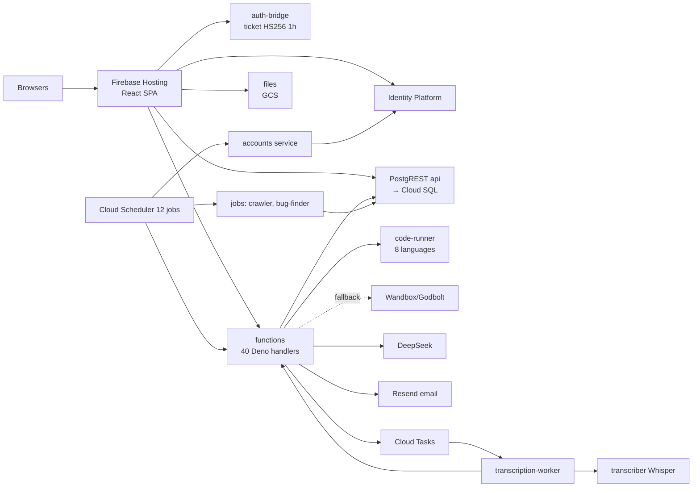

# ProofLabAI — Full Project Architecture (LIVING DOCUMENT)

> **Rule:** update this file in the same change as any change to code, database, cloud config, IAM, scheduler, queues, secrets (names only), prompts or product flow.
> - Add a line to the **Change log** at the bottom.
> - Edit the affected section.
> - If something is planned but not built, put it under **Future (target)**, never under **Now**.
>
> Last verified against reality: **3 Oct 2026**, HEAD `d736e4d`.
> Deep evidence lives in `docs/FINAL-FULL-PROJECT-PIN-TO-PIN-DOSSIER-2026-10-03.md` and its 18 companion reports.

---

## Part 1 — NOW (what is actually running)

### 1.1 The product in one paragraph

A proof-of-skill platform for Indian engineering colleges (https://prooflab.co.in).
1. A college imports students from a CSV.
2. Each student gets one real work task a day (a **Lot**), does it in the app (a code editor or a written answer), and it is graded on the spot.
3. Students can record a spoken explanation, which is transcribed and scored in the background.
4. Students learn on Tracks.
5. They compete in squads inside their college.
6. Companies search talent and sponsor Lots.
7. Admins run the platform.

### 1.2 Who uses what

| Role (DB role) | Main screens now |
|---|---|
| Student (`student`) | Daily Card · Build-Log · Squad · Profile (17 sub-tabs inside) |
| College / TPO (`college_admin`) | Home · Students · Squads · Insights |
| Company / Recruiter (`startup`; org tables `startups` + `recruiters`) | Home · Talent (Search, Shortlist) · Work (Post Task, My Tasks, Applications, Submissions, Sponsored Lots) · Jobs |
| Admin (`admin`) | Overview · People · Work Queue · Platform |

### 1.3 System map

### 1.4 Google Cloud resources (project `prooflab-508214`, region `asia-south1`)

| Kind | Production | Staging |
|---|---|---|
| Cloud Run services | api, functions, auth-bridge, files, accounts, code-runner, transcriber, transcription-worker (all min 0) | the same 8 with `prooflab-staging-*` names + leftover `staging-tasks-test-worker` |
| Cloud Run jobs | prooflab-crawler, prooflab-bug-finder | prooflab-staging-inspect4 (staging SQL runner: psql against prooflab-staging-db) |
| Cloud SQL | prooflab-db (PG17, db-g1-small, zonal, PITR on) | prooflab-staging-db (db-f1-micro) |
| Cloud Tasks | prooflab-transcription (2 concurrent, 3 attempts) | prooflab-staging-transcription; prooflab-staging-ai-background (no producer) |
| Scheduler | 12 jobs, all Asia/Kolkata | 1 (reaper) |
| Buckets | private (resumes, voice, books, 1 old proof), public (photos), backups | private, public |
| Service accounts | one robot per service (`prooflab-rt-*`, `transc-wk`, `code-runner`, `tasks-invoker`, `rt-scheduler`); **nobody has Editor** | `prooflab-staging-*` |
| Monitoring | 27 alert policies, 8 uptime checks, ₹3,000 budget | — |

### 1.5 How the main flows work

| Flow | Path |
|---|---|
| **Login** | Identity Platform → bridge verifies the Google token → `resolve_account` → HS256 ticket (1 h) → API / functions / files |
| **Daily Lot** | 05:40 IST `assign_todays_lots` → `create_lot_for` → oldest unused `source_content` page → seed template. The first student's browser calls `lot-writer` → DeepSeek writes the Lot + grading config **once per page**; every student reuses it |
| **Coding evaluation engine** | One engine for Daily Lots, assigned tasks and the resume round: `auto-config.ts` (generate) + `test-quality.ts` (gate) + `sandbox.ts gradeTests/redact` (grade). Evaluators are frozen once used (migration 52): a change creates a new config, so every result traces to the exact tests that graded it |
| **Coding task** | Run = visible tests; Submit = all tests (hidden redacted) on the own code runner → `task_submissions`. Public runners (Wandbox/Godbolt/Glot) are off unless `PUBLIC_RUNNER_FALLBACK=allow`; when the own runner is busy the student gets "runner busy, try again" *(work/stabilization)* |
| **Written task** | `submit-written-task` → DeepSeek rubric (quote-checked, 2nd grader near the pass line) → `task_submissions` |
| **Voice** | Record ≤ 60 s → private bucket → `transcription-enqueue` → Cloud Tasks → worker → Whisper base (English) → `voice-score` (DeepSeek) → Build-Log. Optional, not limited per task |
| **Resume** | browser pdf.js → `resume-parser` (DeepSeek) → claims → 5 MCQ + short answers → coding round (2 problems, generated and validated by the shared coding engine: reference passes, constant/empty/echo/buggy programs fail; 4–8 normal/boundary/edge tests in `task_sandbox_config` origin `resume`) → scorecard + roadmap tasks. Answer keys and hidden tests are server-only (migration 50: students may SELECT only safe columns of their own `resume_assessments` row, never write it); Submit replies never include hidden tests *(migration 50 on staging; production pending approval)* |
| **Crawler** | Sunday 08:10 IST job reads seed URLs of 6 sources → Jina Reader / GitHub / YouTube → dedupe → `source_content` (28 pages, nothing new since 13 Sep) |
| **Squads** | nightly formation; Sunday scoring and seasons |
| **Account sync** | every 10 min: a student is removed only after their Identity login has stayed missing for 30 min across separate passes (ledger `account_sync_missing`), and one pass may remove at most max(5, 2% of students); an abnormal pass removes nothing and logs `ACCOUNT SYNC ABORTED` (`accounts/sync_plan.py`). Removal itself is still a hard delete with a snapshot. `?dry_run=1` reports without acting. *(work/stabilization; staging only until approved)* |

### 1.6 Known problems right now (top)

| ID | Problem |
|---|---|
| F3 | AI usage, rate limits, AI cache and server security log are silently off in production (env-var mismatch since 12 Sep). **Fixed on work/stabilization**: they use `backend.ts serviceRest`; failures log `TELEMETRY PROBLEM:`; `/ready` reports `telemetry` and is not-ready when it is `none`. All AI calls now have a 90 s deadline (`LLM TIMEOUT:` log) |
| N20 | Resume answer keys and hidden tests were readable AND writable by the student (**proven on staging 3 Oct**). Fixed by migration 50 on staging; production pending approval |
| L1 / N24 | Companies never see submissions or Sponsored-Lot results (they read the old `proof_uploads`) |
| F1 / F2 | One shared signing secret; every function runs with full DB rights |
| F4 | CSV import linked unverified accounts. Fixed on work/stabilization: links only when `account_email_confirmed()` (migration 51) is true |
| F8 / F9 / F10 | Code runner isolation; hidden tests could go to public runners. **Fixed on work/stabilization, proven on staging**: after every run all `runner`-uid processes are killed and runner files in /tmp,/var/tmp,/dev/shm removed; output to capped files (no pipe hang); RLIMIT_AS 768 MB (python/ruby/php/c/cpp), node --max-old-space-size=256, GOMEMLIMIT 512MiB, Java -Xmx256m; each run in its own empty network namespace (no internet, no metadata; `/ready` shows `net_isolation`); one run per instance (lock). Suite `code-runner/test_runner.py` 22/22 on staging and in CI. Production rollout pending approval |
| N30 | Some Lot texts ask for files or unseen articles |
| N1 | Test logins deleted, so the bug finder and healthcheck are blind |

Full register: `docs/SECURITY-F1-F21-REVALIDATION-2026-10-03.md`.

---

## Part 2 — FUTURE (target, not built)

| Area | Target |
|---|---|
| Student UI | Floor · Build-log · Squad · Profile, few concepts |
| Recruiter = Company | one role, one org; Home → Talent → Shortlist → Lots → Submissions → Review on `task_submissions` |
| Work evidence | `task_submissions` + voice only; Proof/Trust/Cosigns/conceptual retired |
| Coding | one shared evaluation engine; AI drafts tests, real execution validates (reference + known-wrong) and grades; hidden tests never leave the server; AutoTestCase ideas inside it, never AI-simulated results |
| Lots | pre-generated after each crawl; wording contract (Title, Context, Task, Input, Output, Constraints, Example); personalised order; job sources |
| Voice | required after Submit, one per task, length-gated, scored against the submitted work, write-once audio |
| AI | every call metered, capped, timed out; heavy work async |
| Security | bridge-only asymmetric signing; service identity; verified email server-side; isolated internal code runner |
| Ops | IaC, build-once CI for all services, one migration folder + applied table, alerts for silent AI logging / mass removals / crawler 0-new |
| Scale | 15k registered students: daily job fan-out, pool sizing, pre-aggregated recruiter search, measured on staging |

Order of work: `docs/FINAL-IMPLEMENTATION-DEPENDENCY-PLAN-2026-10-03.md`.

---

## Change log (newest first)

| Date | Change | By | Evidence |
|---|---|---|---|
| 2026-10-03 | Wave 3b (branch work/stabilization): shared coding engine + test-quality gate; resume round moved onto it; migration 52 (resume origin, frozen evaluators) on staging. Staging E2E: round generated in 33 s, 5 labelled tests per problem, 2 visible, tests unreadable by the student, `print(4)` scored 1/5, constant `0.00` 2/5, a correct solution passed the visible tests, no hidden data in replies | Claude | functions `stab-a0047ad` on staging |
| 2026-10-03 | Wave 3a (branch work/stabilization): code runner hardened (F8, F9, pipe hang) + first runner test suite in CI (`code-runner` job, deploy now needs it). Staging runner image `prooflab-code-runner:stab-w3a` (revision 00003-twx): 22/22 checks incl. net isolation; functions to runner path re-checked | Claude | `code-runner/test_runner.py` |
| 2026-10-03 | Wave 2 (branch work/stabilization): deleted 24 provably dead frontend files (22 orphans with zero importers, ProofViewer: lazily imported but never routed, UploadProofModal: its open-state was never set), the quiz-polling loop only that modal could start, and the realtime channels on proof_uploads/conceptual_tests (cannot work on PostgREST). KEPT for Wave 5/8 because they still render when legacy data exists: StudentUploadsPage appeal/reflection/conceptual modals, conceptual buttons in Your tasks. Correction to the 3 Oct map: 24 dead files proven, not 30 (the other 6 are data-reachable). Routes unchanged (27) | Claude | typecheck clean, unit 92/92, build ok, repo-wide name search: only comments |
| 2026-10-03 | Wave 1 (branch work/stabilization): F3 telemetry via backend.ts + `/ready` telemetry field; AI 90 s timeouts; N20 migration 50 (staging applied); N21 hidden tests redacted in resume Submit, full denominator; TypeScript removed from resume language map; F10 public runners off by default; F6 safe sync (grace, ceiling, dry run, alert line) + migration 51 ledger; F4 verified-only linking (migration 51 RPC); N25 password-link only for logins created < 1 h ago and never for admins; F7 constant-time webhook checks. Staging probes: N20, F8, F9 confirmed before the fix | Claude | `migration/50*`, `migration/51*`, `accounts/test_sync_plan.py`, deno tests 94/94 |
| 2026-10-03 | Correction: `prooflab-staging-inspect4` is the staging SQL runner (psql via `prooflab-staging-db-uri`), not a leftover | Claude | job spec read 3 Oct |
| 2026-10-03 | File created from the pin-to-pin discovery (read-only; no system changes) | Claude | `docs/FINAL-FULL-PROJECT-PIN-TO-PIN-DOSSIER-2026-10-03.md` |
